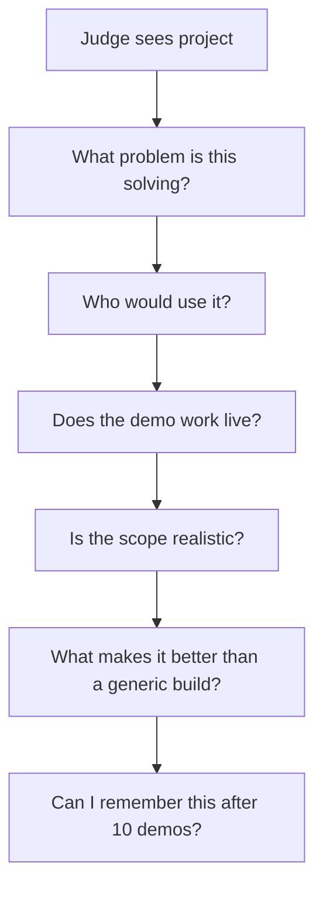
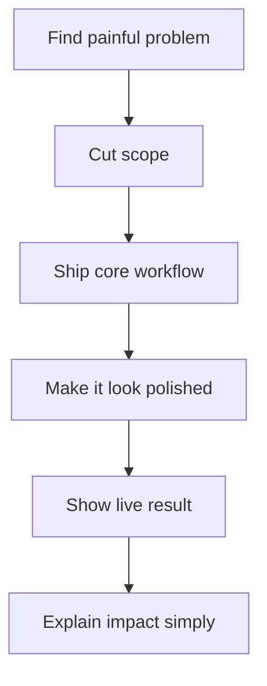

# 01. Getting Started

Hackathons are less about being “the best coder in the room” and more about making good decisions under time pressure.

This section gives you the operating model.

## What a hackathon really is

A hackathon is a short, high-intensity build sprint where teams turn an idea into a working demo and pitch it to judges.

The real game is not just coding. It is:
- finding a problem worth solving,
- choosing a stack that will not slow you down,
- building only what matters,
- shipping a live demo,
- and presenting it clearly.

## Hackathon types

Not all hackathons are the same.

Understanding the format changes your strategy.

| Type | What it is | Best approach |
|---|---|---|
| Open Innovation | Build anything | Solve a painful, obvious problem |
| Sponsor Challenge | Build using sponsor tech | Use sponsor APIs early |
| AI Hackathon | AI-first products | Focus on visible outputs |
| College Hackathon | Beginner-friendly | Keep scope small and polished |
| Startup/Incubator Hackathon | Business-oriented | Validate problem and market |
| Government/Public Impact | Civic problems | Show measurable impact |

### Quick rule

If prizes are sponsor-specific, align your build with sponsor tooling whenever possible.

Example:

Google sponsor → use Gemini  
Microsoft sponsor → use Azure/OpenAI  
MongoDB sponsor → use MongoDB visibly

## Online vs offline

| Format | Advantage | Risk | Best strategy |
|---|---|---|---|
| Online | Easier tooling, faster iteration, more flexible collaboration | Less social energy, more distraction | Over-communicate, keep demo crisp |
| Offline | Strong team energy, easier whiteboarding, faster bonding | Setup issues, hardware friction, time loss | Bring fallback devices, keep a local backup |
| Hybrid | Best of both worlds if managed well | Coordination complexity | Assign one owner per function |

## Solo vs team

| Mode | Best for | Risk | Winning pattern |
|---|---|---|---|
| Solo | Fast prototype, small scope, personal challenge | Too much work for one person | Tiny scope, polished output |
| 2 people | Strong balance of speed and coordination | One-person bottleneck | Split into frontend and backend or build and pitch |
| 3 to 4 people | Most stable for a student hackathon | Coordination overhead | Clear roles, strict sync points |
| 5+ people | Larger delivery potential | Too many meetings, unclear ownership | Only works with disciplined leads |

## How judging usually works

Judges typically look for a mix of:
- problem relevance,
- product clarity,
- technical execution,
- originality,
- demo quality,
- usefulness,
- and presentation confidence.

## Common judging criteria

Every hackathon is different, but most scoring looks similar.

| Criteria | What judges actually mean |
|---|---|
| Innovation | Is this solving something in a smart way? |
| Technical complexity | Did the team build meaningful functionality? |
| Practicality | Would someone actually use this? |
| Design | Is the experience understandable quickly? |
| Demo | Does it work smoothly under pressure? |
| Business impact | Can this become something larger? |

### Hidden truth

A working, simple product usually beats an ambitious broken one.

### Judge mindset



## Judge psychology

Judges often reward:
- clear use cases,
- real users,
- obvious effort,
- live functionality,
- and a project that feels finished enough to trust.

They usually do not reward:
- vague “AI powered” labels,
- huge features that are half-built,
- random dashboards with no user story,
- and demos that need long explanations before they make sense.

## What judges secretly look for

Judges rarely say this directly, but they often reward projects that:

- make sense in under 30 seconds,
- solve a real pain point,
- show obvious progress,
- feel polished enough to trust,
- avoid unnecessary complexity,
- and demonstrate something memorable.

### Fast mental test

Ask yourself:

> Would a stranger understand this without explanation?

If not, simplify.

## Beginner myths

| Myth | Reality |
|---|---|
| You need a revolutionary idea | You need a sharp problem and a clean demo |
| Bigger features win | Better focus usually wins |
| Fancy tech automatically impresses judges | Clear value impresses judges |
| Design is optional | Design helps judges understand your product faster |
| The pitch can be improvised | Winning teams rehearse |
| The hackathon starts after the idea is chosen | The idea choice is already part of the build |

## Beginner reality check

Most first-time participants imagine hackathons like this:

```text
Crazy coding marathon → impossible competition → genius developers
```

## Lifecycle of a good hackathon project


## What actually wins

A project has a much better chance when it has:
- one clear user,
- one painful problem,
- one main workflow,
- one clean demo,
- and one story judges can repeat in one sentence.

## Common mistakes

- Starting with a tech stack instead of a user problem
- Building too many features
- Ignoring deployment until the end
- Spending too much time on logos and too little on flow
- Leaving demo practice for the last 10 minutes
- Choosing a problem that sounds cool but is hard to validate
- Making a product that looks impressive but solves nothing clearly

## Success pattern



## Beginner checklist

- [ ] Understand the judging criteria
- [ ] Pick a small, real problem
- [ ] Choose a fast stack
- [ ] Decide the MVP before coding
- [ ] Create a landing page or simple app shell early
- [ ] Deploy as soon as possible
- [ ] Rehearse the pitch
- [ ] Keep a backup demo plan
- [ ] Make the project easy to explain in under 30 seconds

## First-time hackathon advice

Start small.  
A tiny, useful, finished project beats a large unfinished concept.

<details>
<summary><strong>Need a simple hackathon rule?</strong></summary>

If you cannot explain the project in one sentence, the scope is probably too large.

A strong hackathon project usually looks like this:

```text
One user
↓
One painful problem
↓
One clear workflow
↓
One memorable demo

</details>
