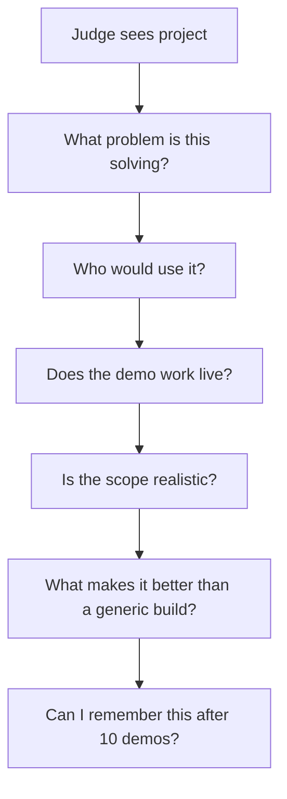
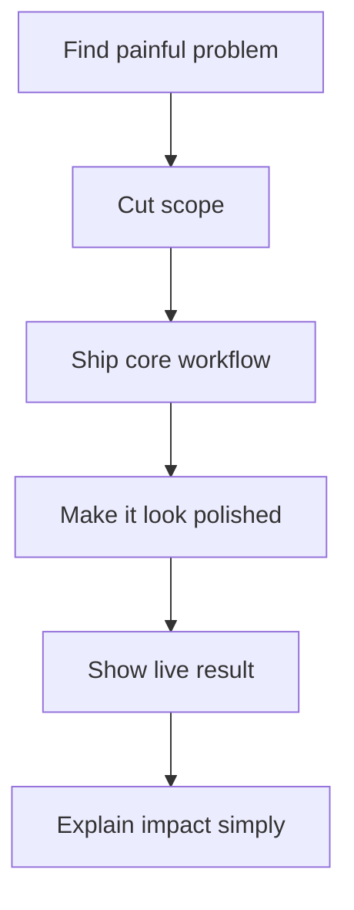

# 01. Getting Started

Hackathons are less about being “the best coder in the room” and more about making good decisions under time pressure.

This section gives you the operating model.

## What a hackathon really is

A hackathon is a short, high-intensity build sprint where teams turn an idea into a working demo and pitch it to judges.

The real game is not just coding. It is:
- finding a problem worth solving,
- choosing a stack that will not slow you down,
- building only what matters,
- shipping a live demo,
- and presenting it clearly.

## Hackathon types

Not all hackathons are the same.

Understanding the format changes your strategy.

| Type | What it is | Best approach |
|---|---|---|
| Open Innovation | Build anything | Solve a painful, obvious problem |
| Sponsor Challenge | Build using sponsor tech | Use sponsor APIs early |
| AI Hackathon | AI-first products | Focus on visible outputs |
| College Hackathon | Beginner-friendly | Keep scope small and polished |
| Startup/Incubator Hackathon | Business-oriented | Validate problem and market |
| Government/Public Impact | Civic problems | Show measurable impact |

### Quick rule

If prizes are sponsor-specific, align your build with sponsor tooling whenever possible.

Example:

Google sponsor → use Gemini  
Microsoft sponsor → use Azure/OpenAI  
MongoDB sponsor → use MongoDB visibly

## Online vs offline

| Format | Advantage | Risk | Best strategy |
|---|---|---|---|
| Online | Easier tooling, faster iteration, more flexible collaboration | Less social energy, more distraction | Over-communicate, keep demo crisp |
| Offline | Strong team energy, easier whiteboarding, faster bonding | Setup issues, hardware friction, time loss | Bring fallback devices, keep a local backup |
| Hybrid | Best of both worlds if managed well | Coordination complexity | Assign one owner per function |

## Solo vs team

| Mode | Best for | Risk | Winning pattern |
|---|---|---|---|
| Solo | Fast prototype, small scope, personal challenge | Too much work for one person | Tiny scope, polished output |
| 2 people | Strong balance of speed and coordination | One-person bottleneck | Split into frontend and backend or build and pitch |
| 3 to 4 people | Most stable for a student hackathon | Coordination overhead | Clear roles, strict sync points |
| 5+ people | Larger delivery potential | Too many meetings, unclear ownership | Only works with disciplined leads |

## How judging usually works

Judges typically look for a mix of:
- problem relevance,
- product clarity,
- technical execution,
- originality,
- demo quality,
- usefulness,
- and presentation confidence.

## Common judging criteria

Every hackathon is different, but most scoring looks similar.

| Criteria | What judges actually mean |
|---|---|
| Innovation | Is this solving something in a smart way? |
| Technical complexity | Did the team build meaningful functionality? |
| Practicality | Would someone actually use this? |
| Design | Is the experience understandable quickly? |
| Demo | Does it work smoothly under pressure? |
| Business impact | Can this become something larger? |

### Hidden truth

A working, simple product usually beats an ambitious broken one.

### Judge mindset


```mermaid
flowchart TD
    A[Judge sees project] --> B[What problem is this solving?]
    B --> C[Who would use it?]
    C --> D[Does the demo work live?]
    D --> E[Is the scope realistic?]
    E --> F[What makes it better than a generic build?]
    F --> G[Can I remember this after 10 demos?]
```

## Judge psychology

Judges often reward:
- clear use cases,
- real users,
- obvious effort,
- live functionality,
- and a project that feels finished enough to trust.

They usually do not reward:
- vague “AI powered” labels,
- huge features that are half-built,
- random dashboards with no user story,
- and demos that need long explanations before they make sense.

## What judges secretly look for

Judges rarely say this directly, but they often reward projects that:

- make sense in under 30 seconds,
- solve a real pain point,
- show obvious progress,
- feel polished enough to trust,
- avoid unnecessary complexity,
- and demonstrate something memorable.

### Fast mental test

Ask yourself:

> Would a stranger understand this without explanation?

If not, simplify.

## Hackathon vocabulary

You will hear these words a lot. Knowing them makes you sound like you have done this before, even if it is your first time.

| Term | What it means |
|---|---|
| MVP | Minimum Viable Product — the smallest working version that proves your idea |
| Pitch | The 3-5 minute presentation where you explain your project to judges |
| Demo | A live walkthrough of your working product, not slides |
| Track | A specific category or theme at a hackathon (AI, health, fintech, etc.) |
| Sponsor | A company providing prizes, APIs, or resources — they usually want you to use their tools |
| Hacking | Building your project during the event (not illegal stuff) |
| Shipping | Getting something live and deployed before the deadline |
| MVP moment | The single screen or flow that makes judges say "oh, I get it" |
| Hackathon swag | Free stickers, t-shirts, and gear from sponsors |
| Mentor | An experienced developer or designer who helps teams during the event |
| Pivoting | Changing your idea mid-hackathon because you realized it will not work |
| Scope creep | Keep adding features until you have nothing finished |
| Demo-ready | Your project works, looks good enough, and you can show it confidently |
| Repo | Your code repository (usually GitHub) |
| DevPost / Devfolio | Platforms where hackathons are listed and submissions are tracked |
| Check-in | Registering when you arrive at a venue |
| Submissions | The formal entry you upload before the deadline |
| Judging rubric | The scorecard judges use to evaluate projects |
| Lightning talk | A very short presentation, usually under 2 minutes |
| Badging | A system where hackathons track your participation across events |
| Bounceback | Returning to a hackathon you attended before — organizers love repeat participants |
| Starter template | A pre-built project skeleton to save setup time |
| Loom | A popular tool for recording video demos when you cannot present live |
| Ship it | A casual phrase meaning "just deploy it and move on" |

## Regional hackathon guide

Hackathons look different depending on where you are in the world. Here is what to expect in the major scenes.

### India

India has one of the busiest hackathon ecosystems on the planet. Smart India Hackathon (SIH) is the government-backed giant — hundreds of teams, real problem statements from ministries, and serious prize money. Devfolio is the go-to platform for most Indian hackathons, and it is where you build your profile over time. Events like Hack4Bengal, HackNIT, and Invente attract strong college teams. The culture is very team-oriented and competitive. Mentors are usually available during the event, and sponsor tracks (Google, Microsoft, Amazon) are common. If you are in college in India, you will have no shortage of options.

### United States

MLH (Major League Hacking) runs the official student hackathon circuit across US universities. Events like HackMIT, PennApps, and TreeHacks are well-known and competitive. US hackathons tend to emphasize learning, community, and diversity. Many include workshops, sponsor booths, and networking sessions. The vibe is collaborative, and teams often form on-site. Prizes range from cash to internship offers. Devpost is the primary platform for submissions.

### Europe

Junction (Helsinki) and TechFest (Mumbai, but with European reach) are notable, but Europe also has strong regional events. HackZurich, randomness in Paris, and various EU Horizon hackathons focus on deep tech and social impact. The European scene values innovation and research-grade solutions. Many events are funded by EU programs, so public impact projects do well.

### Online and global

DoraHacks focuses on Web3 and AI builders with bounty-based rewards. ETHGlobal runs blockchain hackathons worldwide. MLH also runs online seasons. Online hackathons are great if you cannot travel, but they require more self-discipline and communication. You need to over-communicate with your team and make your demo extra clear since judges cannot walk up to your booth.

## The first 30 minutes

What you do right after you arrive matters more than you think. Here is a playbook.

**Minutes 1-5: Get oriented.**
Find the check-in desk. Pick up your badge and swag. Locate the bathroom, the food area, and the power outlets. Seriously — find the outlets first.

**Minutes 5-10: Scope the room.**
Walk around. See which teams are already set up. Notice who looks organized and who is still figuring things out. If you do not have a team yet, this is when you approach people.

**Minutes 10-15: Connect to wifi and test it.**
Do this immediately. If the wifi is bad, you need to know now so you can switch to mobile hotspot. Clone your repos, pull your dependencies, and make sure your environment works.

**Minutes 15-20: Set up your workspace.**
Plug in your laptop. Open your code editor. Set up your terminal. If you are at a venue, put your bag under your chair so it does not get in the way.

**Minutes 20-25: Meet your neighbors.**
Introduce yourself to the teams sitting near you. Ask what they are building. This is not just being friendly — you might need to borrow a charger, get a recommendation, or find a last-minute teammate.

**Minutes 25-30: Lock in your idea.**
By now you should have a rough idea of what you are building. Write it down in one sentence. Share it with your team. If you are solo, send it to a friend for a sanity check. The faster you commit, the more time you have to build.

## Beginner myths

| Myth | Reality |
|---|---|
| You need a revolutionary idea | You need a sharp problem and a clean demo |
| Bigger features win | Better focus usually wins |
| Fancy tech automatically impresses judges | Clear value impresses judges |
| Design is optional | Design helps judges understand your product faster |
| The pitch can be improvised | Winning teams rehearse |
| The hackathon starts after the idea is chosen | The idea choice is already part of the build |

## Beginner reality check

Most first-time participants imagine hackathons like this:

```text
Crazy coding marathon → impossible competition → genius developers
```

Reality usually looks more like this:

```text
Small team → practical MVP → quick decisions → live demo → storytelling
```

You do not need to be the smartest developer.

You need to make better decisions under limited time.

## Lifecycle of a good hackathon project


```mermaid
flowchart LR
    A[Discover problem] --> B[Validate quickly]
    B --> C[Choose stack]
    C --> D[Build MVP]
    D --> E[Add polish]
    E --> F[Deploy]
    F --> G[Prepare pitch]
    G --> H[Demo]
```

## What actually wins

A project has a much better chance when it has:
- one clear user,
- one painful problem,
- one main workflow,
- one clean demo,
- and one story judges can repeat in one sentence.

## Common mistakes

- Starting with a tech stack instead of a user problem
- Building too many features
- Ignoring deployment until the end
- Spending too much time on logos and too little on flow
- Leaving demo practice for the last 10 minutes
- Choosing a problem that sounds cool but is hard to validate
- Making a product that looks impressive but solves nothing clearly

## Success pattern


```mermaid
flowchart TD
    A[Find painful problem] --> B[Cut scope]
    B --> C[Ship core workflow]
    C --> D[Make it look polished]
    D --> E[Show live result]
    E --> F[Explain impact simply]
```

## Beginner checklist

- [ ] Understand the judging criteria
- [ ] Pick a small, real problem
- [ ] Choose a fast stack
- [ ] Decide the MVP before coding
- [ ] Create a landing page or simple app shell early
- [ ] Deploy as soon as possible
- [ ] Rehearse the pitch
- [ ] Keep a backup demo plan
- [ ] Make the project easy to explain in under 30 seconds

## First-time hackathon advice

Start small.  
A tiny, useful, finished project beats a large unfinished concept.

<details>
<summary><strong>Need a simple hackathon rule?</strong></summary>

If you cannot explain the project in one sentence, the scope is probably too large.

A strong hackathon project usually looks like this:

```text
One user
↓
One painful problem
↓
One clear workflow
↓
One memorable demo
```

When confused:

Cut features.

Clarity beats complexity.

</details>
