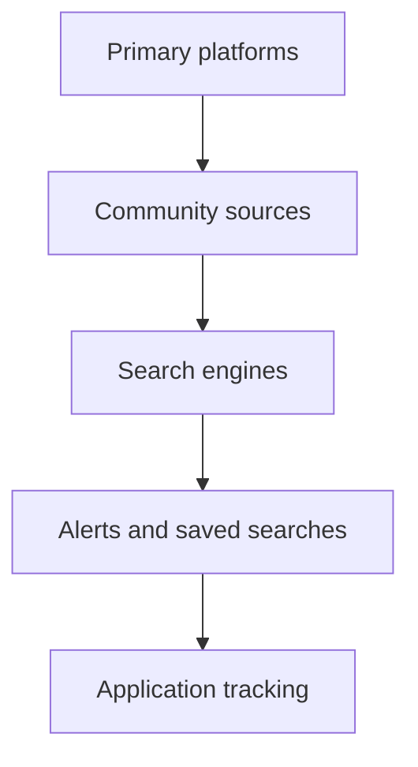

# 02. Find Hackathons

A hackathon strategy starts before the event starts. The best builders do not just wait for opportunities, they build a discovery system.

## Discovery stack



## Major platforms

| Platform | What it is | Best for | Difficulty | Prize types | Win strategy | Common mistake | Profile hack |
|---|---|---|---|---|---|---|---|
| Devfolio | Indian hackathon discovery and participation platform | Student and India-focused events | Medium | Cash, internships, swag, mentorship | Apply early, build a polished profile, read sponsor tracks | Missing deadlines | Keep project links and GitHub strong |
| Devpost | Global hackathon and app contest platform | Big brand events and public submissions | Medium to High | Cash, prizes, recognition | Study past winning projects and sponsor asks | Generic idea selection | Optimize portfolio and project visuals |
| MLH | Student-focused hackathon ecosystem | Official student hackathons | Medium | Swag, learning, community, partner prizes | Focus on execution and learning value | Ignoring event rules | Maintain a clean dev profile |
| HackClub | Student maker community | Student-led, maker-friendly events | Easy to Medium | Community prizes, grants, recognition | Show initiative and clear build logs | Treating it like a generic contest | Join community channels early |
| DoraHacks | Web3, AI, and builder events | Ecosystem-specific hackathons | Medium to High | Grants, tokens, bounties | Match your project to sponsor tracks | Building outside sponsor goals | Read bounty requirements carefully |
| ETHGlobal | Blockchain and Web3 hackathons | Advanced and sponsor-heavy events | High | Cash, bounties, opportunities | Use sponsor APIs and show real usage | Overbuilding infrastructure | Focus on one crisp use case |
| Kaggle | Data science and ML competitions | Model-heavy challenges | High | Cash, medals, recognition | Treat it as data science, not product demo only | Ignoring leaderboard strategy | Public notebooks and credibility |
| Google challenges | Google-hosted or partner challenges | AI, cloud, social impact | Medium | Credits, exposure, prizes | Use official tools and strong documentation | Building without a tie to the challenge | Emphasize product and deployment |
| Microsoft events | Microsoft-sponsored hackathons and challenges | Azure, Copilot, and productivity use cases | Medium | Credits, prizes, mentorship | Show Microsoft stack integration clearly | Using the sponsor weakly | Align to the theme tightly |
| AWS hackathons | Cloud and infrastructure-oriented events | Scalable projects and infra demos | Medium | Credits, prizes, learning | Use AWS services with a clear architecture story | Overcomplicating the stack | Keep architecture clean |
| Meta competitions | Social and product problems | Consumer-scale ideas | Medium | Prizes, recognition | Focus on user growth and social utility | No clear user retention story | Build a product people want to share |
| GitHub events | GitHub-sponsored events and community programs | Developer tools and open source | Medium | Credits, swag, visibility | Make the repo itself part of the product | Treating GitHub as storage only | Present the repo as a polished asset |
| AngelHack | Startup and builder events | Founder-like thinking | Medium | Network, cash, exposure | Tell a business and user story | Only focusing on code | Show market logic |
| TiE | Entrepreneurship and innovation ecosystem | Startup-minded projects | Medium | Mentorship, exposure, network | Make the problem commercially believable | Too much academic framing | Tie the solution to adoption |

## Search strings

Use these exact searches to find more events fast:

```text
site:devfolio.co/hackathons hackathon
site:devpost.com/hackathons hackathon
site:mlh.io hackathon
site:hackclub.com event hackathon
site:dorahacks.io hackathon
site:ethglobal.com hackathon
site:kaggle.com competitions
site:dev.to hackathon announcement
site:linkedin.com/hackathon
site:discord.com hackathon server
site:telegram.me hackathon
"hackathon" "registration"
"student hackathon" "deadline"
"AI hackathon" "prizes"
"cloud hackathon" "student"
```

## Hidden opportunity sources

- University clubs and coding societies
- Sponsor newsletters
- Discord communities for builders
- Telegram channels for student opportunities
- LinkedIn posts by organizers and mentors
- GitHub topics and event repos
- Meetup and community calendars
- Company engineering blogs
- Startup community newsletters
- Local college departments and incubators

## Profile optimization

### What to show
- Best 3 project links
- GitHub profile README
- Real deployment links
- Hackathon participation history
- Clean social links
- One-line builder identity

### What to avoid
- Empty pinned repos
- Broken deployment links
- Random project names with no context
- Half-finished demos
- A profile that looks inactive

## Email alert system

Build a simple tracking system:
1. Save searches in Google Alerts or a feed reader.
2. Track organizer newsletters in one mailbox folder.
3. Use a spreadsheet for deadline tracking.
4. Set reminders one week before deadlines.
5. Keep application materials ready.

## Application winning strategy

- Apply early
- Match the event theme
- Show prior projects or prototypes
- Explain your motivation clearly
- Attach a strong GitHub or deployment link
- Do not submit a vague profile

## Community bonus

The best hackathons often appear through:
- referrals,
- active communities,
- and organizer relationships.

Being visible in builder spaces matters more than most students realize.
