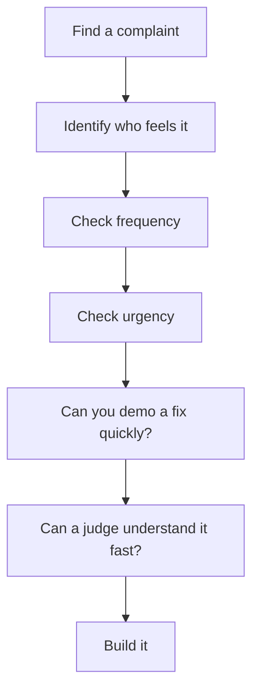
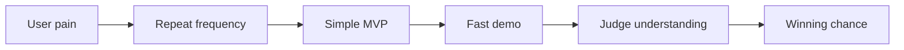

# 03. Problem Selection Engine

This is the strongest section in the repo because most hackathon projects fail before the first line of code.

A strong problem makes everything else easier:
- stack choice,
- product scope,
- demo clarity,
- judge trust,
- and even pitch confidence.

## The real job

Do not ask, “What can I build?”

Ask:
- What painful workflow is annoying enough that people would use a fix?
- What problem can I prove in minutes?
- What can I demo in under 2 minutes?
- What can I ship with a small team?

## Core frameworks

### 1. Painkiller vs Vitamin

| Type | Meaning | Hackathon value |
|---|---|---|
| Painkiller | Solves a real urgent pain | Much stronger |
| Vitamin | Nice to have, but not urgent | Weaker unless very polished |

A hackathon painkiller has:
- repeated usage,
- obvious frustration,
- clear before and after,
- and a simple demo.

### 2. Reddit problem mining

Look for:
- “how do I”
- “any tool for”
- “why is this so hard”
- “am I the only one”
- “I hate when”

### 3. Twitter or X complaint mining

Search for complaint patterns around:
- broken workflows,
- boring admin tasks,
- delayed responses,
- confusing interfaces,
- and repeated manual work.

### 4. Play Store review mining

Sort by 1-star and 2-star reviews.  
Look for:
- bugs,
- missing features,
- poor UX,
- login frustration,
- and payment or notification problems.

### 5. YouTube comment mining

Comments often reveal actual user pain in plain language:
- “Does this work on low-end phones?”
- “I wish it had auto mode”
- “How do I do this for free?”

### 6. Government inefficiencies

Anything involving:
- forms,
- queues,
- document verification,
- complaint tracking,
- status checks,
- or multilingual communication.

### 7. Student pain points

Students are excellent hackathon users because the pain is immediate:
- deadlines,
- internships,
- notes,
- attendance,
- transport,
- rooms,
- clubs,
- exam prep.

### 8. SMB pain points

Small businesses often need simple tools:
- invoice tracking,
- WhatsApp-like reminders,
- customer follow-up,
- inventory,
- bookings,
- lead management.

### 9. AI automation opportunities

Use AI where there is repetition:
- text summarization,
- classification,
- routing,
- note extraction,
- document understanding,
- support replies,
- and form filling.

### 10. Boring industries with bad UX

Boring is good.  
Boring often means:
- low competition,
- real pain,
- and a practical story.

Examples:
- logistics,
- clinics,
- school operations,
- compliance,
- maintenance,
- municipal services,
- and back-office workflows.

---

## How to validate an idea in 20 minutes

### Validation checklist
- [ ] Is the pain real?
- [ ] Is the user obvious?
- [ ] Does the problem happen repeatedly?
- [ ] Can a demo show the fix instantly?
- [ ] Can the project stay small?
- [ ] Does it have a clear before and after?
- [ ] Could a sponsor support it?
- [ ] Would a judge remember it?

---

## How to score ideas

Use this scorecard:

| Factor | Score 1 | Score 5 |
|---|---|---|
| Pain | Mild inconvenience | Daily frustration |
| Clarity | Hard to explain | One sentence explanation |
| Buildability | Huge and risky | Small and shippable |
| Demo power | Hard to show | Obvious live impact |
| Judge appeal | Generic | Memorable and credible |
| Sponsor fit | Weak | Strong |
| Monetization | Impossible | Easy to imagine |

### Best rule
A great hackathon idea is usually not the most advanced.  
It is the most believable one with the strongest demo.

---

## 50 real hackathon-worthy problems

See the full list in [problems.md](problems.md).

### Problem selection pattern

---

## Common mistakes

- Choosing a solution before the problem
- Picking a problem just because it sounds “AI” or “smart”
- Building for everyone
- Ignoring the actual user journey
- Making a demo that is technically clever but emotionally flat
- Not validating whether the issue is frequent enough

---

## Best practice

The best hackathon problem usually has:
- a clear user,
- a clear pain,
- a measurable improvement,
- and a short demo path.

That is the core of winning problem selection.
