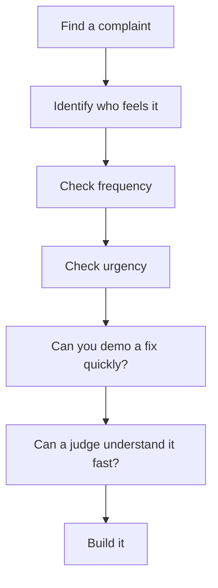
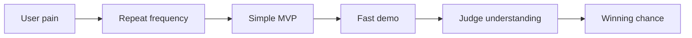
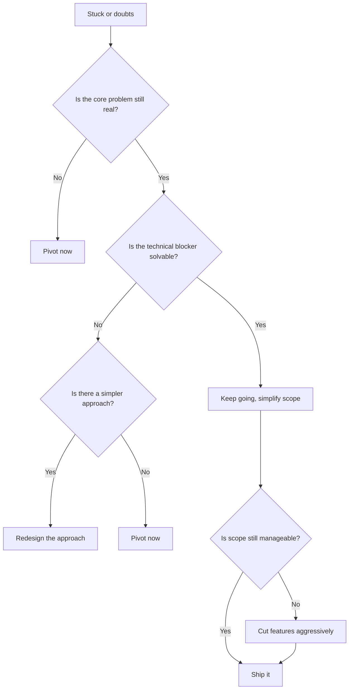

# 03. Problem Selection Engine

This is the strongest section in the repo because most hackathon projects fail before the first line of code.

A strong problem makes everything else easier:
- stack choice,
- product scope,
- demo clarity,
- judge trust,
- and even pitch confidence.

## The real job

Do not ask, “What can I build?”

Ask:
- What painful workflow is annoying enough that people would use a fix?
- What problem can I prove in minutes?
- What can I demo in under 2 minutes?
- What can I ship with a small team?

## Core frameworks

### 1. Painkiller vs Vitamin

| Type | Meaning | Hackathon value |
|---|---|---|
| Painkiller | Solves a real urgent pain | Much stronger |
| Vitamin | Nice to have, but not urgent | Weaker unless very polished |

A hackathon painkiller has:
- repeated usage,
- obvious frustration,
- clear before and after,
- and a simple demo.

### 2. Reddit problem mining

Look for:
- “how do I”
- “any tool for”
- “why is this so hard”
- “am I the only one”
- “I hate when”

### 3. Twitter or X complaint mining

Search for complaint patterns around:
- broken workflows,
- boring admin tasks,
- delayed responses,
- confusing interfaces,
- and repeated manual work.

### 4. Play Store review mining

Sort by 1-star and 2-star reviews.  
Look for:
- bugs,
- missing features,
- poor UX,
- login frustration,
- and payment or notification problems.

### 5. YouTube comment mining

Comments often reveal actual user pain in plain language:
- “Does this work on low-end phones?”
- “I wish it had auto mode”
- “How do I do this for free?”

### 6. Government inefficiencies

Anything involving:
- forms,
- queues,
- document verification,
- complaint tracking,
- status checks,
- or multilingual communication.

### 7. Student pain points

Students are excellent hackathon users because the pain is immediate:
- deadlines,
- internships,
- notes,
- attendance,
- transport,
- rooms,
- clubs,
- exam prep.

### 8. SMB pain points

Small businesses often need simple tools:
- invoice tracking,
- WhatsApp-like reminders,
- customer follow-up,
- inventory,
- bookings,
- lead management.

### 9. AI automation opportunities

Use AI where there is repetition:
- text summarization,
- classification,
- routing,
- note extraction,
- document understanding,
- support replies,
- and form filling.

### 10. Boring industries with bad UX

Boring is good.  
Boring often means:
- low competition,
- real pain,
- and a practical story.

Examples:
- logistics,
- clinics,
- school operations,
- compliance,
- maintenance,
- municipal services,
- and back-office workflows.

---

## How to validate an idea in 20 minutes

```mermaid
flowchart TD
    A[Find a complaint] --> B[Identify who feels it]
    B --> C[Check frequency]
    C --> D[Check urgency]
    D --> E[Can you demo a fix quickly?]
    E --> F[Can a judge understand it fast?]
    F --> G[Build it]
```

### Validation checklist
- [ ] Is the pain real?
- [ ] Is the user obvious?
- [ ] Does the problem happen repeatedly?
- [ ] Can a demo show the fix instantly?
- [ ] Can the project stay small?
- [ ] Does it have a clear before and after?
- [ ] Could a sponsor support it?
- [ ] Would a judge remember it?

---

## How to score ideas

Use this scorecard:

| Factor | Score 1 | Score 5 |
|---|---|---|
| Pain | Mild inconvenience | Daily frustration |
| Clarity | Hard to explain | One sentence explanation |
| Buildability | Huge and risky | Small and shippable |
| Demo power | Hard to show | Obvious live impact |
| Judge appeal | Generic | Memorable and credible |
| Sponsor fit | Weak | Strong |
| Monetization | Impossible | Easy to imagine |

### Best rule
A great hackathon idea is usually not the most advanced.  
It is the most believable one with the strongest demo.

---

## 50 real hackathon-worthy problems

See the full list in [problems.md](problems.md).

### Problem selection pattern

```mermaid
flowchart LR
    A[User pain] --> B[Repeat frequency]
    B --> C[Simple MVP]
    C --> D[Fast demo]
    D --> E[Judge understanding]
    E --> F[Winning chance]
```

---

## Common mistakes

- Choosing a solution before the problem
- Picking a problem just because it sounds “AI” or “smart”
- Building for everyone
- Ignoring the actual user journey
- Making a demo that is technically clever but emotionally flat
- Not validating whether the issue is frequent enough

---

## Best practice

The best hackathon problem usually has:
- a clear user,
- a clear pain,
- a measurable improvement,
- and a short demo path.

That is the core of winning problem selection.

---

## Problem validation interviews

Before you commit to an idea, talk to 3-5 potential users. You are not selling anything — you are learning. Here are five questions that will tell you more in 10 minutes than a week of guessing.

**1. "Tell me about the last time you dealt with [problem]."**
You want specifics, not hypotheticals. If they cannot remember a real instance, the pain might not be real. Listen for emotional cues — frustration, annoyance, resignation.

**2. "How do you handle it right now?"**
This reveals the current workaround. If they are using a spreadsheet, a sticky note, or just ignoring the problem, that is a signal. The worse the current solution, the bigger your opportunity.

**3. "How much time does this cost you?"**
Quantify the pain. If it takes 2 hours a week, that is 100 hours a year. Judges love hearing "this wastes X hours per user per month." It makes your problem concrete.

**4. "If someone built a tool that fixed this, would you actually use it?"**
This is the commitment question. A polite "maybe" is a no. You want "yes, absolutely" or "I would pay for that." If they hesitate, the pain is not strong enough.

**5. "What would make it a no-brainer for you?"**
This tells you the one feature that would make your MVP irresistible. It also helps you avoid building 10 features when only 1 matters.

**How to find people to interview:**
- Post in Reddit communities related to the problem
- DM people who complained on Twitter or X
- Ask classmates or coworkers
- Post in relevant Discord or Slack groups
- Walk into a local business if the problem is SMB-related

Do this before the hackathon if you can. Even 3 conversations will sharpen your idea dramatically.

---

## Competitive analysis template

You do not want to discover during your pitch that someone already built exactly what you are building. Spend 20 minutes checking the landscape.

**Step 1: Search for the problem, not the solution.**
Google "[problem] tool," "[problem] app," "[problem] workflow." You want to see what already exists.

**Step 2: Check Product Hunt and Crunchbase.**
Search for similar products. Note their funding, user base, and what they charge. If a well-funded startup already does this, you need a different angle.

**Step 3: Look at app stores.**
Search the App Store and Play Store for related apps. Read their reviews — especially the negative ones. Those complaints are your opportunity.

**Step 4: Check GitHub.**
Search for open-source projects solving the same problem. If something exists, you can either build on it or differentiate from it.

**Step 5: Document what you find.**

| Competitor | What they do well | What they do poorly | My angle |
|---|---|---|---|
| Tool A | Great UX | No mobile version | Mobile-first approach |
| Tool B | Lots of features | Confusing setup | One-click simplicity |
| Open source C | Free | No support or docs | Hosted with onboarding |

**What to do with this:**
If 5+ competitors exist but all have the same weakness, that is your sweet spot. If nobody is doing it, ask yourself why — maybe the problem is not real. The best hackathon position is: "This problem is real, people are trying to solve it, but nobody has nailed it yet."

---

## The pivot decision tree

You will hit a moment mid-hackathon where you wonder if you should switch ideas. Here is how to decide.

```mermaid
flowchart TD
    A[Stuck or doubts] --> B{Is the core problem still real?}
    B -->|No| C[Pivot now]
    B -->|Yes| D{Is the technical blocker solvable?}
    D -->|Yes| E[Keep going, simplify scope]
    D -->|No| F{Is there a simpler approach?}
    F -->|Yes| G[Redesign the approach]
    F -->|No| H[Pivot now]
    E --> I{Is scope still manageable?}
    I -->|Yes| J[Ship it]
    I -->|No| K[Cut features aggressively]
    K --> J
```

### Signs you should pivot

- You spent 3 hours on a technical problem and made zero progress
- Your "user" cannot explain why they would use your product
- The demo requires more than 2 minutes of explanation
- Your team is confused about what you are building
- You realized a competitor already does this better

### Signs you should NOT pivot

- You are frustrated but the core idea still makes sense
- The blocker is a setup issue, not a concept issue
- You are 6+ hours in and have a working partial demo
- Your teammates still believe in the idea
- Judges would still understand the value

### The 4-hour rule

If you have been stuck on the same problem for 4 hours with no clear path, pivot. You do not have time to be stubborn. Cut your losses, take the simplest version of your idea that still works, and build that instead.

The worst hackathon outcome is not a bad idea — it is no finished project at all.
