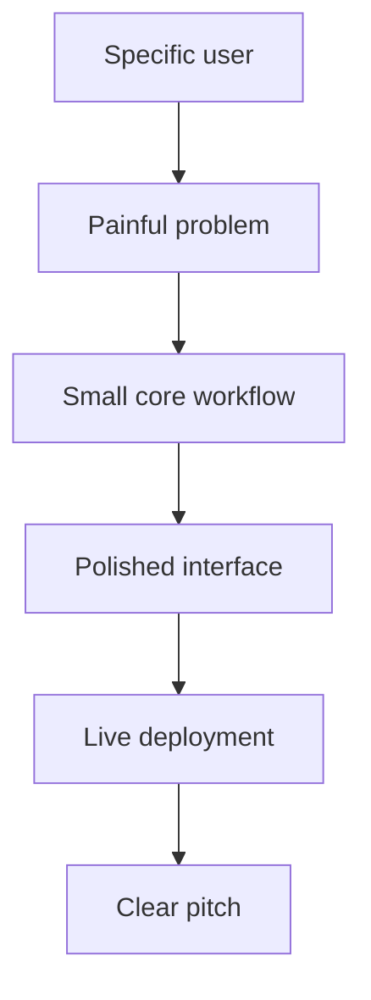

# 04. Winning Project Ideas

Choosing the right hackathon idea is one of the biggest factors in winning. 
The best hackathon projects solve real-world problems, are demo-friendly, 
and can be built as an MVP within 24–48 hours.

## Winning idea formula

## Idea categories

| Category | Strong angle |
|---|---|
| AI | Time-saving assistant with a focused workflow |
| Healthcare | Booking, triage, reminders, or summaries |
| Education | Student productivity and learning systems |
| Fintech | Tracking, detection, and clarity |
| Agriculture | Pricing, forecasting, and logistics |
| Cybersecurity | Simple alerts and safe workflows |
| Climate Tech | Monitoring, optimization, and awareness |
| Women Safety | Route, alert, and support systems |
| Mental Health | Check-ins, support, and guided help |
| Accessibility | Conversion, simplification, and navigation |
| Student Life | Deadlines, attendance, and internships |
| Productivity | Workflow automation and focus systems |
| Local Commerce | Discovery, support, and loyalty |
| Creator Economy | Comment handling, sponsorship, and analytics |
| Social Good | Queueing, donation, or complaint systems |
| College Problems | Campus operations and communication |
| Recruitment | Screening, matching, and outreach |
| Fraud Detection | Detection, scoring, and alerts |
| Logistics | Status, routing, and delivery visibility |
| Transportation | Live tracking and delay reduction |

## Curated ideas

### AI ideas
- Resume assistant that rewrites bullets and scores ATS fit
- Meeting notes extractor with action items
- Document question answerer for college forms
- Support reply assistant for small businesses

### Education ideas
- Assignment deadline tracker with reminders
- Internship pipeline tracker
- Study group matcher
- Exam revision planner

### Healthcare ideas
- Clinic queue predictor
- Medicine reminder assistant
- Prescription explanation helper
- Appointment booking with multilingual support

### Fintech ideas
- Expense receipt vault
- Freelance invoice tracker
- Fraud alert dashboard
- Subscription leak detector

### Climate and civic ideas
- Complaint escalation tracker
- Waste pickup coordination tool
- Water usage monitor
- Public service status explainer

## How to choose the right idea

Ask:
- Can I build the core loop in a few hours?
- Can I show the user benefit in one demo?
- Can I describe the value in one sentence?
- Does the problem feel urgent?
- Does the project look stronger when polished?

## Demo logic

The demo should follow:
1. Problem
2. Current pain
3. Product action
4. Result
5. Why it matters

## Scaling potential

A good hackathon idea can later grow into:
- a student tool,
- a SaaS product,
- an open-source project,
- a community app,
- or a startup prototype.

That future story helps judges see value beyond the event.
