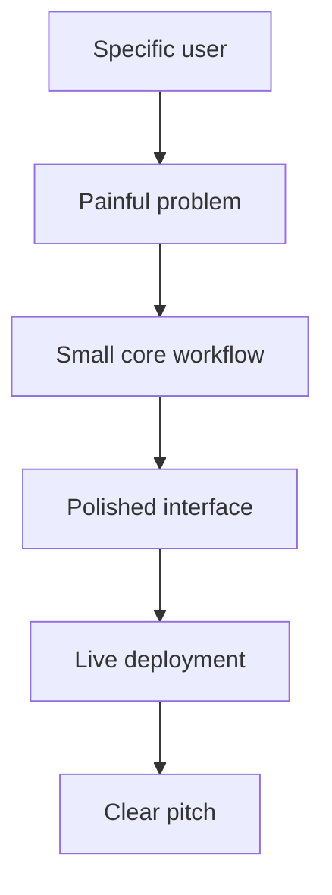

# 04. Winning Project Ideas

Choosing the right hackathon idea is one of the biggest factors in winning. 
The best hackathon projects solve real-world problems, are demo-friendly, 
and can be built as an MVP within 24–48 hours.

## Winning idea formula

```mermaid
flowchart TD
    A[Specific user] --> B[Painful problem]
    B --> C[Small core workflow]
    C --> D[Polished interface]
    D --> E[Live deployment]
    E --> F[Clear pitch]
```

## Idea categories

| Category | Strong angle |
|---|---|
| AI | Time-saving assistant with a focused workflow |
| Healthcare | Booking, triage, reminders, or summaries |
| Education | Student productivity and learning systems |
| Fintech | Tracking, detection, and clarity |
| Agriculture | Pricing, forecasting, and logistics |
| Cybersecurity | Simple alerts and safe workflows |
| Climate Tech | Monitoring, optimization, and awareness |
| Women Safety | Route, alert, and support systems |
| Mental Health | Check-ins, support, and guided help |
| Accessibility | Conversion, simplification, and navigation |
| Student Life | Deadlines, attendance, and internships |
| Productivity | Workflow automation and focus systems |
| Local Commerce | Discovery, support, and loyalty |
| Creator Economy | Comment handling, sponsorship, and analytics |
| Social Good | Queueing, donation, or complaint systems |
| College Problems | Campus operations and communication |
| Recruitment | Screening, matching, and outreach |
| Fraud Detection | Detection, scoring, and alerts |
| Logistics | Status, routing, and delivery visibility |
| Transportation | Live tracking and delay reduction |

## Curated ideas

### AI ideas
- Resume assistant that rewrites bullets and scores ATS fit
- Meeting notes extractor with action items
- Document question answerer for college forms
- Support reply assistant for small businesses

### Education ideas
- Assignment deadline tracker with reminders
- Internship pipeline tracker
- Study group matcher
- Exam revision planner

### Healthcare ideas
- Clinic queue predictor
- Medicine reminder assistant
- Prescription explanation helper
- Appointment booking with multilingual support

### Fintech ideas
- Expense receipt vault
- Freelance invoice tracker
- Fraud alert dashboard
- Subscription leak detector

### Climate and civic ideas
- Complaint escalation tracker
- Waste pickup coordination tool
- Water usage monitor
- Public service status explainer

## How to choose the right idea

Ask:
- Can I build the core loop in a few hours?
- Can I show the user benefit in one demo?
- Can I describe the value in one sentence?
- Does the problem feel urgent?
- Does the project look stronger when polished?

## Demo logic

The demo should follow:
1. Problem
2. Current pain
3. Product action
4. Result
5. Why it matters

## Scaling potential

A good hackathon idea can later grow into:
- a student tool,
- a SaaS product,
- an open-source project,
- a community app,
- or a startup prototype.

That future story helps judges see value beyond the event.

## Idea differentiation matrix

At any decent hackathon, 5-10 teams will have a similar idea. An AI chatbot, a health tracker, an education tool — you are never the only one. The question is: how do you make yours the one judges remember?

Use this matrix to find your edge:

| Dimension | Weak (everyone does this) | Strong (stands out) |
|---|---|---|
| User | "Students" | "First-year engineering students at government colleges" |
| Problem | "Hard to study" | "No way to know which topics are most likely to appear on next week's exam" |
| Approach | "AI-powered" (vague) | "Extracts patterns from 5 years of past papers and generates a personalized study plan" |
| Demo | Slides showing screenshots | Live walkthrough with a real user scenario |
| Data | Fake or hardcoded | Real data or a believable simulation |
| Deployment | "Runs on my laptop" | Live URL that judges can visit on their phones |
| Impact | "Helps students" | "Students using this save 4 hours per week on exam prep" |

**The rule:** specificity wins. The more specific your user, problem, and solution, the more memorable you become. "AI for healthcare" is forgettable. "Appointment reminder for rural clinics with no internet" is not.

### How to apply this

Take your current idea and fill in each row. If your answers are in the "weak" column, you have work to do. Rewrite your one-liner until every piece is specific.

**Before:** "An AI-powered study assistant for students."
**After:** "An AI study planner that analyzes your past exam performance and tells you exactly what to review this week."

The second version is a sentence a judge can repeat to the next team.

## Sponsor-aligned idea generator

Sponsors do not just fund hackathons — they want to see their tools used well. Matching your idea to what a sponsor cares about gives you a real advantage.

**Step 1: Read the sponsor track carefully.**
Every hackathon sponsor publishes what they want you to build with. Do not skim this. Read it twice. Underline the key verbs — "integrate," "demonstrate," "leverage."

**Step 2: List the sponsor's products or APIs.**
Write down exactly what they want you to use. If it is Google, they might want Gemini or Vertex AI. If it is MongoDB, they want to see Atlas or their vector database.

**Step 3: Find the overlap.**
Where does your idea meet their product? The sweet spot is when your real problem naturally requires their tool. If you have to force their API into your project, judges will notice.

**Step 4: Make the integration visible.**
Do not just use the sponsor's tool in the backend. Show it in the demo. If you used their AI model, show the model's response on screen. If you used their database, show the data flow.

**Example alignment:**

| Sponsor | What they want | Your idea angle |
|---|---|---|
| Google | Gemini API usage | A document summarizer that uses Gemini to extract key points from legal contracts |
| MongoDB | Atlas usage | A student project tracker with MongoDB Atlas as the real-time data layer |
| Microsoft | Azure / Copilot | A code review assistant that uses Azure OpenAI to suggest improvements |
| Stripe | Payment integration | A freelance invoice tool with Stripe-powered payment links |
| Twilio | Communication APIs | A clinic appointment system with SMS reminders via Twilio |

**Do not:** build something unrelated and slap the sponsor's API on at the end. Judges see through this instantly.

**Do:** choose a problem where the sponsor's tool is the natural solution. Then talk about it in your pitch.

## Seasonal and trending ideas for 2026

Some problem areas are especially hot right now. Building in these spaces gives you topicality points with judges and aligns with where the industry is headed.

### AI agents

Forget simple chatbots. In 2026, judges want to see AI agents that can take actions, not just answer questions. Think: an agent that books your travel, an agent that triages your emails and drafts replies, an agent that monitors your code and suggests refactors. The key is multi-step reasoning with real-world output.

**Hackathon angle:** Build an agent that does 3-5 steps of a workflow autonomously. Show the decision-making process on screen so judges can see it "thinking."

### Climate tech

Sustainability is no longer niche. Hackathons are dedicating entire tracks to climate solutions. Carbon tracking for small businesses, energy usage monitors, waste reduction tools, supply chain transparency — these are all fair game and increasingly well-funded.

**Hackathon angle:** Combine IoT or real-time data with a simple dashboard. A school that tracks its water usage with a $10 sensor and a web dashboard is a great hackathon project.

### Accessibility

The web is still terrible for people with disabilities. Tools that convert text to simpler language, generate alt text for images, improve navigation for screen readers, or help people with cognitive disabilities — these projects have real social impact and judges love them.

**Hackathon angle:** Pick one specific disability and one specific platform. "Alt text generator for Instagram posts" is better than "accessibility tool."

### Mental health

Student mental health is a crisis, and judges know it. Check-in tools, mood trackers, peer support platforms, guided breathing apps, journaling assistants — these projects resonate emotionally and have clear user value.

**Hackathon angle:** Focus on a specific trigger. "Exam stress check-in for first-year students" is more powerful than "mental health app." Keep it lightweight — you are not building a replacement for therapy.

### Edtech with AI personalization

Generic learning platforms are everywhere. What is not everywhere is truly personalized learning that adapts to how an individual student learns. Spaced repetition, adaptive quizzes, learning style detection — these are areas where AI can genuinely help.

**Hackathon angle:** Show personalization in action. Let a judge take a quiz, then show how the system adapts based on their answers.

### Rural and underserved community tech

Tech for tier-2 and tier-3 cities, for farmers, for small shopkeepers, for people with limited connectivity — this is where the real impact is. Offline-first apps, multilingual interfaces, SMS-based tools, simple WhatsApp integrations.

**Hackathon angle:** Show the tool working on a low-end phone or with a bad internet connection. That is a powerful demo moment.
