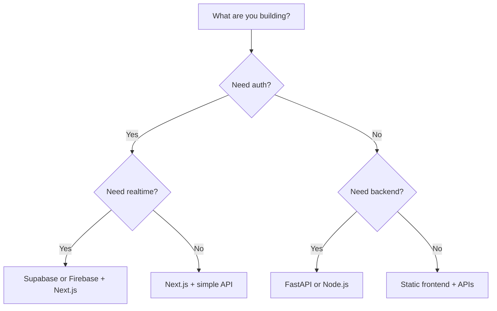

# 05. Tech Stack Chooser

A good stack is not the most powerful stack. It is the stack that gets you to a working demo fastest.

## Stack selection logic

## Fastest stacks

| Project type | Recommended stack | Why |
|---|---|---|
| AI web app | Next.js + API route + OpenRouter or Gemini + Supabase | Fast, modern, deploys easily |
| Dashboard | Next.js + Supabase + charts | Clean UI and data layer |
| Chat app | Next.js + Firebase or Supabase realtime | Easy auth and realtime |
| CRUD tool | React or Next.js + backendless DB | Minimal moving parts |
| ML demo | FastAPI + simple frontend | Easier model serving |
| Internal tool | Next.js + auth + database | Fast to ship |
| Simple landing + waitlist | Next.js static + forms | Very fast |

## Compare the common choices

| Tool | Strengths | Limitations | Best use |
|---|---|---|---|
| Next.js | Full-stack, polished UX, great deployment | Can be overkill for tiny scripts | Most hackathon web apps |
| React | Flexible UI layer | Requires more setup | Frontend-only builds |
| Firebase | Auth, database, hosting, speed | Vendor lock-in, model complexity | Student tools and quick apps |
| Supabase | Postgres, auth, realtime, SQL | More setup than pure no-code | Products needing structured data |
| Node.js | Huge ecosystem | Backend design choices can sprawl | APIs, auth, integrations |
| FastAPI | Fast Python APIs, clean docs | Needs frontend layer | AI and data apps |
| Flask | Simple, lightweight | Less structure than FastAPI | Tiny prototypes |
| Django | Batteries included | Can be heavier for hackathons | Admin-heavy systems |
| MongoDB | Flexible documents | Not always ideal for relational data | Rapid prototyping |
| PostgreSQL | Strong, reliable, scalable | Slightly more design work | Serious product data |
| Neon | Serverless Postgres | Dependency on cloud setup | Quick hosted SQL |
| Railway | Fast deploy and infra | Credit planning matters | Full-stack prototypes |
| Render | Easy web services and background jobs | Platform limits | Stable deployments |
| Cloudflare Pages | Very fast static hosting | Backend needs separate service | Frontend-first projects |
| Convex | Fast app backend and realtime patterns | Opinionated ecosystem | Rapid collaborative apps |

## Practical recommendations

### Build fast
Use:
- Next.js
- Supabase
- Vercel
- Tailwind
- a small API layer

### Build with Python
Use:
- FastAPI
- PostgreSQL or Supabase
- Render or Railway

### Build with AI
Use:
- Next.js or FastAPI
- OpenRouter, Gemini, or Groq
- simple prompt templates
- a strong fallback flow

## Best stack by scenario

| Scenario | Stack |
|---|---|
| Student tracker | Next.js + Supabase + Vercel |
| AI assistant | Next.js + OpenRouter + Supabase |
| OCR workflow | FastAPI + OCR API + Postgres |
| Analytics dashboard | Next.js + Supabase + chart library |
| Realtime collaboration | Firebase or Supabase realtime |
| Hackathon MVP in 6 hours | Next.js + Supabase + Vercel |

## Avoid these mistakes

- Choosing a stack because it feels advanced
- Adding Docker too early
- Mixing too many backend tools
- Choosing three databases
- Building a custom auth system from scratch
- Using an unfamiliar framework under time pressure

## Rule of thumb

If the stack makes your demo harder to explain, it is probably too much.
