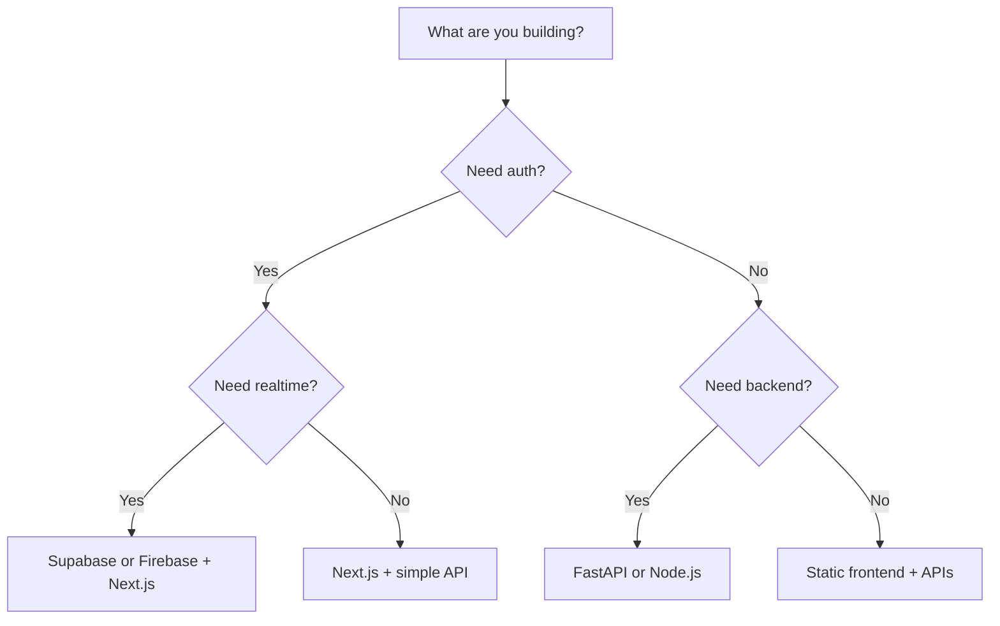

# 05. Tech Stack Chooser

A good stack is not the most powerful stack. It is the stack that gets you to a working demo fastest.

## Stack selection logic

```mermaid
flowchart TD
    A[What are you building?] --> B{Need auth?}
    B -->|Yes| C{Need realtime?}
    B -->|No| D{Need backend?}
    C -->|Yes| E[Supabase or Firebase + Next.js]
    C -->|No| F[Next.js + simple API]
    D -->|Yes| G[FastAPI or Node.js]
    D -->|No| H[Static frontend + APIs]
```

## Fastest stacks

| Project type | Recommended stack | Why |
|---|---|---|
| AI web app | Next.js + API route + OpenRouter or Gemini + Supabase | Fast, modern, deploys easily |
| Dashboard | Next.js + Supabase + charts | Clean UI and data layer |
| Chat app | Next.js + Firebase or Supabase realtime | Easy auth and realtime |
| CRUD tool | React or Next.js + backendless DB | Minimal moving parts |
| ML demo | FastAPI + simple frontend | Easier model serving |
| Internal tool | Next.js + auth + database | Fast to ship |
| Simple landing + waitlist | Next.js static + forms | Very fast |

## Compare the common choices

| Tool | Strengths | Limitations | Best use |
|---|---|---|---|
| Next.js | Full-stack, polished UX, great deployment | Can be overkill for tiny scripts | Most hackathon web apps |
| React | Flexible UI layer | Requires more setup | Frontend-only builds |
| Firebase | Auth, database, hosting, speed | Vendor lock-in, model complexity | Student tools and quick apps |
| Supabase | Postgres, auth, realtime, SQL | More setup than pure no-code | Products needing structured data |
| Node.js | Huge ecosystem | Backend design choices can sprawl | APIs, auth, integrations |
| FastAPI | Fast Python APIs, clean docs | Needs frontend layer | AI and data apps |
| Flask | Simple, lightweight | Less structure than FastAPI | Tiny prototypes |
| Django | Batteries included | Can be heavier for hackathons | Admin-heavy systems |
| MongoDB | Flexible documents | Not always ideal for relational data | Rapid prototyping |
| PostgreSQL | Strong, reliable, scalable | Slightly more design work | Serious product data |
| Neon | Serverless Postgres | Dependency on cloud setup | Quick hosted SQL |
| Railway | Fast deploy and infra | Credit planning matters | Full-stack prototypes |
| Render | Easy web services and background jobs | Platform limits | Stable deployments |
| Cloudflare Pages | Very fast static hosting | Backend needs separate service | Frontend-first projects |
| Convex | Fast app backend and realtime patterns | Opinionated ecosystem | Rapid collaborative apps |

## Practical recommendations

### Build fast
Use:
- Next.js
- Supabase
- Vercel
- Tailwind
- a small API layer

### Build with Python
Use:
- FastAPI
- PostgreSQL or Supabase
- Render or Railway

### Build with AI
Use:
- Next.js or FastAPI
- OpenRouter, Gemini, or Groq
- simple prompt templates
- a strong fallback flow

## Best stack by scenario

| Scenario | Stack |
|---|---|
| Student tracker | Next.js + Supabase + Vercel |
| AI assistant | Next.js + OpenRouter + Supabase |
| OCR workflow | FastAPI + OCR API + Postgres |
| Analytics dashboard | Next.js + Supabase + chart library |
| Realtime collaboration | Firebase or Supabase realtime |
| Hackathon MVP in 6 hours | Next.js + Supabase + Vercel |

## Avoid these mistakes

- Choosing a stack because it feels advanced
- Adding Docker too early
- Mixing too many backend tools
- Choosing three databases
- Building a custom auth system from scratch
- Using an unfamiliar framework under time pressure

## Rule of thumb

If the stack makes your demo harder to explain, it is probably too much.

## Stack comparison benchmarks

When you are choosing a stack, actual performance numbers matter more than opinions. Here are real-world benchmarks for common hackathon stacks.

### Build and deploy times

| Stack | Initial setup | First deploy | Subsequent deploys | Cold start (serverless) |
|---|---|---|---|---|
| Next.js + Vercel | 3-5 min | 2-3 min | 30-60 sec | 200-500ms |
| Next.js + Supabase + Vercel | 5-8 min | 3-5 min | 30-60 sec | 200-500ms |
| React + Firebase | 5-8 min | 5-8 min | 1-2 min | 300-800ms |
| FastAPI + Render | 8-12 min | 3-5 min | 2-3 min | 30-60 sec (free tier spins down) |
| FastAPI + Railway | 5-8 min | 2-3 min | 1-2 min | 500ms-1s |
| Flutter + Firebase | 10-15 min | 5-10 min | 2-5 min | N/A (mobile) |
| Django + Railway | 10-15 min | 3-5 min | 1-2 min | 500ms-1s |
| Static HTML + Cloudflare Pages | 1 min | 1-2 min | 30 sec | N/A |

**What this means for you:** If you have 24 hours, you can afford about 2 hours of setup and deploy issues. Next.js + Vercel is the fastest path to a live URL. If you are using Python, Railway is faster than Render for iterative deploys.

### Database performance

| Database | Write speed | Query speed | Best for | Free tier limit |
|---|---|---|---|---|
| Supabase (Postgres) | Fast | Fast | Structured data, relationships | 500MB storage, 50K rows |
| Firebase Firestore | Fast | Medium | Realtime, nested documents | 1GB storage, 50K reads/day |
| MongoDB Atlas | Fast | Medium | Flexible schemas, rapid prototyping | 512MB storage |
| Neon (Postgres) | Fast | Fast | Serverless SQL | 512MB storage |
| PlanetScale | Fast | Fast | MySQL-compatible, branching | 5GB storage (limited) |
| Turso (SQLite edge) | Very fast | Very fast | Low-latency reads at the edge | 9GB storage |

**What this means for you:** For most hackathons, Supabase gives you the best balance of speed, features, and free tier. Firebase is better if you need realtime by default. If your data is simple, even a JSON file in your repo works.

## Migration guide

Sometimes you start with one stack and realize mid-hackathon you need to switch. Here are the three most common migrations.

### Migration 1: Firebase to Supabase

**Why:** Firebase pricing is confusing, the query model is limiting, and Supabase gives you real SQL.

**Steps:**
1. Set up a Supabase project (2 minutes).
2. Create tables that match your Firestore collections.
3. Replace Firebase Auth with Supabase Auth (very similar API).
4. Swap Firestore queries for Supabase client queries.
5. Update your environment variables.

**Time cost:** 1-2 hours depending on how much data logic you have.
**Risk:** Low. Supabase client libraries are straightforward.

### Migration 2: Flask to FastAPI

**Why:** Flask gets messy without structure. FastAPI gives you automatic docs, type hints, and better performance.

**Steps:**
1. Install FastAPI and uvicorn.
2. Convert your Flask routes to FastAPI route decorators.
3. Replace `request.json` with Pydantic models.
4. Add `async` where it helps (database calls, API calls).
5. Run with `uvicorn main:app --reload`.

**Time cost:** 30-60 minutes for a small app.
**Risk:** Low. The syntax is similar enough that you can convert incrementally.

### Migration 3: React to Next.js

**Why:** You started with a pure frontend but realize you need API routes, SSR, or better routing.

**Steps:**
1. Create a Next.js project with `npx create-next-app`.
2. Move your React components into the `app/` or `pages/` directory.
3. Convert any `fetch` calls to API routes in the `app/api/` directory.
4. Update your routing from React Router to Next.js file-based routing.
5. Deploy to Vercel.

**Time cost:** 1-2 hours.
**Risk:** Medium. Routing changes can break things if you have complex navigation.

## Stack by budget

Most hackathon teams have a $0 budget. Here is what you can do for free and when you will hit limits.

| Platform | Free tier | What you get | When you hit the wall |
|---|---|---|---|
| Vercel | Hobby plan | 100GB bandwidth, serverless functions, custom domains | 100GB bandwidth/month, team features require paid plan |
| Netlify | Free tier | 100GB bandwidth, forms, serverless functions | 100GB bandwidth, 125K invocations/month |
| Supabase | Free tier | 500MB database, 50K monthly active users, 1GB file storage | 500MB storage, 50K MAU, project pauses after 7 days inactivity |
| Firebase | Spark plan | 1GB Firestore, 10GB hosting, 50K reads/day | 1GB storage, 50K reads/day, 20K writes/day |
| Railway | $5 free credit | Full-stack hosting, databases, cron jobs | $5 runs out in about 500 hours of basic usage |
| Render | Free tier | Web services, PostgreSQL | Free tier services spin down after inactivity (slow cold starts) |
| Cloudflare Pages | Free | Unlimited bandwidth, edge functions | 500 builds/month, 1 worker per project |
| Neon | Free tier | 512MB Postgres, branching | 512MB storage, compute hours limited |
| MongoDB Atlas | Free tier | 512MB cluster | 512MB storage, shared RAM |

**Strategy for a 24-hour hackathon:** Stay on free tiers. The only thing you might run out of is Supabase storage if you upload a lot of files. Use Vercel for frontend, Supabase for backend, and you will be fine for the event. Worry about scaling after you win.

## Mobile app stacks

If your hackathon project needs a mobile app, you have three realistic options.

### Flutter

**Pros:**
- Single codebase for iOS and Android
- Hot reload is fast and reliable
- Beautiful Material Design and Cupertino widgets out of the box
- Strong Google backing and growing community

**Cons:**
- Dart is less common than JavaScript — learning curve if you do not know it
- Web support is improving but not production-ready
- Some native integrations require platform-specific code

**Best for:** Projects where visual polish matters and you need both iOS and Android.

### React Native (bare workflow)

**Pros:**
- JavaScript/TypeScript — most web devs already know it
- Huge ecosystem of libraries
- Direct access to native modules when needed
- Expo makes setup much easier

**Cons:**
- Debugging can be painful (Metro bundler issues, native module conflicts)
- Performance is not as smooth as Flutter for complex animations
- Version updates can break things

**Best for:** Teams with strong React/JavaScript experience who want native performance.

### Expo

**Pros:**
- React Native without the pain — managed workflow handles native code for you
- `expo build` and EAS Build for easy APK/IPA generation
- Expo Router for file-based routing (feels like Next.js)
- Tons of built-in modules (camera, notifications, maps, etc.)

**Cons:**
- Some native features require ejecting or using config plugins
- Large app sizes compared to bare React Native
- You are somewhat locked into Expo's ecosystem

**Best for:** Hackathon projects where you need a mobile app fast and do not want to deal with native build tooling.

### Quick comparison

| Factor | Flutter | React Native | Expo |
|---|---|---|---|
| Setup time | 10-15 min | 15-30 min | 5-10 min |
| Build to device | Fast | Medium | Fast (EAS Build) |
| Learning curve (for web devs) | Medium (Dart) | Low (JS/TS) | Low (JS/TS) |
| UI polish out of box | High | Medium | Medium |
| Native feature access | Good | Full (bare) | Limited (managed) |
| Hackathon recommendation | Use if team knows Dart | Use if team knows React | Best default choice |

**Hackathon advice:** If you are building a mobile app for a hackathon, use Expo. It is the fastest path from zero to a working app on a real phone. You can always eject later if you need deep native features — but for most hackathon demos, you will not.
