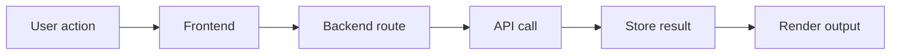

# 06. Free APIs Mega List

APIs are how hackathon projects stop being fake.

A good API can turn a basic idea into something that feels real, responsive, and useful. But picking the wrong one, or overloading your project with too many, can sink your entire demo. This section covers not just what's available — but how to actually combine them, stay within free tiers, and avoid the failure modes that kill presentations.

## How to use this list

Pick APIs by job, not by hype:
- AI needs a model or reasoning service
- maps need geolocation
- notifications need email or SMS
- forms need authentication and storage
- voice needs speech-to-text or text-to-speech
- dashboards need structured data

Don't add an API because it sounds impressive. Add it because it solves a specific problem in your demo flow.

## API selection rules

- Use the simplest API that solves the core problem.
- Prefer one strong API over three weak ones.
- Do not add APIs just to look advanced.
- Check free tier rules before the hackathon starts.
- Keep a fallback if the API fails.

## Mega list

See [api-database.md](api-database.md) for the full table.

## Best categories for hackathons

| Category | Why it matters |
|---|---|
| AI | Fast wow factor and useful workflows |
| Maps | Strong demo clarity and location use cases |
| Weather | Easy integration and good utility |
| Finance | Practical dashboards and tracking |
| OCR | Excellent for document-heavy workflows |
| Voice | Makes demos feel dynamic |
| Email | Easy notification systems |
| Auth | Required for serious products |
| Payments | Useful for business-like products |
| Open data | Strong social and civic use cases |

## API combination recipes — 10 project architectures that work

These are battle-tested combos where the APIs play well together and the demo tells a clear story.

### 1. AI + Maps + Auth = Smart Location App
Use OpenAI for reasoning, Mapbox or Google Maps for geolocation, and Supabase Auth for user accounts. Example: "Find me the best coffee shops near me" — the AI interprets the query, the map plots results, auth saves preferences.

### 2. Weather + Finance + Charts = Portfolio Risk Dashboard
Combine OpenWeatherMap with a free financial API (like Alpha Vantage or Finnhub). Render with Chart.js or Recharts. Example: "How does rain affect my coffee stock?" — sounds silly, but judges love creative connections.

### 3. OCR + AI + Email = Document Auto-Processor
Tesseract or Google Cloud Vision extracts text from uploaded images, GPT summarizes it, SendGrid emails the summary. Example: "Upload a receipt, get a categorized expense report in your inbox."

### 4. Voice + AI + Database = Voice-Powered Assistant
Whisper for speech-to-text, GPT for understanding, Supabase for storing conversation history. Example: "Talk to your notes app" — speak a task, it gets saved and categorized.

### 5. Maps + Weather + AI = Trip Planner
Google Maps for routes, OpenWeatherMap for forecasts, GPT for recommendations. Example: "Plan my weekend road trip" — the AI picks stops based on weather and drive times.

### 6. Auth + Payments + AI = SaaS Starter
Supabase Auth for login, Stripe for payments, OpenAI for a premium feature. Example: "AI-powered resume reviewer with a free tier and paid unlock."

### 7. Open Data + Maps + Charts = Civic Impact Tool
Use data.gov or Census APIs for public datasets, plot on a map, add charts. Example: "Show me air quality by neighborhood" — strong for social impact pitches.

### 8. Email + AI + Calendar = Smart Scheduler
SendGrid for notifications, GPT for parsing meeting notes, Google Calendar API for scheduling. Example: "Email me meeting notes and auto-block focus time."

### 9. Weather + AI + Voice = Daily Briefing Bot
OpenWeatherMap for conditions, GPT for generating a friendly summary, ElevenLabs for text-to-speech. Example: "Your morning briefing, read aloud by AI."

### 10. OCR + Maps + Auth = Location-Based Document Scanner
Tesseract for extracting addresses from documents, Google Maps for geocoding, Supabase for storing scans. Example: "Scan a business card, pin it on a map."

## Rate limit cheat sheet — top 10 APIs

| API | Free Tier | Rate Limit | Reset Period | Gotcha |
|---|---|---|---|---|
| OpenAI | $5 credit | 3 RPM (tier 0) | Per minute | Credit runs out fast — batch requests |
| OpenWeatherMap | 1,000 calls/day | 60/minute | Daily | Stops returning data silently at limit |
| Google Maps | $200/month credit | 50 QPS | Per second | Credit expires monthly, not daily |
| Alpha Vantage | 25 calls/day | 5/minute | Daily | 25 is brutal — cache aggressively |
| SendGrid | 100 emails/day | — | Daily | Spams go to junk — use real templates |
| Supabase | 500MB database | No strict RPM | — | Storage limits matter more than calls |
| Stripe | Unlimited sandbox | No limit | — | Sandbox ≠ production — don't demo with test keys showing |
| Mapbox | 100,000 loads/month | No strict RPM | Monthly | Token exposure in frontend is okay |
| ElevenLabs | 10,000 characters/month | — | Monthly | Characters count fast — keep audio short |
| Tesseract/OCR | Unlimited (local) | No limit | — | Accuracy drops hard on low-res images |

## Fallback API recommendations

When your primary API goes down mid-demo, you need a backup. Here's what to swap to:

| Primary API | Fallback | Why |
|---|---|---|
| OpenAI GPT | Claude API or local Ollama | Different provider, similar interface |
| OpenWeatherMap | WeatherAPI.com | Both free, similar endpoints |
| Google Maps | Leaflet + OpenStreetMap | Free, no API key needed |
| Stripe | PayPal sandbox | Similar flow, different integration |
| SendGrid | Resend or Nodemailer | Both support transactional email |
| Firebase Auth | Supabase Auth | Both free, similar setup |
| Alpha Vantage | Finnhub (free tier) | Finnhub is more generous |
| Cloudinary | Uploadcare | Both handle image optimization |

The key: mock your fallback data locally. If the API fails, return cached JSON that looks like the real response. The judges won't know, and your demo stays intact.

## API integration checklist — what to test before demo

Run through this list 2 hours before you present:

- [ ] Every API call works with the real endpoint (not just mocks)
- [ ] Environment variables are set in production, not just locally
- [ ] Rate limits won't be hit during a 5-minute demo
- [ ] Error responses are handled gracefully (no blank screens)
- [ ] Loading states exist for every API call
- [ ] API keys are not exposed in the frontend code
- [ ] Fallback data is ready if the API is slow
- [ ] Response times are under 3 seconds for the demo flow
- [ ] CORS is configured correctly for your domain
- [ ] You've tested on a different network than your dev environment

## Real code snippets — API calls with error handling

### fetch with timeout and retry

```javascript
async function callAPI(url, options = {}, retries = 2) {
  const controller = new AbortController();
  const timeout = setTimeout(() => controller.abort(), 8000);

  for (let attempt = 0; attempt <= retries; attempt++) {
    try {
      const response = await fetch(url, {
        ...options,
        signal: controller.signal,
      });

      if (!response.ok) {
        throw new Error(`HTTP ${response.status}: ${response.statusText}`);
      }

      const data = await response.json();
      clearTimeout(timeout);
      return { data, error: null };
    } catch (err) {
      if (attempt === retries) {
        clearTimeout(timeout);
        return { data: null, error: err.message };
      }
      await new Promise(r => setTimeout(r, 1000 * (attempt + 1)));
    }
  }
}

// Usage
const { data, error } = await callAPI(
  'https://api.openweathermap.org/data/2.5/weather?q=London&appid=' + import.meta.env.VITE_WEATHER_KEY
);

if (error) {
  showToast('Weather data unavailable. Showing cached results.');
  data = getCachedWeather();
}
```

### Supabase query with error handling

```javascript
import { createClient } from '@supabase/supabase-js';

const supabase = createClient(
  import.meta.env.VITE_SUPABASE_URL,
  import.meta.env.VITE_SUPABASE_KEY
);

async function getProjects(userId) {
  const { data, error } = await supabase
    .from('projects')
    .select('*')
    .eq('user_id', userId)
    .order('created_at', { ascending: false })
    .limit(10);

  if (error) {
    console.error('Supabase error:', error.message);
    return { projects: [], error: 'Failed to load projects' };
  }

  return { projects: data, error: null };
}
```

### OpenAI call with streaming

```javascript
async function summarizeText(text) {
  try {
    const response = await fetch('https://api.openai.com/v1/chat/completions', {
      method: 'POST',
      headers: {
        'Content-Type': 'application/json',
        'Authorization': `Bearer ${import.meta.env.VITE_OPENAI_KEY}`,
      },
      body: JSON.stringify({
        model: 'gpt-3.5-turbo',
        messages: [
          { role: 'system', content: 'Summarize the following text in 2-3 sentences.' },
          { role: 'user', content: text },
        ],
        max_tokens: 150,
      }),
    });

    if (!response.ok) {
      throw new Error(`OpenAI API error: ${response.status}`);
    }

    const result = await response.json();
    return result.choices[0].message.content;
  } catch (err) {
    console.error('AI summarization failed:', err);
    return 'Summary unavailable. Please try again later.';
  }
}
```

## API cost calculator — what you'll actually pay after free tier

Most free tiers sound generous until you do the math. Here's what a typical hackathon project actually costs:

| Scenario | API Calls | Free Tier | Overage Cost | Real Cost |
|---|---|---|---|---|
| Weather app (100 users/day) | 300 calls | 1,000/day free | $0.0015/call | $0 |
| AI chatbot (50 queries/day) | 50 calls | $5 credit (~750 calls) | $0.002/call | $0 for hackathon |
| Map-heavy app (200 loads/day) | 200 loads | $200/month credit | $0.007/load | $0 for hackathon |
| Email notifications (100/day) | 100 emails | 100/day free | $0.0001/email | $0 — right at limit |
| Image uploads (50/day) | 50 uploads | 25 credits/day (Cloudinary) | $0.01/upload | $0 for hackathon |

**The honest math:** Most hackathon projects stay within free tiers if you cache aggressively and don't make redundant calls. The real cost risk is OpenAI — a $5 credit sounds like a lot, but GPT-4 calls eat through it fast. Stick to GPT-3.5-turbo for demos.

## The API that kills your demo — common failure modes and how to prevent them

### 1. The silent timeout
**What happens:** The API takes 10+ seconds. The judge thinks your app is broken.
**Prevention:** Always set a timeout (8 seconds max). Show a loading spinner immediately. Have cached data ready.

### 2. The rate limit surprise
**What happens:** You demo 5 times, and by the 6th time, the API returns 429.
**Prevention:** Know your rate limits. If you're at a hackathon with 20 demos planned, you need 20x your single-call quota. Cache responses aggressively.

### 3. The environment variable ghost
**What happens:** Works on localhost, breaks in production because you forgot to set the env var.
**Prevention:** Before deploying, check every `import.meta.env` or `process.env` reference. Add a startup check that validates all required keys exist.

### 4. The CORS error
**What happens:** The browser blocks the API call because the server doesn't allow your origin.
**Prevention:** Test with your production URL early. Most free APIs have CORS issues — use a backend proxy if needed.

### 5. The key exposure
**What happens:** Your API key is visible in the browser's network tab. Judges notice. Security-conscious judges dock points.
**Prevention:** Never put API keys in frontend code. Use a backend route or serverless function as a proxy.

### 6. The data format mismatch
**What happens:** The API returns nested JSON, and your frontend expects flat data. Everything renders as `undefined`.
**Prevention:** Log the full API response in development. Write a simple transform function that maps API data to your component's expected shape.

### 7. The free tier cliff
**What happens:** Your app works perfectly during development, but the free tier expires mid-hackathon.
**Prevention:** Check free tier reset dates before the event. Some reset daily, some monthly. Alpha Vantage's 25 calls/day limit is particularly brutal.

## API stack pattern



## Build pattern

1. Start with one API.
2. Save the output.
3. Show the result immediately.
4. Add one extra layer only if it strengthens the demo.
5. Keep a fallback mode.

## API testing strategy for hackathons

Don't overthink testing. You need three things:

**1. A smoke test for every API call**
```javascript
// Quick check before demo
async function smokeTest() {
  const tests = [
    { name: 'Weather', fn: () => callWeatherAPI('New York') },
    { name: 'AI', fn: () => summarizeText('Hello world') },
    { name: 'Database', fn: () => getProjects('test-user') },
  ];

  for (const test of tests) {
    try {
      await test.fn();
      console.log(`✅ ${test.name} OK`);
    } catch {
      console.log(`❌ ${test.name} FAILED`);
    }
  }
}
```

**2. A mock data layer**
```javascript
const mockWeather = {
  main: { temp: 72 },
  weather: [{ description: 'clear sky' }],
  name: 'New York',
};

function getWeather(city) {
  if (import.meta.env.DEV) return Promise.resolve(mockWeather);
  return fetchWeatherAPI(city);
}
```

**3. A cached response store**
Keep a `cache/` directory with JSON files for each API endpoint. If the live call fails, serve the cached version. Judges won't notice the difference during a 5-minute demo.

## Final advice

The best hackathon APIs are boring, reliable, and well-understood. Don't use a cutting-edge API you've never tested. The goal isn't to showcase the API — it's to showcase your idea. The API is plumbing, not the product.
