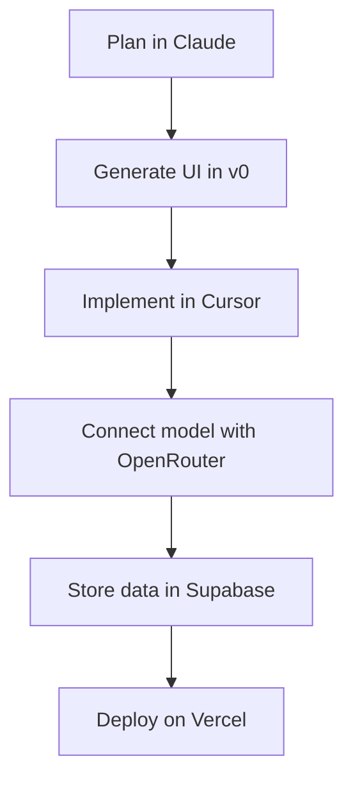

# 07. Vibe Coding Tools

AI tools can accelerate a hackathon, but only if the workflow stays disciplined.

The wrong way:
- open ten tools,
- paste random prompts,
- chase generated code,
- lose the architecture.

The right way:
- choose one primary editor,
- one primary model,
- one assistant for review,
- and one deployment target.

## Tool comparison

| Tool | Strengths | Limitations | Best workflow |
|---|---|---|---|
| Cursor | Fast coding inside the editor, strong AI assist | Can tempt over-generation | Use for implementation and refactor support |
| Windsurf | Agentic coding workflow | Needs clear task boundaries | Use for multi-file changes |
| Copilot | Familiar, reliable autocomplete | Less opinionated workflow support | Use for fast inline coding |
| Claude | Strong reasoning and writing | Not a full editor by itself | Use for architecture, debugging, and docs |
| Gemini | Good for multimodal and broad assistance | Workflow varies by product surface | Use for planning and research support |
| OpenRouter | Access to multiple models | Need to manage model choice | Use for flexible model routing |
| Bolt | Fast app scaffolding | Can be limiting for deep customization | Use for quick prototypes |
| Lovable | Fast product generation | Less control than coding directly | Use for landing pages and early MVPs |
| v0 | UI generation for React patterns | UI-first, not full system design | Use for clean components and pages |
| Firebase Studio | Firebase-oriented app flow | Best if you stay in the Firebase ecosystem | Use for Firebase-heavy products |
| Replit | Fast online development | May be less ideal for complex local setups | Use for quick, shareable prototypes |
| Codeium | AI assistance and completion | Different strengths depending on environment | Use for coding support |
| Continue.dev | Open-source AI assistant workflow | Requires setup | Use for customizable local workflows |
| Aider | Git-aware coding assistant | Best with disciplined prompts | Use for codebase edits and refactors |
| RooCode | Agentic coding workflow | Requires task clarity | Use for structured implementation |
| Cline | Autonomous coding agent | Can overshoot scope | Use for large tasks with guardrails |

## Best combinations

### Fastest practical combo
- Cursor
- Claude
- Vercel
- Supabase

### Strong AI app combo
- Cursor or Windsurf
- OpenRouter or Gemini
- Next.js
- Supabase

### Python demo combo
- Claude
- FastAPI
- Render or Railway

## Best AI stack for a 24-hour hackathon

## Ideal prompts

Use prompts that specify:
- user,
- workflow,
- input,
- output,
- constraints,
- and exact files to change.

### Example prompt
“Build a student deadline tracker with a clean dashboard, add login, store deadlines in Supabase, and make the UI mobile friendly.”

## Common mistakes

- Letting the model decide the product scope
- Asking for too much in one prompt
- Not reviewing generated code
- Forgetting environment variables
- Not testing the actual user flow
- Generating UI without thinking about data flow

## Best practice

Use AI as a speed multiplier, not as a substitute for product judgment.
