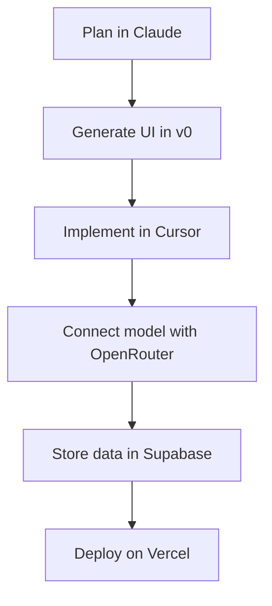

# 07. Vibe Coding Tools

AI tools can accelerate a hackathon, but only if the workflow stays disciplined.

The wrong way: open ten tools, paste random prompts, chase generated code, lose the architecture.

The right way: choose one primary editor, one primary model, one assistant for review, and one deployment target.

This section goes deeper — how to actually set up each tool, when to trust AI and when to override it, and how to stay productive when the AI generates nonsense.

## Tool comparison

| Tool | Strengths | Limitations | Best workflow |
|---|---|---|---|
| Cursor | Fast coding inside the editor, strong AI assist | Can tempt over-generation | Use for implementation and refactor support |
| Windsurf | Agentic coding workflow | Needs clear task boundaries | Use for multi-file changes |
| Copilot | Familiar, reliable autocomplete | Less opinionated workflow support | Use for fast inline coding |
| Claude | Strong reasoning and writing | Not a full editor by itself | Use for architecture, debugging, and docs |
| Gemini | Good for multimodal and broad assistance | Workflow varies by product surface | Use for planning and research support |
| OpenRouter | Access to multiple models | Need to manage model choice | Use for flexible model routing |
| Bolt | Fast app scaffolding | Can be limiting for deep customization | Use for quick prototypes |
| Lovable | Fast product generation | Less control than coding directly | Use for landing pages and early MVPs |
| v0 | UI generation for React patterns | UI-first, not full system design | Use for clean components and pages |
| Firebase Studio | Firebase-oriented app flow | Best if you stay in the Firebase ecosystem | Use for Firebase-heavy products |
| Replit | Fast online development | May be less ideal for complex local setups | Use for quick, shareable prototypes |
| Codeium | AI assistance and completion | Different strengths depending on environment | Use for coding support |
| Continue.dev | Open-source AI assistant workflow | Requires setup | Use for customizable local workflows |
| Aider | Git-aware coding assistant | Best with disciplined prompts | Use for codebase edits and refactors |
| RooCode | Agentic coding workflow | Requires task clarity | Use for structured implementation |
| Cline | Autonomous coding agent | Can overshoot scope | Use for large tasks with guardrails |

## Best combinations

### Fastest practical combo
- Cursor
- Claude
- Vercel
- Supabase

### Strong AI app combo
- Cursor or Windsurf
- OpenRouter or Gemini
- Next.js
- Supabase

### Python demo combo
- Claude
- FastAPI
- Render or Railway

## Best AI stack for a 24-hour hackathon


```mermaid
flowchart TD
    A[Plan in Claude] --> B[Generate UI in v0]
    B --> C[Implement in Cursor]
    C --> D[Connect model with OpenRouter]
    D --> E[Store data in Supabase]
    E --> F[Deploy on Vercel]
```

## Tool-specific tutorials

### Cursor setup guide

**Install and configure:**
1. Download Cursor from cursor.com
2. Open your project folder (not just a file)
3. Go to Settings → Models and pick Claude 3.5 Sonnet or GPT-4o
4. Enable "Composer" mode for multi-file edits
5. Set your `.cursorrules` file in the project root:

```markdown
# Project rules
- Use TypeScript with strict mode
- Use Tailwind CSS for styling
- Use Next.js App Router
- Prefer server components over client components
- Use Supabase for data and auth
- No comments unless the logic is non-obvious
```

**Keyboard shortcuts to know:**
- `Cmd+K` — inline edit selection
- `Cmd+L` — open chat panel
- `Cmd+Shift+L` — add current file to chat context
- `Cmd+I` — open Composer for multi-file changes

**Pro tip:** Before asking Cursor to generate code, open the relevant files first. Cursor uses the open files as context. If you have the wrong file open, you'll get the wrong code.

### Copilot tips

**What Copilot does best:** autocomplete, small function completion, boilerplate generation, test writing.

**What it does poorly:** architecture decisions, multi-file refactors, debugging complex state.

**Workflow:**
1. Write a comment describing what you want
2. Let Copilot suggest the implementation
3. Accept if it's 80% right, fix the rest manually
4. Never accept a suggestion you don't understand

```python
# Good prompt for Copilot:
def calculate_bmi(weight_kg, height_m):
    # Calculate BMI and return category
```

Copilot will generate the formula and category logic. Review it, then move on.

### Claude workflow

Claude is your architect, debugger, and documentation writer. Use it in a browser tab or the Claude app alongside your editor.

**Architecture prompt:**
```
I'm building a [type] app for [user] that [core action].

Tech stack: Next.js, Supabase, Tailwind, Vercel.

Give me:
1. The database schema (Supabase SQL)
2. The main components and their responsibilities
3. The API routes I need
4. The order to build things in (what comes first)

Keep it practical for a hackathon — skip auth complexity if it's not the core feature.
```

**Debugging prompt:**
```
Here's the error: [paste error]
Here's the code: [paste relevant code]
Here's what I expected: [describe expected behavior]
Here's what actually happens: [describe actual behavior]

What's wrong and how do I fix it?
```

### v0 for UI

v0 generates React components from text descriptions. It's best for landing pages, dashboards, and common UI patterns.

**What to prompt:**
```
A dashboard page for a habit tracker app. 
Shows a grid of habit cards with streak counts, 
a weekly progress chart, and a "add new habit" button.
Clean, modern design with subtle gradients.
Use Tailwind CSS and shadcn/ui components.
```

**What v0 does well:**
- Card layouts, tables, forms
- Landing pages and hero sections
- Dashboard components
- Modal and dialog patterns

**What v0 does poorly:**
- Complex stateful interactions
- Backend integration
- Animation-heavy interfaces
- Custom data visualizations

**Workflow:** Generate with v0 → copy to your project → customize colors and spacing → connect to your data → deploy.

## AI-generated code review checklist — 10 things to check before committing

Run through this for every chunk of AI-generated code. It takes 2 minutes and saves you hours of debugging.

1. **Does it actually work?** Run it. Don't assume.

2. **Are there hardcoded values?** Replace any `localhost:3000`, `test@email.com`, or dummy API keys with environment variables.

3. **Is error handling present?** AI code often has happy-path-only logic. Add try/catch blocks and error states.

4. **Are imports correct?** AI sometimes imports from packages you haven't installed or from wrong paths.

5. **Is the data flow clear?** Trace the data from input to output. If you can't explain it, the judges can't follow it.

6. **Are there unused variables or functions?** Clean them up. Dead code confuses everyone.

7. **Is the styling consistent?** AI mixes Tailwind classes, inline styles, and CSS modules. Pick one approach.

8. **Are there any security issues?** Check for exposed API keys, SQL injection, or XSS vulnerabilities.

9. **Does it handle edge cases?** What happens with empty arrays, null values, or long strings?

10. **Would you be embarrassed to explain this line to a judge?** If yes, rewrite it or add a comment.

## When AI fails you — manual coding survival guide

Sometimes the AI gives you garbage. Here's how to keep moving.

### Scenario 1: The code doesn't compile
**What to do:** Read the error message. Seriously. 80% of the time, it tells you exactly what's wrong. Fix the first error, then rebuild. Errors often cascade.

### Scenario 2: The AI keeps generating the same wrong code
**What to do:** Stop prompting. Write the code yourself. Even if it's ugly. A working ugly function beats a non-working elegant one.

### Scenario 3: The AI suggests a library you've never used
**What to do:** Skip it. Use something you know. The hackathon isn't the time to learn a new library from scratch.

### Scenario 4: The AI output is 90% right but 10% is subtly wrong
**What to do:** This is the most dangerous scenario. The code looks right but has a logic bug. Test it with real data, not just "does it compile."

### Scenario 5: The AI can't figure out your architecture
**What to do:** Simplify your architecture. If the AI can't generate coherent code for it, a judge probably can't follow it either.

### The manual coding survival kit
Keep these patterns ready for when you need to write code without AI help:

```javascript
// Basic CRUD operations
async function fetchAll(endpoint) {
  const res = await fetch(`/api/${endpoint}`);
  return res.json();
}

async function createOne(endpoint, data) {
  const res = await fetch(`/api/${endpoint}`, {
    method: 'POST',
    headers: { 'Content-Type': 'application/json' },
    body: JSON.stringify(data),
  });
  return res.json();
}

// Simple state management
function useState(initial) {
  let value = initial;
  const subscribers = [];

  return {
    get: () => value,
    set: (newVal) => {
      value = newVal;
      subscribers.forEach(fn => fn(value));
    },
    subscribe: (fn) => subscribers.push(fn),
  };
}

// Basic form handler
function handleForm(form, onSubmit) {
  form.addEventListener('submit', (e) => {
    e.preventDefault();
    const data = Object.fromEntries(new FormData(form));
    onSubmit(data);
  });
}
```

## Prompt library — 15 best prompts for hackathon tasks

These prompts are tuned for hackathon speed. Copy them, customize the brackets.

### 1. Project scaffolding
```
Create a Next.js 14 app with App Router, TypeScript, Tailwind CSS, and Supabase.
Set up a basic project structure with:
- app/ directory with layout.tsx and page.tsx
- lib/supabase.ts for client setup
- components/ directory
- .env.example with required variables
Include a basic auth check on the dashboard page.
```

### 2. Database schema
```
Design a Supabase SQL schema for a [type] app.
Tables needed:
- [describe entities]
Include foreign keys, indexes, and RLS policies.
Keep it simple — this is a hackathon, not a production system.
```

### 3. API route
```
Create a Next.js API route at app/api/[endpoint]/route.ts that:
- GET: fetches [data] from Supabase
- POST: creates a new [item] with validation
Include error handling and proper status codes.
```

### 4. Dashboard component
```
Build a dashboard page that shows:
- A header with the user's name
- 3 metric cards (total items, active items, completed)
- A table of recent items
- A "create new" button
Use Tailwind CSS. Make it responsive.
```

### 5. Form component
```
Create a form component for [purpose] with:
- [list fields]
- Client-side validation
- Loading state during submission
- Success/error feedback
Use controlled inputs with useState.
```

### 6. Auth integration
```
Add Supabase auth to this Next.js app:
- Login page with email/password
- Protected dashboard route
- Auth context for the whole app
- Logout functionality
Redirect unauthenticated users to login.
```

### 7. API integration
```
Integrate [API name] into the app:
- Create a server-side API route that calls [API]
- Pass the API key from environment variables
- Add error handling and loading states
- Cache the response for 5 minutes
```

### 8. Chart component
```
Create a Recharts bar chart that displays [data].
Use these colors: [colors]
Make it responsive and add a tooltip.
Include a legend if there are multiple series.
```

### 9. Mobile responsive fix
```
Make this page mobile responsive.
Current issues: [list problems]
Keep the desktop layout but stack elements vertically on mobile.
Use Tailwind responsive prefixes (sm:, md:, lg:).
```

### 10. Bug fix
```
This code has a bug:
[paste code]

Expected behavior: [describe]
Actual behavior: [describe]
Error message: [paste if any]

Find the bug and fix it. Explain what was wrong.
```

### 11. Code review
```
Review this code for a hackathon demo:
[paste code]

Check for:
- Logic errors
- Missing error handling
- Security issues
- Performance problems
- Anything that would break during a demo
```

### 12. Documentation
```
Write a README for this hackathon project:
- One-sentence description
- How to run it locally
- What APIs it uses
- What's the main feature
- What you'd build next with more time
Keep it under 200 words.
```

### 13. Deployment config
```
Create a Vercel deployment configuration for this Next.js app.
Include:
- vercel.json with any needed settings
- Environment variable documentation
- Build command verification
- Any rewrites or redirects needed
```

### 14. Testing
```
Write 3 quick test cases for the [function/component name]:
- Happy path
- Edge case (empty input)
- Error case
Use [test framework]. Keep tests simple and focused.
```

### 15. Refactoring
```
Refactor this code to be cleaner:
[paste code]

Focus on:
- Removing duplication
- Better naming
- Simpler logic
- Easier to understand
Don't change the functionality.
```

## The AI team member mindset

Stop thinking of AI as a tool. Start thinking of it as a teammate with specific strengths and weaknesses.

**What AI is good at:**
- Writing boilerplate code
- Generating variations of a pattern
- Explaining code you don't understand
- Catching obvious mistakes
- Writing documentation
- Suggesting architecture (with caveats)

**What AI is bad at:**
- Understanding your specific project context
- Making product decisions
- Knowing when something is "good enough"
- Recognizing when a simpler approach exists
- Understanding the hackathon's judging criteria

**How to work with your AI teammate:**
1. Give it clear, specific tasks (not "build my app")
2. Review everything it produces
3. Use it for speed, not for judgment
4. When it suggests something, ask "why?" — understand the reasoning
5. When it's wrong, correct it and move on (don't keep prompting hoping for a different answer)

## AI cost management — staying within free tiers

AI API costs can sneak up on you during a hackathon. Here's how to stay free:

| Tool | Free Tier | Strategy |
|---|---|---|
| Cursor | 2000 completions/month, 50 slow premium requests | Use fast requests for implementation, slow for planning |
| Copilot | Free for students, $10/month otherwise | Student email = free |
| Claude | Free tier with usage limits | Use web interface, not API, for planning |
| OpenAI | $5 new credit | Use GPT-3.5-turbo, not GPT-4 |
| v0 | Limited free generations | Generate once, customize manually |
| Replit | Free tier with limited AI | Use for small tasks only |

**Cost-saving habits:**
- Cache AI responses locally (if you ask the same question twice, you're wasting money)
- Use smaller models for simple tasks
- Batch similar requests together
- Don't let AI generate code you could write in 30 seconds
- Set spending alerts before the hackathon

## The human-AI workflow — best practices for splitting work

Here's the optimal split for a hackathon:

**Human does:**
- Product decisions (what to build, what to cut)
- Architecture choices (which stack, which patterns)
- Testing (does it actually work?)
- Demo preparation (what to show, what to say)
- Git management (commits, branches)
- Deployment and final checks

**AI does:**
- Boilerplate generation (scaffolding, CRUD, forms)
- UI component creation (from descriptions)
- Code completion (filling in obvious logic)
- Documentation (README, comments)
- Debugging assistance (explaining errors)
- Pattern generation (repeating a successful pattern)

**The workflow:**
1. Human decides what to build → AI generates the structure
2. Human reviews → AI fixes issues
3. Human tests → AI helps debug
4. Human polishes → AI fills in gaps
5. Human deploys → AI writes documentation

**The golden rule:** You should be able to explain every line of code in your project. If AI wrote it and you can't explain it, you don't own it — and judges will notice.

## Ideal prompts

Use prompts that specify:
- user,
- workflow,
- input,
- output,
- constraints,
- and exact files to change.

### Example prompt
"Build a student deadline tracker with a clean dashboard, add login, store deadlines in Supabase, and make the UI mobile friendly."

## Common mistakes

- Letting the model decide the product scope
- Asking for too much in one prompt
- Not reviewing generated code
- Forgetting environment variables
- Not testing the actual user flow
- Generating UI without thinking about data flow
- Using AI for decisions it's not qualified to make
- Trusting AI output without testing it

## Best practice

Use AI as a speed multiplier, not as a substitute for product judgment. The fastest way to build a hackathon project is: you decide, AI generates, you review, you deploy. That's the loop. Stick to it.
