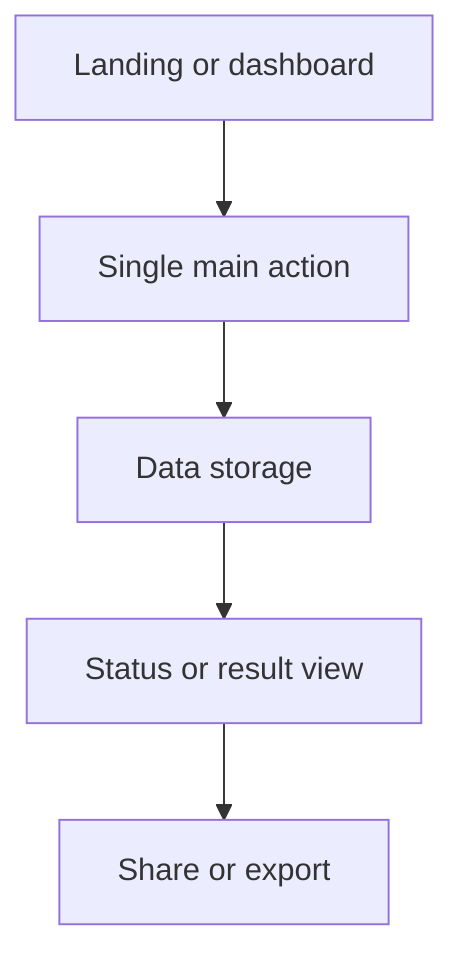

# 08. Build Fast Framework

This is the section that turns panic into execution.

## Build in six hours

```mermaid
gantt
    title Hackathon MVP in 6 hours
    dateFormat  HH
    axisFormat  %H
    section Plan
    Problem + MVP lock      :a1, 00, 01
    section Build
    Layout + auth + db      :a2, 01, 02
    Core workflow           :a3, 03, 02
    section Polish
    UI polish + edge cases   :a4, 05, 01
```

## Hour by hour

### Hour 0 to 1
Lock the problem, user, and MVP.

Deliverables:
- one-sentence problem statement
- one-sentence solution
- one main workflow
- one stack choice
- one deployment target

### Hour 1 to 2
Set up the app shell.

Deliverables:
- project scaffold
- auth if needed
- database connection
- basic layout
- environment variables

### Hour 2 to 4
Build the core feature.

Deliverables:
- input form
- data capture
- result display
- success state
- error state

### Hour 4 to 5
Polish the demo.

Deliverables:
- navigation
- empty states
- mobile responsiveness
- loading states
- clean typography

### Hour 5 to 6
Deploy and rehearse.

Deliverables:
- live URL
- backup screenshots
- pitch draft
- demo rehearsal
- fallback plan

## Speed hacks

- Start with a component library.
- Use mocked data first, then connect real APIs.
- Use one-page flows where possible.
- Avoid custom auth unless required.
- Use templates and boilerplates.
- Keep files shallow and readable.
- Remove features that do not help the story.

## Reusable structure

## Emergency fallback system

If the build is behind schedule:
1. Cut the least important feature.
2. Replace real-time with manual refresh.
3. Replace complex AI with a simpler API.
4. Replace custom charts with clean tables.
5. Focus on one fully working path.

## Common mistakes

- Perfecting UI before the workflow exists
- Trying to support every edge case
- Waiting too long to deploy
- Leaving demo assets for the end
- Building something too large to finish

## Rule

A shipped simple project beats an incomplete ambitious project every time.
