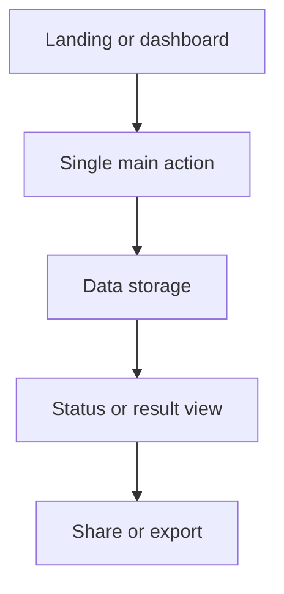

# 08. Build Fast Framework

This is the section that turns panic into execution.

Every hackathon has the same arc: excitement in hour one, confusion in hour two, panic in hour five, and either triumph or regret in hour six. The difference between those outcomes isn't talent — it's a system. This framework gives you that system.

## Build in six hours


```mermaid
gantt
    title Hackathon MVP in 6 hours
    dateFormat  HH
    axisFormat  %H
    section Plan
    Problem + MVP lock      :a1, 00, 01
    section Build
    Layout + auth + db      :a2, 01, 02
    Core workflow           :a3, 03, 02
    section Polish
    UI polish + edge cases   :a4, 05, 01
```

## Build in twelve hours

If you have a full day, don't just add more time to each phase — add new phases that let you build a better product.


```mermaid
gantt
    title Hackathon MVP in 12 hours
    dateFormat  HH
    axisFormat  %H
    section Plan
    Problem + MVP lock        :a1, 00, 01
    Research APIs + stack     :a2, 01, 02
    section Build
    Project scaffold          :a3, 02, 03
    Core workflow             :a4, 05, 03
    section Polish
    UI polish + mobile        :a5, 08, 02
    section Prep
    Deploy + demo + rehearse  :a6, 10, 02
```

### Hour 0 to 1 — Research and lock
- Understand the theme deeply (read the brief twice)
- Research 2-3 potential approaches
- Pick the one that's most demoable, not most impressive
- Lock the MVP: one sentence for problem, one for solution

### Hour 1 to 2 — Stack and architecture
- Finalize your tech stack
- Set up the project repo
- Choose your APIs and verify they work
- Draw the data flow on paper (or in text)
- Decide what you're NOT building

### Hour 2 to 5 — Build the core
- Scaffold the project
- Build the main user flow end-to-end
- Connect the database
- Integrate the primary API
- Get a working (ugly) version running

### Hour 5 to 8 — Polish and extend
- Make it look professional
- Add mobile responsiveness
- Handle edge cases and errors
- Add secondary features (only if core works)
- Write basic documentation

### Hour 8 to 10 — Test and fix
- Test every user flow
- Fix the bugs that would embarrass you
- Test on a different device/browser
- Optimize performance
- Prepare fallbacks for API failures

### Hour 10 to 12 — Deploy and rehearse
- Deploy to production
- Test the live URL
- Take screenshots
- Write your pitch
- Practice the demo 3 times

## Build in twenty-four hours

A 24-hour hackathon is a different beast. You have time, but you also have fatigue. The structure changes.

### Hour 0 to 2 — Plan aggressively
- Spend more time on architecture decisions
- Sketch the full UI in a design tool or on paper
- Write the database schema before writing code
- Plan your sleep schedule (seriously)

### Hour 2 to 6 — Build the skeleton
- Scaffold everything
- Build all pages (even with placeholder content)
- Set up auth, database, and API connections
- Get a "clickable but empty" version working

### Hour 6 to 12 — Fill in the core
- Build the main features
- Connect real data
- Implement the AI/API integration
- Make it actually work

### Hour 12 to 18 — Polish and extend
- UI refinement
- Mobile responsiveness
- Error handling
- Additional features
- Documentation

### Hour 18 to 22 — Test and fix
- Full user flow testing
- Bug fixes
- Performance optimization
- Cross-browser testing
- Security checks

### Hour 22 to 24 — Deploy and present
- Final deployment
- Pitch preparation
- Demo rehearsal
- Screenshot and recording backup
- Team sync on presentation roles

## Hour by hour — the 6-hour version

### Hour 0 to 1
Lock the problem, user, and MVP.

Deliverables:
- one-sentence problem statement
- one-sentence solution
- one main workflow
- one stack choice
- one deployment target

### Hour 1 to 2
Set up the app shell.

Deliverables:
- project scaffold
- auth if needed
- database connection
- basic layout
- environment variables

### Hour 2 to 4
Build the core feature.

Deliverables:
- input form
- data capture
- result display
- success state
- error state

### Hour 4 to 5
Polish the demo.

Deliverables:
- navigation
- empty states
- mobile responsiveness
- loading states
- clean typography

### Hour 5 to 6
Deploy and rehearse.

Deliverables:
- live URL
- backup screenshots
- pitch draft
- demo rehearsal
- fallback plan

## Checkpoint system — know if you're on track every hour

Set a phone alarm for every hour. When it goes off, ask yourself these questions:

| Hour | Checkpoint Question | Green | Yellow | Red |
|---|---|---|---|---|
| 1 | Is the MVP locked and the stack decided? | Yes, written down | Mostly decided | Still arguing |
| 2 | Does the project scaffold run? | App starts, shows something | App starts, blank screen | App won't start |
| 3 | Can you see any data on screen? | Mock data renders | Database connected, no display | Nothing showing |
| 4 | Does the core flow work end-to-end? | Can complete main action | Partially works | Broken flow |
| 5 | Does it look like a product? | Clean UI, mobile-friendly | Functional but ugly | Debug screens |
| 6 | Is it deployed and ready to demo? | Live URL works | Deployed but has bugs | Not deployed |

**If you're yellow at any checkpoint:** You can recover. Focus ruthlessly on the next milestone.

**If you're red at any checkpoint:** You need to cut scope immediately. Remove the least important feature. Simplify the architecture. Get to green by the next hour.

## Parallel workflow — how 2-4 team members work simultaneously

The biggest waste in a hackathon is two people waiting for the same person. Here's how to split work so everyone stays productive.

### 2-person team

| Person | Hours 0-2 | Hours 2-4 | Hours 4-6 |
|---|---|---|---|
| Builder A | Project scaffold, auth, database | Core feature (backend) | API integration, deployment |
| Builder B | UI components, layout, styling | Core feature (frontend) | Polish, mobile, testing |

**Sync points:** Hour 2 (check scaffold works), Hour 4 (connect frontend to backend), Hour 5 (final review).

### 3-person team

| Person | Hours 0-2 | Hours 2-4 | Hours 4-6 |
|---|---|---|---|
| Builder A | Project setup, database, auth | Core feature (backend) | API integration, deployment |
| Builder B | UI components, layout | Core feature (frontend) | Polish, mobile responsiveness |
| Designer/PM | Research, wireframes, pitch | Copy, assets, documentation | Testing, screenshots, demo prep |

**Sync points:** Hour 2, Hour 4, Hour 5.

### 4-person team

| Person | Hours 0-2 | Hours 2-4 | Hours 4-6 |
|---|---|---|---|
| Backend | Database, auth, API routes | Core feature backend | API integration, optimization |
| Frontend | Scaffold, components, layout | Core feature frontend | Polish, mobile, accessibility |
| Full-stack | Infrastructure, deployment, CI | Secondary features | Testing, bug fixes |
| PM/Designer | Research, design, pitch | Documentation, copy | Demo prep, screenshots |

**Rules for parallel work:**
- Each person works in their own directory (components/, lib/, api/, etc.)
- Use a shared type definitions file so everyone agrees on data shapes
- Commit every 30 minutes so no one's work gets lost
- Don't merge to main without a quick check — broken main blocks everyone
- Use a shared Slack/Discord channel for "I'm stuck" moments

## Tech debt decisions — what to skip and what to keep

Not all tech debt is bad. In a hackathon, some shortcuts are smart and some are fatal.

### Skip these (nobody will notice)

- **Input validation on edge cases** — validate the happy path, handle common errors
- **Comprehensive error logging** — console.log is fine for a demo
- **Database migrations** — just create the tables fresh
- **CI/CD pipeline** — deploy manually, it's fine
- **Unit tests** — test manually, but test thoroughly
- **Accessibility audits** — do the basics (alt text, contrast), skip WCAG compliance
- **Performance optimization** — unless it's visibly slow
- **Code documentation** — the code should be self-explanatory for a hackathon
- **Internationalization** — English only is fine
- **Advanced caching** — simple fetch is enough

### Keep these (they'll save your demo)

- **Error handling on API calls** — blank screens lose demos
- **Loading states** — judges think the app is broken without them
- **Mobile responsiveness** — judges will try it on their phones
- **Environment variables** — hardcoded keys look bad and break in production
- **Basic auth** — if your app needs user accounts, do it right
- **Data validation on the critical path** — validate what matters for the demo
- **Git commits** — commit frequently so you can roll back
- **The core user flow** — this must work perfectly, everything else is optional

### The tech debt litmus test

Before taking a shortcut, ask:
1. Will this cause the demo to fail? → Don't skip it
2. Will a judge notice this? → Don't skip it
3. Will this make the code unreadable to me in 2 hours? → Don't skip it
4. Is this a "nice to have" that doesn't affect the demo? → Skip it

## The boring middle — surviving hours 3-6 when novelty wears off

Hour 1 is exciting. Hour 2 is productive. Hour 3-6 is where most hackathon projects die. Here's why and how to survive it.

**Why it happens:**
- The initial rush of starting fades
- You hit technical problems that aren't fun to solve
- The gap between what you imagined and what you built feels huge
- Team members get tired or frustrated
- The "this is too hard" voice gets loud

**How to survive:**

### 1. Focus on the next 30 minutes, not the finish line
Don't think about the demo. Think about making the next function work. Small wins build momentum.

### 2. Pair program when stuck
Two people staring at the same bug usually find it faster than one person alone. Explain the problem out loud — you'll often solve it mid-sentence.

### 3. Switch tasks when frustrated
If you've been fighting the same bug for 20 minutes, switch to something else. Come back fresh in 10 minutes.

### 4. Eat and hydrate
Low blood sugar kills problem-solving ability. Keep snacks and water at your desk.

### 5. Take a 5-minute walk
Seriously. Walk around the room, look at something far away, then come back. Your brain needs the break.

### 6. Celebrate small wins
Got the database connected? That's a win. Tell your team. High five. Momentum matters.

## Save points — when to commit and what to checkpoint

Think of git commits as save points in a video game. You want enough that you can always recover, but not so many that your history is noise.

### When to commit

- **Every time something works** that didn't work before
- **Before trying something risky** (new library, major refactor)
- **Every 30 minutes** even if nothing major changed
- **Before switching tasks** or team members
- **Before deploying** to production

### What to commit

```
git add -A && git commit -m "feat: working auth flow with Supabase"
git add -A && git commit -m "feat: dashboard shows real data from database"
git add -A && git commit -m "fix: loading state for API calls"
git add -A && git commit -m "style: mobile responsive layout"
```

### Commit message format

Keep it simple:
- `feat:` for new features
- `fix:` for bug fixes
- `style:` for UI changes
- `refactor:` for code cleanup
- `docs:` for documentation

### The checkpoint list

Before each commit, verify:
- [ ] The app still runs
- [ ] No environment variables are exposed
- [ ] The commit message is clear
- [ ] You haven't committed node_modules or .env

## Scope creep emergency — when features keep getting added

This is the #1 hackathon killer. Someone says "what if we also add..." and suddenly you're building three apps instead of one.

### The scope creep warning signs

- "We should also add..."
- "It would be cool if..."
- "The judges would love..."
- "While we're at it..."
- "This is almost done, let me just..."

### The emergency brake

When you notice scope creep, stop and ask:

1. **Does this feature replace an existing one?** If yes, cut the old one first.
2. **Does this feature take more than 30 minutes?** If yes, defer it to "nice to have."
3. **Does this feature strengthen the core demo?** If no, don't build it.
4. **Can you demo without this feature?** If yes, skip it.

### The scope reduction ladder

If you're behind schedule, cut features in this order:

1. **Cut "nice to have" features** (anything not in the original MVP)
2. **Cut secondary user flows** (focus on the one main path)
3. **Cut real-time features** (replace with manual refresh)
4. **Cut complex AI** (replace with simpler API or mock)
5. **Cut custom charts** (replace with clean tables)
6. **Cut custom auth** (use a pre-built auth provider)

### The one-page rule

If your app has more than 3 pages, you probably have too much. Try to build a one-page app where everything happens on a single screen with different sections.

## Speed hacks

- Start with a component library.
- Use mocked data first, then connect real APIs.
- Use one-page flows where possible.
- Avoid custom auth unless required.
- Use templates and boilerplates.
- Keep files shallow and readable.
- Remove features that do not help the story.
- Copy-paste from your own previous projects (it's not cheating, it's efficiency).
- Use a shared component library across your team.
- Don't fight with CSS — use Tailwind or a component library.

## Reusable structure


```mermaid
flowchart TD
    A[Landing or dashboard] --> B[Single main action]
    B --> C[Data storage]
    C --> D[Status or result view]
    D --> E[Share or export]
```

This structure works for 80% of hackathon projects. Adapt it to your idea.

## Emergency fallback system

If the build is behind schedule:
1. Cut the least important feature.
2. Replace real-time with manual refresh.
3. Replace complex AI with a simpler API.
4. Replace custom charts with clean tables.
5. Focus on one fully working path.

## The demo-first rule

Build your demo path first, not last. Here's why: if you build the full app and the demo doesn't work, you have nothing. If you build the demo first and add features around it, you always have something to show.

**Demo-first workflow:**
1. Build the screen the judge sees first
2. Build the action the judge sees second
3. Build the result the judge sees third
4. Make that 3-step flow perfect
5. Add everything else around it

## Common mistakes

- Perfecting UI before the workflow exists
- Trying to support every edge case
- Waiting too long to deploy
- Leaving demo assets for the end
- Building something too large to finish
- Not checking in with teammates regularly
- Arguing about architecture instead of building
- Testing only on one browser
- Forgetting to save backups of working versions

## Rule

A shipped simple project beats an incomplete ambitious project every time. Ship something. It's better to have a working prototype that does one thing well than a half-finished app that tries to do everything. The judges know this too — they've seen a thousand broken ambitious projects. Show them something that works.
