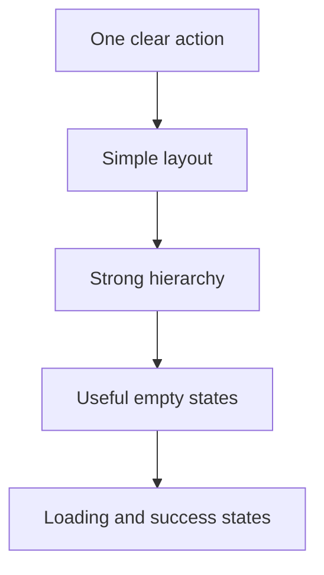

# 09. UI UX Fast Track

Good UI is not decoration. It is comprehension.

A strong interface helps judges understand the product without effort.

## UI goals in a hackathon

- make the main action obvious,
- reduce clutter,
- show progress,
- explain value visually,
- and make the app feel finished.

## Fast UI system

## Design rules that work

- One page, one main job.
- Use consistent spacing.
- Keep text short.
- Use cards for structure.
- Use charts only when they explain something.
- Show before and after states.
- Make the call to action obvious.

## Premium look checklist

- [ ] Headline with a strong promise
- [ ] Clear subtitle
- [ ] Useful icon or illustration
- [ ] Logical grid
- [ ] Color system with restraint
- [ ] Clean buttons
- [ ] Mobile-friendly layout
- [ ] Empty state that teaches the user
- [ ] Loading state
- [ ] Success feedback

## Common UI mistakes

- Too many colors
- Too much text
- Poor contrast
- Inconsistent spacing
- No clear primary action
- Debug-looking screens
- Not optimizing for mobile

## Fast components to reuse

- hero cards
- metric cards
- sidebars
- stepper blocks
- timeline blocks
- empty states
- profile cards
- activity lists
- modal confirmations

## Screenshot strategy

Take screenshots of:
- landing page,
- core workflow,
- result screen,
- mobile view,
- and deployment success.

Store them in:
- `assets/screenshots/`
- `assets/gifs/`

## Demo visual rule

The app should look understandable in three seconds.

## Optional polish ideas

- subtle gradients,
- soft shadows,
- better icon alignment,
- progressive disclosure,
- and one strong accent color.

## Fast conclusion

UI should make the product feel obvious, not complicated.
