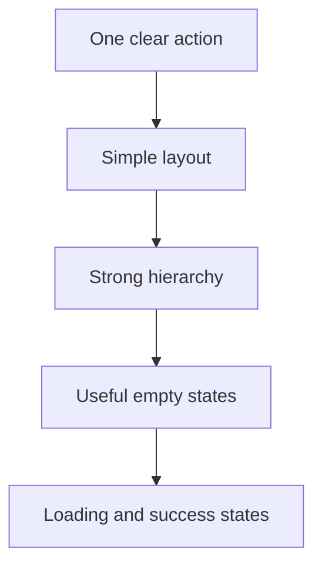

# 09. UI/UX Fast Track

Good UI is not decoration. It is comprehension.

A strong interface helps judges understand the product without effort. In a hackathon, you have about 10 seconds to convince someone your project is worth looking at. The UI is what buys you those seconds.

## UI goals in a hackathon

- make the main action obvious,
- reduce clutter,
- show progress,
- explain value visually,
- and make the app feel finished.

## Fast UI system


```mermaid
flowchart TD
    A[One clear action] --> B[Simple layout]
    B --> C[Strong hierarchy]
    C --> D[Useful empty states]
    D --> E[Loading and success states]
```

## Design rules that work

- One page, one main job.
- Use consistent spacing.
- Keep text short.
- Use cards for structure.
- Use charts only when they explain something.
- Show before and after states.
- Make the call to action obvious.

## Component library — 15 copy-paste Tailwind components

These are ready-to-use components. Copy them, change the colors and text, and you're done.

### 1. Primary Button

```html
<button class="px-6 py-3 bg-blue-600 text-white font-semibold rounded-lg hover:bg-blue-700 active:bg-blue-800 transition-colors duration-150 shadow-md hover:shadow-lg">
  Get Started
</button>
```

### 2. Card

```html
<div class="bg-white rounded-xl shadow-md p-6 hover:shadow-lg transition-shadow duration-200 border border-gray-100">
  <h3 class="text-lg font-semibold text-gray-900 mb-2">Card Title</h3>
  <p class="text-gray-600 text-sm leading-relaxed">Card description goes here. Keep it short and clear.</p>
</div>
```

### 3. Input Field

```html
<div class="space-y-1">
  <label class="block text-sm font-medium text-gray-700">Email</label>
  <input 
    type="email" 
    placeholder="you@example.com"
    class="w-full px-4 py-2.5 border border-gray-300 rounded-lg focus:ring-2 focus:ring-blue-500 focus:border-blue-500 outline-none transition-all duration-150 text-sm"
  />
</div>
```

### 4. Modal

```html
<div class="fixed inset-0 bg-black/50 flex items-center justify-center z-50">
  <div class="bg-white rounded-2xl shadow-2xl p-8 max-w-md w-full mx-4 transform transition-all">
    <h2 class="text-xl font-bold text-gray-900 mb-4">Confirm Action</h2>
    <p class="text-gray-600 mb-6">Are you sure you want to proceed? This action cannot be undone.</p>
    <div class="flex gap-3 justify-end">
      <button class="px-4 py-2 text-gray-700 hover:bg-gray-100 rounded-lg transition-colors">Cancel</button>
      <button class="px-4 py-2 bg-blue-600 text-white rounded-lg hover:bg-blue-700 transition-colors">Confirm</button>
    </div>
  </div>
</div>
```

### 5. Navbar

```html
<nav class="bg-white border-b border-gray-200 px-6 py-4">
  <div class="max-w-7xl mx-auto flex items-center justify-between">
    <div class="flex items-center gap-2">
      <div class="w-8 h-8 bg-blue-600 rounded-lg"></div>
      <span class="font-bold text-gray-900 text-lg">AppName</span>
    </div>
    <div class="hidden md:flex items-center gap-6">
      <a href="#" class="text-gray-600 hover:text-gray-900 text-sm font-medium">Features</a>
      <a href="#" class="text-gray-600 hover:text-gray-900 text-sm font-medium">Pricing</a>
      <a href="#" class="text-gray-600 hover:text-gray-900 text-sm font-medium">About</a>
      <button class="px-4 py-2 bg-blue-600 text-white text-sm font-medium rounded-lg hover:bg-blue-700">Sign Up</button>
    </div>
  </div>
</nav>
```

### 6. Hero Section

```html
<section class="bg-gradient-to-br from-blue-50 to-indigo-100 py-20 px-6">
  <div class="max-w-4xl mx-auto text-center">
    <h1 class="text-4xl md:text-5xl font-bold text-gray-900 mb-6 leading-tight">
      Build faster, ship sooner
    </h1>
    <p class="text-xl text-gray-600 mb-8 max-w-2xl mx-auto">
      The toolkit that helps hackathon teams go from idea to demo in hours, not days.
    </p>
    <div class="flex gap-4 justify-center">
      <button class="px-8 py-3.5 bg-blue-600 text-white font-semibold rounded-lg hover:bg-blue-700 transition-colors shadow-lg">Start Building</button>
      <button class="px-8 py-3.5 border border-gray-300 text-gray-700 font-semibold rounded-lg hover:bg-gray-50 transition-colors">Learn More</button>
    </div>
  </div>
</section>
```

### 7. Footer

```html
<footer class="bg-gray-900 text-gray-400 py-12 px-6">
  <div class="max-w-7xl mx-auto grid grid-cols-2 md:grid-cols-4 gap-8">
    <div>
      <h4 class="text-white font-semibold mb-4">Product</h4>
      <ul class="space-y-2 text-sm">
        <li><a href="#" class="hover:text-white transition-colors">Features</a></li>
        <li><a href="#" class="hover:text-white transition-colors">Pricing</a></li>
        <li><a href="#" class="hover:text-white transition-colors">Docs</a></li>
      </ul>
    </div>
    <div>
      <h4 class="text-white font-semibold mb-4">Company</h4>
      <ul class="space-y-2 text-sm">
        <li><a href="#" class="hover:text-white transition-colors">About</a></li>
        <li><a href="#" class="hover:text-white transition-colors">Blog</a></li>
        <li><a href="#" class="hover:text-white transition-colors">Careers</a></li>
      </ul>
    </div>
  </div>
  <div class="max-w-7xl mx-auto mt-8 pt-8 border-t border-gray-800 text-center text-sm">
    <p>&copy; 2026 AppName. Built at a hackathon.</p>
  </div>
</footer>
```

### 8. Badge

```html
<span class="inline-flex items-center px-2.5 py-0.5 rounded-full text-xs font-medium bg-green-100 text-green-800">
  Active
</span>
<span class="inline-flex items-center px-2.5 py-0.5 rounded-full text-xs font-medium bg-yellow-100 text-yellow-800">
  Pending
</span>
<span class="inline-flex items-center px-2.5 py-0.5 rounded-full text-xs font-medium bg-red-100 text-red-800">
  Failed
</span>
```

### 9. Avatar

```html
<div class="flex items-center gap-3">
  
  <div>
    <p class="text-sm font-medium text-gray-900">Jane Smith</p>
    <p class="text-xs text-gray-500">jane@example.com</p>
  </div>
</div>
```

### 10. Table

```html
<div class="overflow-x-auto rounded-lg border border-gray-200">
  <table class="w-full text-sm">
    <thead class="bg-gray-50 border-b border-gray-200">
      <tr>
        <th class="text-left px-4 py-3 font-medium text-gray-700">Name</th>
        <th class="text-left px-4 py-3 font-medium text-gray-700">Status</th>
        <th class="text-left px-4 py-3 font-medium text-gray-700">Date</th>
      </tr>
    </thead>
    <tbody class="divide-y divide-gray-200">
      <tr class="hover:bg-gray-50">
        <td class="px-4 py-3 text-gray-900">Project Alpha</td>
        <td class="px-4 py-3"><span class="px-2 py-0.5 text-xs font-medium bg-green-100 text-green-700 rounded-full">Active</span></td>
        <td class="px-4 py-3 text-gray-500">Sep 1, 2026</td>
      </tr>
      <tr class="hover:bg-gray-50">
        <td class="px-4 py-3 text-gray-900">Project Beta</td>
        <td class="px-4 py-3"><span class="px-2 py-0.5 text-xs font-medium bg-yellow-100 text-yellow-700 rounded-full">Pending</span></td>
        <td class="px-4 py-3 text-gray-500">Sep 2, 2026</td>
      </tr>
    </tbody>
  </table>
</div>
```

### 11. Sidebar

```html
<aside class="w-64 bg-gray-50 border-r border-gray-200 h-screen p-4">
  <div class="space-y-1">
    <a href="#" class="flex items-center gap-3 px-3 py-2 text-sm font-medium text-gray-900 bg-white rounded-lg shadow-sm">
      <span class="w-5 h-5 bg-blue-600 rounded"></span>
      Dashboard
    </a>
    <a href="#" class="flex items-center gap-3 px-3 py-2 text-sm font-medium text-gray-600 hover:bg-white hover:text-gray-900 rounded-lg transition-colors">
      <span class="w-5 h-5 bg-gray-400 rounded"></span>
      Projects
    </a>
    <a href="#" class="flex items-center gap-3 px-3 py-2 text-sm font-medium text-gray-600 hover:bg-white hover:text-gray-900 rounded-lg transition-colors">
      <span class="w-5 h-5 bg-gray-400 rounded"></span>
      Settings
    </a>
  </div>
</aside>
```

### 12. Toast Notification

```html
<div class="fixed bottom-4 right-4 bg-green-600 text-white px-4 py-3 rounded-lg shadow-lg flex items-center gap-3 animate-in slide-in-from-bottom-5">
  <svg class="w-5 h-5" fill="none" stroke="currentColor" viewBox="0 0 24 24">
    <path stroke-linecap="round" stroke-linejoin="round" stroke-width="2" d="M5 13l4 4L19 7"></path>
  </svg>
  <span class="text-sm font-medium">Changes saved successfully</span>
</div>
```

### 13. Tabs

```html
<div class="border-b border-gray-200">
  <nav class="flex gap-6 px-6">
    <button class="py-3 text-sm font-medium text-blue-600 border-b-2 border-blue-600">Overview</button>
    <button class="py-3 text-sm font-medium text-gray-500 hover:text-gray-700 border-b-2 border-transparent">Analytics</button>
    <button class="py-3 text-sm font-medium text-gray-500 hover:text-gray-700 border-b-2 border-transparent">Settings</button>
  </nav>
</div>
```

### 14. Accordion

```html
<div class="border border-gray-200 rounded-lg divide-y divide-gray-200">
  <div class="px-4 py-3">
    <button class="w-full flex items-center justify-between text-sm font-medium text-gray-900">
      What is this project?
      <svg class="w-4 h-4 text-gray-500" fill="none" stroke="currentColor" viewBox="0 0 24 24">
        <path stroke-linecap="round" stroke-linejoin="round" stroke-width="2" d="M19 9l-7 7-7-7"></path>
      </svg>
    </button>
  </div>
  <div class="px-4 py-3">
    <button class="w-full flex items-center justify-between text-sm font-medium text-gray-900">
      How does it work?
      <svg class="w-4 h-4 text-gray-500" fill="none" stroke="currentColor" viewBox="0 0 24 24">
        <path stroke-linecap="round" stroke-linejoin="round" stroke-width="2" d="M19 9l-7 7-7-7"></path>
      </svg>
    </button>
  </div>
</div>
```

### 15. Skeleton Loader

```html
<div class="animate-pulse space-y-4">
  <div class="h-4 bg-gray-200 rounded w-3/4"></div>
  <div class="h-4 bg-gray-200 rounded w-1/2"></div>
  <div class="h-32 bg-gray-200 rounded"></div>
  <div class="flex gap-4">
    <div class="h-8 bg-gray-200 rounded w-24"></div>
    <div class="h-8 bg-gray-200 rounded w-24"></div>
  </div>
</div>
```

## Color palette generator — 5 hackathon-ready palettes

Pick one palette and stick with it. Consistency beats creativity here.

### 1. Ocean Professional
| Role | Hex | Use |
|---|---|---|
| Primary | `#2563EB` | Buttons, links, active states |
| Secondary | `#0EA5E9` | Accents, hover states |
| Background | `#F8FAFC` | Page background |
| Surface | `#FFFFFF` | Cards, modals |
| Text | `#1E293B` | Headings, body |
| Muted | `#94A3B8` | Secondary text |
| Success | `#22C55E` | Positive feedback |
| Error | `#EF4444` | Errors, destructive actions |

### 2. Midnight Dark
| Role | Hex | Use |
|---|---|---|
| Primary | `#8B5CF6` | Buttons, links, active states |
| Secondary | `#A78BFA` | Accents, hover states |
| Background | `#0F172A` | Page background |
| Surface | `#1E293B` | Cards, modals |
| Text | `#F1F5F9` | Headings, body |
| Muted | `#64748B` | Secondary text |
| Success | `#34D399` | Positive feedback |
| Error | `#F87171` | Errors, destructive actions |

### 3. Warm Sunset
| Role | Hex | Use |
|---|---|---|
| Primary | `#F97316` | Buttons, links, active states |
| Secondary | `#FB923C` | Accents, hover states |
| Background | `#FFFBEB` | Page background |
| Surface | `#FFFFFF` | Cards, modals |
| Text | `#292524` | Headings, body |
| Muted | `#A8A29E` | Secondary text |
| Success | `#22C55E` | Positive feedback |
| Error | `#EF4444` | Errors, destructive actions |

### 4. Forest Green
| Role | Hex | Use |
|---|---|---|
| Primary | `#059669` | Buttons, links, active states |
| Secondary | `#10B981` | Accents, hover states |
| Background | `#ECFDF5` | Page background |
| Surface | `#FFFFFF` | Cards, modals |
| Text | `#064E3B` | Headings, body |
| Muted | `#6B7280` | Secondary text |
| Success | `#22C55E` | Positive feedback |
| Error | `#EF4444` | Errors, destructive actions |

### 5. Neon Cyber
| Role | Hex | Use |
|---|---|---|
| Primary | `#06B6D4` | Buttons, links, active states |
| Secondary | `#22D3EE` | Accents, hover states |
| Background | `#0A0A0A` | Page background |
| Surface | `#1A1A2E` | Cards, modals |
| Text | `#E2E8F0` | Headings, body |
| Muted | `#64748B` | Secondary text |
| Success | `#34D399` | Positive feedback |
| Error | `#F87171` | Errors, destructive actions |

## Mobile-first design checklist

Mobile isn't optional. Judges will try your app on their phones. Run through this checklist:

- [ ] All text is readable without zooming (minimum 14px)
- [ ] Buttons are tappable (minimum 44x44px tap target)
- [ ] Forms work on mobile keyboards (correct input types)
- [ ] Navigation doesn't overflow (hamburger menu if needed)
- [ ] Images don't break the layout (max-width: 100%)
- [ ] No horizontal scrolling on any page
- [ ] Modals fit on small screens (no fixed positioning that cuts off content)
- [ ] Touch targets have enough spacing (minimum 8px between)
- [ ] Loading states are visible on small screens
- [ ] The primary action is thumb-reachable (bottom of screen)

## Accessibility quick wins — 5 things that take 10 minutes but matter

These take almost no time but make your app usable for more people. Judges notice this.

### 1. Add alt text to every image
```html
<!-- Bad -->


<!-- Good -->

```

### 2. Use semantic HTML
```html
<!-- Bad -->
<div class="nav">
  <div class="nav-item">Home</div>
</div>

<!-- Good -->
<nav>
  <a href="/">Home</a>
</nav>
```

### 3. Ensure sufficient color contrast
Use [WebAIM's contrast checker](https://webaim.org/resources/contrastchecker/). Your text needs a contrast ratio of at least 4.5:1 against its background.

### 4. Add focus states
```css
button:focus-visible {
  outline: 2px solid #2563EB;
  outline-offset: 2px;
}
```

### 5. Use ARIA labels where needed
```html
<button aria-label="Close dialog">
  <svg><!-- X icon --></svg>
</button>
```

## The 3-second rule — how to test if your UI passes

Show your app to someone who's never seen it. Give them 3 seconds. Then ask:
1. What does this app do?
2. What should I do first?

If they can't answer both, your UI fails the 3-second rule.

**How to fix it:**
- Make the headline say what the app does (not a clever slogan)
- Make the primary button the most prominent element on the page
- Remove anything that doesn't answer "what should I do first?"
- Use whitespace to guide the eye to the main action
- Show, don't tell — use a screenshot or icon, not just text

**The test in practice:**
1. Open your app on a phone
2. Hand it to someone
3. Start a timer
4. Say "tell me what this does"
5. If they hesitate past 3 seconds, simplify

## Visual hierarchy — what to make big vs small

The size of an element tells the user how important it is. Use this hierarchy:

| Element | Size Range | Weight | Color |
|---|---|---|---|
| Page title | 32-48px | Bold (700-800) | Darkest color |
| Section heading | 24-32px | Semibold (600) | Dark color |
| Subheading | 18-20px | Medium (500) | Dark color |
| Body text | 14-16px | Regular (400) | Medium color |
| Caption/label | 12-14px | Regular (400) | Muted color |
| Primary button | 16px text | Semibold (600) | Primary color, filled |
| Secondary button | 14-16px text | Medium (500) | Border or ghost |
| Link | 14-16px | Medium (500) | Primary color, underline on hover |

**The rule:** If everything is big, nothing is big. If everything is bold, nothing is bold. Use size and weight to create contrast between important and less important elements.

## The ugly-to-premium pipeline — step-by-step transformation

Take any ugly hackathon UI and transform it in 20 minutes.

### Step 1: Reset the defaults (2 minutes)
Add a CSS reset. This alone fixes 30% of ugly UIs.
```css
* { margin: 0; padding: 0; box-sizing: border-box; }
body { font-family: system-ui, -apple-system, sans-serif; line-height: 1.6; }
```

### Step 2: Pick a color palette (2 minutes)
Choose one of the palettes above. Replace all hardcoded colors with palette variables.

### Step 3: Add consistent spacing (3 minutes)
Replace random margins and paddings with a spacing system:
- `4px` — tiny gap
- `8px` — small gap
- `16px` — default gap
- `24px` — section gap
- `32px` — large gap
- `48px` — page section gap
- `64px` — major section gap

### Step 4: Fix typography (3 minutes)
- One font family maximum
- Clear size hierarchy (see above)
- Consistent line heights (1.5 for body, 1.2 for headings)
- Limited text widths (65 characters max for readability)

### Step 5: Add rounded corners (1 minute)
Replace sharp corners with consistent radius:
- Buttons: `8px`
- Cards: `12px`
- Inputs: `8px`
- Modals: `16px`
- Avatars: `50%`

### Step 6: Add subtle shadows (2 minutes)
Replace harsh borders with soft shadows:
```css
.card { box-shadow: 0 1px 3px rgba(0,0,0,0.1); }
.card:hover { box-shadow: 0 4px 12px rgba(0,0,0,0.15); }
```

### Step 7: Add transitions (1 minute)
Smooth interactions feel premium:
```css
button { transition: all 0.15s ease; }
```

### Step 8: Fix alignment (3 minutes)
- Align everything to a grid
- Make sure cards are the same height
- Center content with max-width containers
- Use flexbox for consistent spacing

### Step 9: Add one accent element (2 minutes)
Pick one thing to make special — a gradient header, a colored sidebar, or an illustrated hero. One accent is enough. More than one looks messy.

### Step 10: Final pass (3 minutes)
- Remove any element that doesn't serve the core flow
- Check mobile responsiveness
- Make sure the primary action stands out
- Verify text is readable

## Premium look checklist

- [ ] Headline with a strong promise
- [ ] Clear subtitle
- [ ] Useful icon or illustration
- [ ] Logical grid
- [ ] Color system with restraint
- [ ] Clean buttons
- [ ] Mobile-friendly layout
- [ ] Empty state that teaches the user
- [ ] Loading state
- [ ] Success feedback

## Common UI mistakes

- Too many colors
- Too much text
- Poor contrast
- Inconsistent spacing
- No clear primary action
- Debug-looking screens
- Not optimizing for mobile
- Mixing font styles
- Overusing animations
- Making everything a gradient

## Screenshot strategy

Take screenshots of:
- landing page,
- core workflow,
- result screen,
- mobile view,
- and deployment success.

Store them in:
- `assets/screenshots/`
- `assets/gifs/`

**Screenshot tips:**
- Use a clean browser window (no bookmarks bar, no notifications)
- Use consistent viewport sizes (1440x900 for desktop, 375x812 for mobile)
- Take screenshots with real-looking data (not "Lorem ipsum")
- Include the URL bar showing your deployed domain
- Take screenshots of error states too — they show you thought about edge cases

## Demo visual rule

The app should look understandable in three seconds.

## Optional polish ideas

- subtle gradients,
- soft shadows,
- better icon alignment,
- progressive disclosure,
- and one strong accent color.

## Fast conclusion

UI should make the product feel obvious, not complicated. Every pixel should answer a question for the user. If it doesn't serve the demo, remove it. If it does, make it beautiful.
