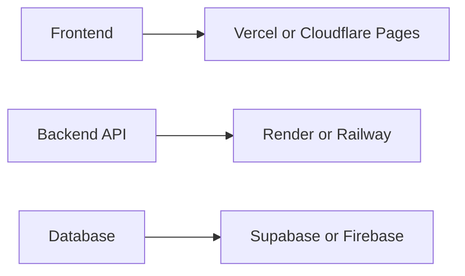
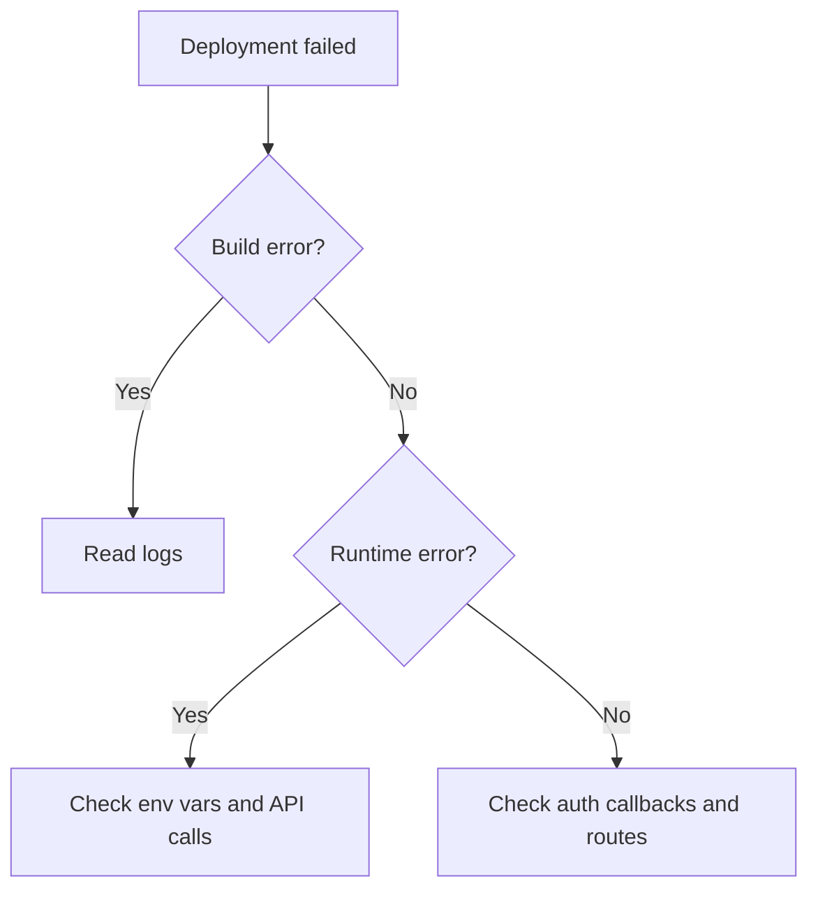

# 10. Deployment Mastery

Deployment should not be the part that ruins the demo.

This section is built around practical launch paths for common hackathon stacks.

## Deployment map

## Platform guide

### Vercel
Best for:
- Next.js
- frontends
- serverless routes
- fast preview links

### Netlify
Best for:
- static sites
- simple frontend apps
- quick forms and hosting

### Railway
Best for:
- backend services
- databases
- simple all-in-one prototypes

### Render
Best for:
- web services
- background jobs
- APIs with persistent runtime needs

### Firebase
Best for:
- auth
- Firestore
- hosting
- quick full-stack app flows

### Supabase
Best for:
- Postgres-backed apps
- auth
- storage
- realtime features

### AWS
Best for:
- more advanced infrastructure
- long-term scaling
- teams already comfortable with cloud architecture

### Cloudflare Pages
Best for:
- static or edge-first frontends
- fast global delivery

## Deployment workflow

1. Push the code to GitHub.
2. Connect the repo to the deployment service.
3. Set environment variables.
4. Configure auth callbacks.
5. Test the core user flow.
6. Verify a live URL.
7. Keep a backup deployment if possible.

## Common failures

- Missing environment variables
- Wrong redirect URLs
- Broken CORS settings
- Database connection errors
- Build failures caused by incompatible dependencies
- Secret keys leaking into the client
- Using local-only paths in production

## Debugging system

## Deployment checklist

- [ ] Build passes locally
- [ ] Env vars added
- [ ] Auth callbacks set
- [ ] Database connected
- [ ] Main workflow tested
- [ ] Live URL saved
- [ ] Backup plan ready

## Best rule

Deploy early.  
A working live link reduces risk more than almost anything else.
