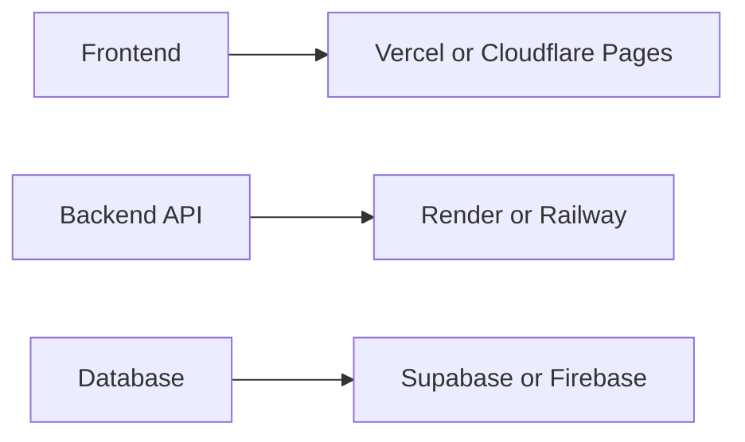
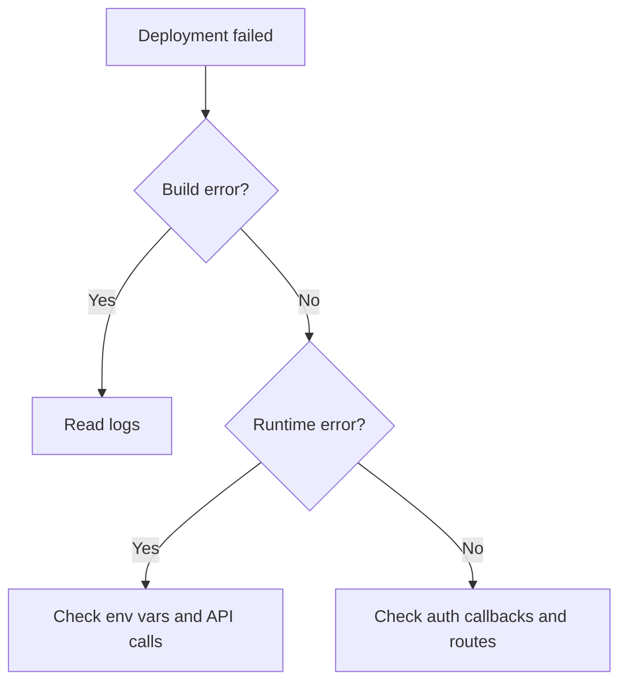
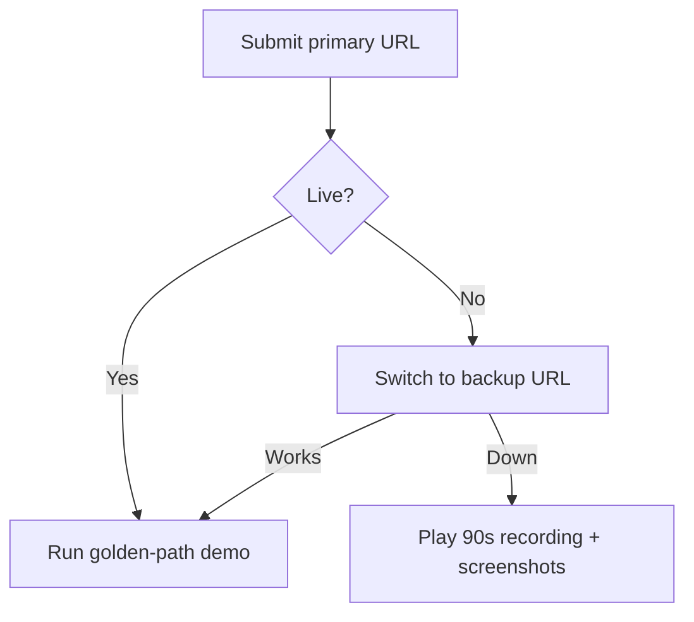

# 10. Deployment Mastery

Deployment should not be the part that ruins the demo.

This section is built around practical launch paths for common hackathon stacks.

## Deployment map

```mermaid
flowchart LR
    A[Frontend] --> B[Vercel or Cloudflare Pages]
    C[Backend API] --> D[Render or Railway]
    E[Database] --> F[Supabase or Firebase]
```

## Platform guide

### Vercel
Best for:
- Next.js
- frontends
- serverless routes
- fast preview links

### Netlify
Best for:
- static sites
- simple frontend apps
- quick forms and hosting

### Railway
Best for:
- backend services
- databases
- simple all-in-one prototypes

### Render
Best for:
- web services
- background jobs
- APIs with persistent runtime needs

### Firebase
Best for:
- auth
- Firestore
- hosting
- quick full-stack app flows

### Supabase
Best for:
- Postgres-backed apps
- auth
- storage
- realtime features

### AWS
Best for:
- more advanced infrastructure
- long-term scaling
- teams already comfortable with cloud architecture

### Cloudflare Pages
Best for:
- static or edge-first frontends
- fast global delivery

## Deployment workflow

1. Push the code to GitHub.
2. Connect the repo to the deployment service.
3. Set environment variables.
4. Configure auth callbacks.
5. Test the core user flow.
6. Verify a live URL.
7. Keep a backup deployment if possible.

## Common failures

- Missing environment variables
- Wrong redirect URLs
- Broken CORS settings
- Database connection errors
- Build failures caused by incompatible dependencies
- Secret keys leaking into the client
- Using local-only paths in production

## Debugging system

```mermaid
flowchart TD
    A[Deployment failed] --> B{Build error?}
    B -->|Yes| C[Read logs]
    B -->|No| D{Runtime error?}
    D -->|Yes| E[Check env vars and API calls]
    D -->|No| F[Check auth callbacks and routes]
```

## Deployment checklist

- [ ] Build passes locally
- [ ] Env vars added
- [ ] Auth callbacks set
- [ ] Database connected
- [ ] Main workflow tested
- [ ] Live URL saved
- [ ] Backup plan ready

## Best rule

Deploy early.  
A working live link reduces risk more than almost anything else.

---

## Platform quickstarts (verified Sept 2026)

Official docs change often — start from these canonical doc roots and follow the
current "Deploy" / "Getting started" page:

- Vercel: https://vercel.com/docs
- Netlify: https://docs.netlify.com
- Railway: https://docs.railway.app
- Render: https://render.com/docs
- Firebase Hosting + Auth + Firestore: https://firebase.google.com/docs
- Supabase (Auth / Postgres / Storage): https://supabase.com/docs
- Cloudflare Pages: https://developers.cloudflare.com/pages/

### Vercel (Next.js / frontend + serverless routes)

1. Push to GitHub. `npm run build` must pass locally first.
2. Import the repo in Vercel → Framework preset auto-detects Next.js.
3. Add Environment Variables (all server keys + `NEXT_PUBLIC_*` client keys).
4. Set the Production branch (usually `main`).
5. Deploy → open the production URL, not just the preview URL.
6. If you use Supabase/Firebase Auth: add the Vercel URL to allowed
   redirect URLs / authorized domains.

Common gotcha: forgetting `NEXT_PUBLIC_` prefix for browser-exposed vars,
or adding keys to Preview but not Production.

### Railway / Render (backend API + jobs)

1. Create a Web Service from the GitHub repo.
2. Set the start command explicitly (e.g. `uvicorn main:app --host 0.0.0.0 --port $PORT`
   for FastAPI, `node server.js` for Node).
3. Add env vars in the dashboard — never commit `.env`.
4. Attach a managed Postgres/Redis if needed, or point at Supabase/Neon.
5. Add a health-check route (`GET /healthz` → `{"ok": true}`) so the platform
   can tell a good deploy from a bad one.
6. Test cold start: free/low tiers sleep. Hit the URL 2–3 min before your demo.

### Firebase / Supabase (auth + data fast path)

1. Create the project, enable the Auth providers you actually demo.
2. Firebase: add your deploy domain under Authentication → Authorized domains.
3. Supabase: add the deploy URL under Authentication → URL Configuration
   (Site URL + Redirect URLs).
4. Use Row Level Security (Supabase) / Security Rules (Firestore) that are
   open enough for the demo but not `true` for everything in a public repo —
   note the tradeoff in your README.
5. Test sign-up → login → write → read on the **deployed** URL, in an
   incognito window.

## Environment variable checklist

Copy this into your deploy dashboard and tick it off:

- [ ] LLM / API keys (server-only, never `NEXT_PUBLIC_`)
- [ ] Database URL / anon key / service-role key (service-role stays server-only)
- [ ] Auth callback / redirect URLs match the live domain
- [ ] CORS origins allow the frontend domain
- [ ] Storage bucket + public/private flags
- [ ] `NODE_ENV=production` / `PYTHON_ENV` equivalents
- [ ] Separate Preview vs Production values where the platform supports it

Secrets rule: if a key can spend money or read all data, it never goes in
client-side code, a committed `.env`, a screenshot, or a slide.

## Demo-day backup plan

Judges remember "it worked when I clicked it." Plan for failure:

1. **Primary live URL** — the link you submit.
2. **Backup deploy** — same code on a second host (e.g. Vercel + Cloudflare Pages
   for frontend, or Railway + Render for API). Takes 10 min, saves demos.
3. **Offline recording** — 60–90 s screen recording of the golden path,
   recorded after the final deploy. Keep it under ~25 MB for form uploads.
4. **Screenshots** — 3–5 key screens in `/assets` or in slides.
5. **Seeded demo account** — `demo@hack.local / demo1234` with realistic data
   already created; never rely on live sign-up during judging.
6. **Kill-switch** — a `?demo=1` query param or "Load sample data" button that
   bypasses flaky third-party APIs with local fixtures.

```mermaid
flowchart TD
    A[Submit primary URL] --> B{Live?}
    B -->|Yes| C[Run golden-path demo]
    B -->|No| D[Switch to backup URL]
    D -->|Works| C
    D -->|Down| E[Play 90s recording + screenshots]
```

## Pre-submit verification (run 30 min before deadline)

- [ ] `npm run build` / `pip install -r requirements.txt` passes from a clean clone
- [ ] Live URL loads in incognito with no console errors on the golden path
- [ ] Auth works for a fresh test user on the live URL
- [ ] Forms/ uploads work with realistic (not `test123`) data
- [ ] Mobile viewport doesn't break the hero + CTA
- [ ] Devpost / Devfolio / Unstop links point at production, not `localhost`
- [ ] GitHub README has live link + 3 screenshots + setup steps
- [ ] Recording + screenshots exported and linked

## Docs + template in this section

- `templates/deploy-checklist.md` — printable pre-submit checklist.
- `examples/example-vercel-flow.md` — worked Vercel walkthrough.

Last verified: 2026-09-10. Platform free tiers and dashboards change —
if a step mismatches the current docs, follow the official docs above.
