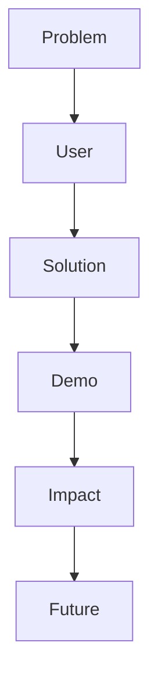

# 11. Presentation Winning

A good hackathon pitch is not an essay. It is a compressed story that helps the judge understand value quickly.

## Winning pitch structure

## Core pitch template

1. Problem
2. User
3. Current pain
4. Your solution
5. Live demo
6. Why it matters
7. What is next

## Judge psychology in the room

Judges respond well to:
- clarity,
- confidence,
- visible progress,
- and believable usefulness.

They respond poorly to:
- overexplaining,
- vague AI claims,
- broken demos,
- and giant scopes.

## Demo psychology

Your demo should feel:
- smooth,
- short,
- live,
- and easy to follow.

## Recovery plan if the demo breaks

1. Stay calm.
2. Show screenshots.
3. Show the deployed URL.
4. Explain the expected behavior.
5. Keep the pitch moving.

## PPT psychology

| Slide type | Goal |
|---|---|
| Title | Make the project memorable |
| Problem | Create urgency |
| Solution | Show clarity |
| Demo | Prove it works |
| Impact | Show why it matters |
| Future | Show ambition without overpromising |

## Copy-paste pitch template

### 30-second version
“We built a tool for [user] who struggles with [problem]. It helps by [solution]. Here is the live workflow, and this is why it saves time or reduces friction.”

### 60-second version
“[User] currently deals with [problem]. Existing solutions are hard because [reason]. We built [name], which [core action]. In the demo, you will see [flow]. This matters because [impact].”

## Slide design rules

- One idea per slide
- Use large text
- Avoid walls of text
- Show real screenshots
- Keep the flow simple
- Highlight the result, not the implementation first

## Practice checklist

- [ ] Pitch in under 60 seconds
- [ ] Demo in under 2 minutes
- [ ] Backup slide ready
- [ ] Live link tested
- [ ] Team roles clear
- [ ] Opening and closing lines memorized

## Best rule

The pitch should make the judge think, “This is clear, useful, and finished.”
