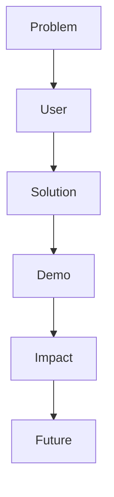

# 11. Presentation Winning

A good hackathon pitch is not an essay. It is a compressed story that helps the judge understand value quickly.

## Winning pitch structure

```mermaid
flowchart TD
    A[Problem] --> B[User] --> C[Solution] --> D[Demo] --> E[Impact] --> F[Future]
```

## Core pitch template

1. Problem
2. User
3. Current pain
4. Your solution
5. Live demo
6. Why it matters
7. What is next

## Judge psychology in the room

Judges respond well to:
- clarity,
- confidence,
- visible progress,
- and believable usefulness.

They respond poorly to:
- overexplaining,
- vague AI claims,
- broken demos,
- and giant scopes.

## Demo psychology

Your demo should feel:
- smooth,
- short,
- live,
- and easy to follow.

## Recovery plan if the demo breaks

1. Stay calm.
2. Show screenshots.
3. Show the deployed URL.
4. Explain the expected behavior.
5. Keep the pitch moving.

## PPT psychology

| Slide type | Goal |
|---|---|
| Title | Make the project memorable |
| Problem | Create urgency |
| Solution | Show clarity |
| Demo | Prove it works |
| Impact | Show why it matters |
| Future | Show ambition without overpromising |

## Copy-paste pitch template

### 30-second version
“We built a tool for [user] who struggles with [problem]. It helps by [solution]. Here is the live workflow, and this is why it saves time or reduces friction.”

### 60-second version
“[User] currently deals with [problem]. Existing solutions are hard because [reason]. We built [name], which [core action]. In the demo, you will see [flow]. This matters because [impact].”

## Slide design rules

- One idea per slide
- Use large text
- Avoid walls of text
- Show real screenshots
- Keep the flow simple
- Highlight the result, not the implementation first

## Practice checklist

- [ ] Pitch in under 60 seconds
- [ ] Demo in under 2 minutes
- [ ] Backup slide ready
- [ ] Live link tested
- [ ] Team roles clear
- [ ] Opening and closing lines memorized

## Best rule

The pitch should make the judge think, “This is clear, useful, and finished.”

---

## The 3-minute structure judges can follow

| Time | Say | Show | Avoid |
|---|---|---|---|
| 0:00–0:25 | One-sentence problem + who feels it | Problem slide, one stat or quote | Origin story, team intros |
| 0:25–1:00 | Your solution in one line + the core loop | Live product, golden path only | Feature list, architecture |
| 1:00–1:50 | Live demo, narrated click-by-click | Real data, seeded account | Typing, sign-up flows, logs |
| 1:50–2:25 | Why it matters + what you validated | Before/after, tiny metric | "AI-powered" without proof |
| 2:25–3:00 | What's next + ask | Roadmap (3 items max), live link + QR | Overpromising, ending on "questions?" |

Script skeleton (fill the brackets, then cut 20%):

> "[User] wastes [time/money] on [problem] because [current workaround] is
> [slow/expensive/confusing]. We built [name]: [one-line solution].
> Watch — [click 1] → [click 2] → [result]. That [saves X / removes Y].
> Next we'd [1, 2, 3]. Try it now at [URL]."

## Demo scripting rules

1. **Golden path only.** One user, one task, under 90 seconds.
2. **Seed everything.** Logged-in account, realistic data, no empty states.
3. **Narrate clicks before you click.** "I'll upload a bill — watch the total extract."
4. **No live typing.** Pre-fill inputs; paste long text.
5. **No sign-up on stage.** Auth is the #1 demo killer.
6. **Have a `?demo=1` mode.** One click loads sample data if an API is down.
7. **Rehearse the fail line:** "The live API is rate-limited right now — here's
   the recording from 20 minutes ago showing the same flow."

## Booth vs stage

- **Booth (science-fair):** judges come to you for 3–5 min. Open with the
  product, not slides. Let them click within 30 seconds. Keep a one-pager
  with the link + QR on the table.
- **Stage (timed pitch):** slides + strict clock. Memorize the first and last
  20 seconds; those decide recall. End 10 seconds early — running over reads
  as unfinished.

## Q&A bank — the 15 questions judges actually ask

1. Who is this for, specifically?
2. What problem does it solve that existing tools don't?
3. How did you validate anyone wants this?
4. What did you build vs what is mocked?
5. What breaks if 100 users try this now?
6. How does the AI part work — model, prompt, fallback?
7. What happens when the API is down or rate-limited?
8. Where is data stored and who can see it?
9. Why this stack — what did it let you ship faster?
10. What would you cut if you had 4 fewer hours?
11. What would you build with 4 more weeks?
12. How would you get your first 100 users?
13. What did each teammate own?
14. What was the hardest bug and how did you fix it?
15. Can I try it myself right now? (Always answerable with URL + demo login.)

Answer formula: direct answer (10 s) → evidence (20 s) → scope honesty (10 s).
Never bluff a live capability — offer the recording instead.

## Body language + delivery

- One speaker drives; others handle clicks and Q&A. Switching speakers mid-demo wastes time.
- Stand where you can see the screen without turning your back.
- Speak 10% slower than feels natural; hackathon rooms are noisy.
- Point at the result, not the code, unless asked for depth.
- End on the link: say it, show the QR, and stop. Don't trail off.

## Timing drill (do this twice)

1. Run `python3 tools/pitch-timer.py --file pitch.txt` — targets:
   30 s ≈ 75–90 words, 60 s ≈ 150–180, 2 min ≈ 300–360, 3 min ≈ 450–540.
2. Record one full run on your phone. Cut filler until you're 10 s under.
3. Do one run with wifi off (backup recording + screenshots only).

## Templates + tools in this repo

- `templates/pitch-script.md` — 30 s / 2 min / 5 min skeletons.
- `examples/example-pitch.md` — worked example pitch.
- `tools/pitch-timer.py` — word-count + pacing check.
- Sections `20-judging-insider/`, `29-storytelling/` — scoring and narrative depth.

Last verified: 2026-09-10.
