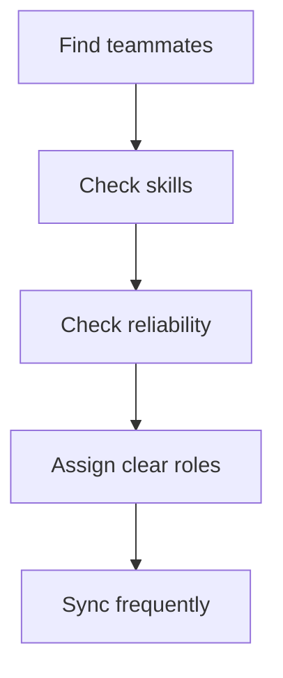

# 12. Team Building

Hackathons are easier when the team is organized before the panic starts.

## Ideal roles

| Role | Responsibility |
|---|---|
| Builder | Implements core features |
| Designer | Handles UI, visuals, and presentation polish |
| Pitch lead | Owns the story and final delivery |
| Integrator | Connects pieces and keeps deployment stable |

## Team formation strategy

## What matters more than skill

- reliability,
- communication,
- speed of response,
- and willingness to stay focused.

## Common team mistakes

- Too many people doing the same task
- No clear owner
- Silent team members
- Conflicting UI opinions
- Late integration
- No pitch rehearsal

## Team rules that work

- Assign one owner per area.
- Use short check-ins.
- Keep decisions visible.
- Protect the MVP.
- Integrate early.
- Rehearse the demo together.

## Hackathon team checklist

- [ ] Everyone knows the problem
- [ ] Everyone knows the MVP
- [ ] Everyone knows their role
- [ ] Everyone knows the deadline plan
- [ ] Everyone knows the demo order

## Team selection tip

Choose people who reduce chaos, not people who create more meetings.
