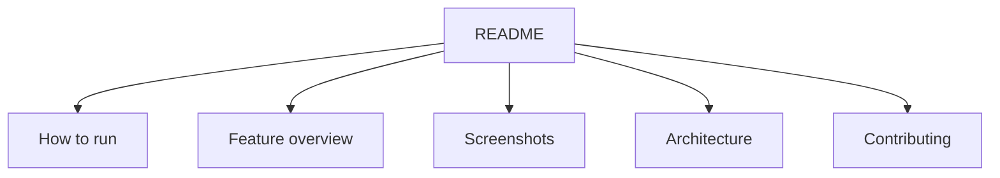

# 13. GitHub for Hackathons

Your GitHub should not look like a folder dump. It should look like a product.

## What a strong repo needs

- clear README,
- live deployment link,
- screenshots,
- GIFs,
- setup steps,
- architecture diagram,
- feature list,
- and contribution path.

## Repository structure

## Good repo behavior

- commit often,
- keep messages clear,
- add issues or tasks,
- create branches for major changes,
- and document setup before the event ends.

## GitHub checklist for hackathons

- [ ] Repo name is clear
- [ ] README is premium
- [ ] Live demo link is visible
- [ ] Screenshots are added
- [ ] Environment variables are documented
- [ ] Setup steps are short
- [ ] Project has a demo story
- [ ] Contributors are named properly

## Common mistakes

- Empty README
- No setup guide
- No screenshots
- Broken links
- Messy commit history
- No explanation of the core value

## Best practice

The repo itself should help a judge understand the project faster.
