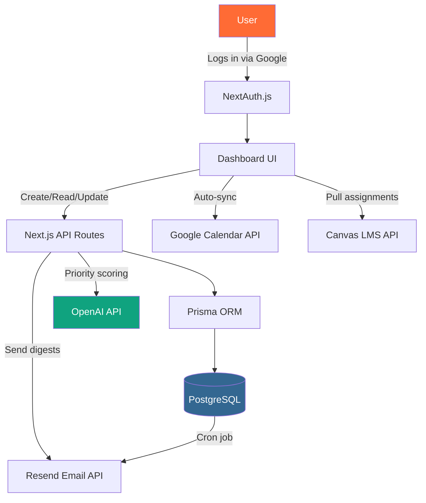

# Example README.md — Hackathon Project

This is a full, copy-pasteable README template. Replace every bracketed section with your own project details.

---

```markdown
<!-- Badges — keep them on one line for a clean header -->


# 🎯 DeadlineBoss

> A campus deadline tracker that helps students organize internships, assignments,
> exam schedules, and reminders in one clean dashboard — so nothing falls through the cracks.

**Built during [HackMIT 2026](https://hackmit.org) — 1st Place Winner 🏆**

[](https://deadlineboss.vercel.app)
[](https://youtube.com/watch?v=YOUR_VIDEO_ID)
[](https://docs.google.com/presentation/d/YOUR_SLIDES_ID)

---

## 📸 Screenshots

| Dashboard | Calendar View | Mobile |
|-----------|--------------|--------|
|  |  |  |

---

## 🤔 The Problem

68% of college students report missing at least one important deadline per semester
(NACE 2025 Student Survey). Between internship applications, coursework, club events,
and personal goals, students juggle 15–20 overlapping deadlines at peak times.
Google Calendar doesn't prioritize by urgency. Spreadsheets need manual updates.
There's no single source of truth.

## 💡 The Solution

DeadlineBoss pulls all your deadlines into one smart dashboard:

- **Auto-import** from Google Calendar, Canvas LMS, and manual entry
- **Priority scoring** — the app ranks deadlines by weight, urgency, and effort required
- **Smart reminders** — 48h, 24h, 2h before, with escalating notifications
- **Visual timeline** — see your entire month at a glance with color-coded categories
- **Team mode** — share deadlines with study groups or project teams

---

## ✨ Features

- [x] OAuth login with Google (2-click setup)
- [x] Auto-sync Google Calendar events
- [x] Canvas LMS integration (pulls assignment due dates)
- [x] AI-powered priority scoring based on grade weight and time remaining
- [x] Responsive design — works on mobile, tablet, desktop
- [x] Dark mode toggle
- [x] Export deadlines as .ics files
- [x] Email digest — weekly summary every Sunday at 6 PM
- [ ] Gamification badges (planned for v2)
- [ ] Slack/Discord bot integration (planned for v2)

---

## 🛠️ Tech Stack

| Layer | Technology | Why |
|-------|-----------|-----|
| Frontend | Next.js 14 + TypeScript | Fast SSR, great DX, strong typing |
| Styling | Tailwind CSS + Radix UI | Rapid prototyping with accessible components |
| Backend | Next.js API Routes | No separate backend needed |
| Database | PostgreSQL + Prisma | Relational data, great migrations |
| Auth | NextAuth.js | Google OAuth in 10 lines |
| Hosting | Vercel | Zero-config deploys, free for hackathons |
| AI | OpenAI GPT-4o-mini | Priority scoring + smart suggestions |
| Email | Resend | Developer-friendly transactional email |

---

## 🏗️ Architecture



---

## 🚀 Quick Start

### Prerequisites

- Node.js 18+ (`node -v` to check)
- PostgreSQL (or use Vercel Postgres for free)
- A Google Cloud project with Calendar API enabled

### Setup

```bash
# 1. Clone the repo
git clone https://github.com/YOUR_USERNAME/deadlineboss.git
cd deadlineboss

# 2. Install dependencies
npm install

# 3. Set up environment variables
cp .env.example .env.local
# Edit .env.local with your API keys:
#   GOOGLE_CLIENT_ID=
#   GOOGLE_CLIENT_SECRET=
#   DATABASE_URL=
#   OPENAI_API_KEY=
#   RESEND_API_KEY=

# 4. Run database migrations
npx prisma db push

# 5. Seed with sample data
npx prisma db seed

# 6. Start dev server
npm run dev
```

Open [http://localhost:3000](http://localhost:3000) and you're live.

---

## 📁 Project Structure

```
deadlineboss/
├── app/                    # Next.js app router pages
│   ├── dashboard/          # Main dashboard view
│   ├── calendar/           # Calendar grid view
│   ├── api/                # API route handlers
│   └── layout.tsx          # Root layout with providers
├── components/
│   ├── ui/                 # Reusable UI primitives
│   ├── DeadlineCard.tsx    # Individual deadline display
│   ├── PriorityBadge.tsx   # Color-coded priority indicator
│   └── WeekView.tsx        # Timeline visualization
├── lib/
│   ├── prisma.ts           # Prisma client singleton
│   ├── priorities.ts       # AI scoring algorithm
│   └── integrations/       # Google, Canvas, Resend clients
├── prisma/
│   ├── schema.prisma       # Database schema
│   └── seed.ts             # Sample data seeder
├── public/screenshots/     # Demo images
├── .env.example            # Template for secrets
├── tailwind.config.ts      # Tailwind customization
└── README.md               # You're reading it
```

---

## 🧪 Running Tests

```bash
npm run test         # Unit tests (Vitest)
npm run test:e2e     # End-to-end tests (Playwright)
npm run test:coverage # Coverage report — aim for 80%+
```

---

## 🏆 Hackathon Details

| | |
|---|---|
| **Event** | HackMIT 2026 |
| **Team** | Jane Chen, Marco Reyes, Priya Sharma, Alex Kim |
| **Duration** | 36 hours |
| **Result** | 🥇 1st Place + Best Design Award |
| **Judges' Feedback** | "The priority scoring is genuinely novel — we haven't seen that in a deadline tool before." |

---

## 🤝 Contributing

Contributions welcome! This project was built in 36 hours — there's plenty of room to improve.

1. Fork the repo
2. Create a feature branch: `git checkout -b feature/awesome-thing`
3. Commit: `git commit -m "Add awesome thing"`
4. Push: `git push origin feature/awesome-thing`
5. Open a PR with a clear description of what changed and why

Please follow the existing code style. Run `npm run lint` before pushing.

---

## 📄 License

MIT — do whatever you want with it. If you build on this for a hackathon, we'd love a shoutout!

---

## 🙏 Acknowledgments

- [HackMIT](https://hackmit.org) organizers for an incredible 36 hours
- Vercel for the free hosting tier that kept us live during demos
- The Prisma team for excellent docs that saved us hours of debugging
- Our mentor Sarah who told us to "cut the Slack integration" at hour 20 — she was right
```

---

**How to use this template:**

1. Copy everything inside the code block above
2. Paste it into your project's `README.md`
3. Replace every placeholder (`YOUR_USERNAME`, `YOUR_VIDEO_ID`, etc.) with real values
4. Add actual screenshots to `public/screenshots/`
5. Customize the tech stack table for your project
6. The Mermaid diagram renders automatically on GitHub — no extra steps needed

**Pro tips:**

- Keep badges to one line — judges skim fast, and clutter kills first impressions
- Screenshots at the top matter more than code — judges look at the README for 10 seconds before deciding if they care
- The architecture diagram is optional but it makes you look prepared and professional
- Always include the live demo link — a working demo beats a perfect codebase every time
- The "Hackathon Details" table is your trophy case — show it off
