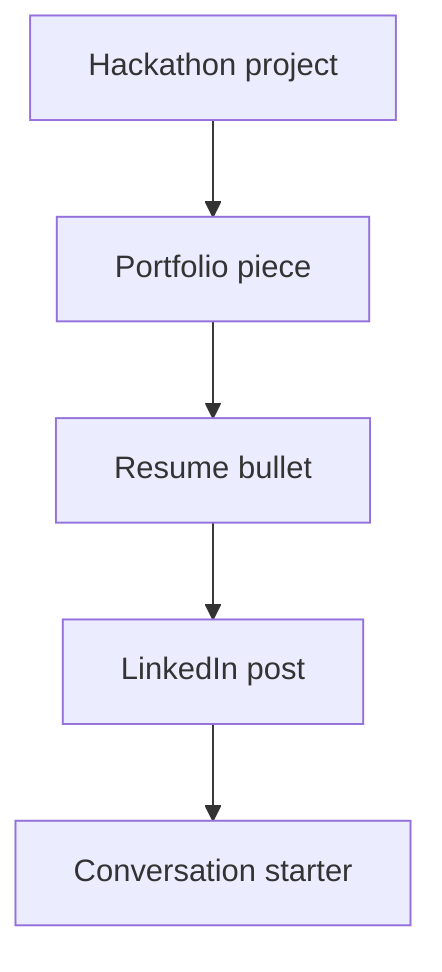

# 14. Resume + LinkedIn Leverage

A hackathon should leave more than a prize result. It should leave career leverage.

## What to capture

- project title,
- problem statement,
- tech stack,
- deployment link,
- your role,
- measurable impact,
- and a short story you can reuse later.

## Resume bullet formula

**Built [project] using [stack] to solve [problem], resulting in [impact].**

## LinkedIn post formula

1. What you built
2. Why it mattered
3. What made it hard
4. What you learned
5. A clean screenshot or demo link

## Career value system

## What makes the project résumé-ready

- clear user value
- live deployment
- visible technical work
- clean code organization
- strong visuals
- a short story with measurable outcomes

## Common mistakes

- writing vague bullets
- forgetting the deployment link
- not saving screenshots
- failing to record what the team built
- not tracking your own contribution clearly

## Simple rule

If the hackathon project can become a portfolio asset, treat it like one from day one.
