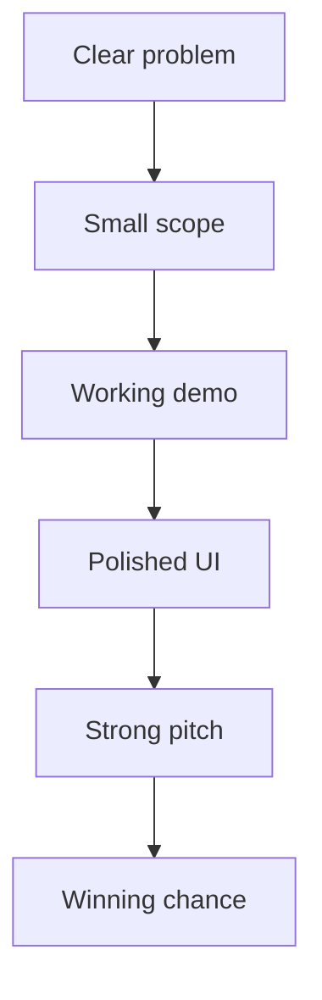

# 15. Winning Secrets

This section collects the small details that often decide whether a project feels amateur or polished.

## Small things that matter a lot

- naming
- spacing
- demo flow
- deployment stability
- short explanations
- confidence under pressure
- visual clarity
- sponsor alignment
- and a believable story

## Winning pattern map

## What judges notice fast

- whether the app works
- whether the problem is real
- whether the team understands the user
- whether the solution is practical
- whether the execution feels finished

## What usually hurts scores

- overengineering
- vague problem framing
- weak demo script
- bad UI hierarchy
- missing backup plans
- unfinished features that distract from the core story

## Secret weapon mindset

Do not try to impress with complexity.  
Try to impress with confidence, clarity, and usefulness.
