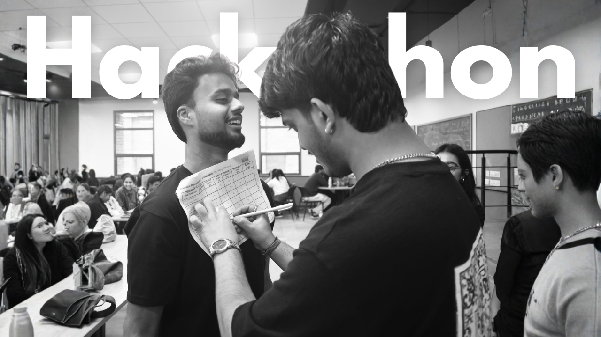
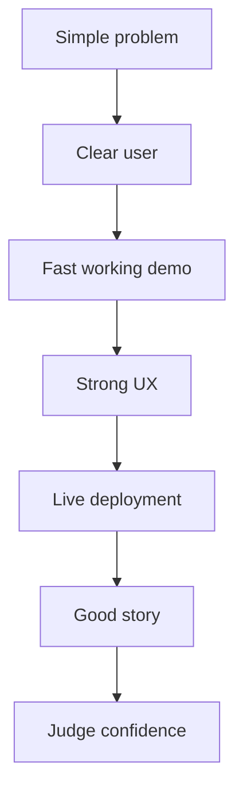
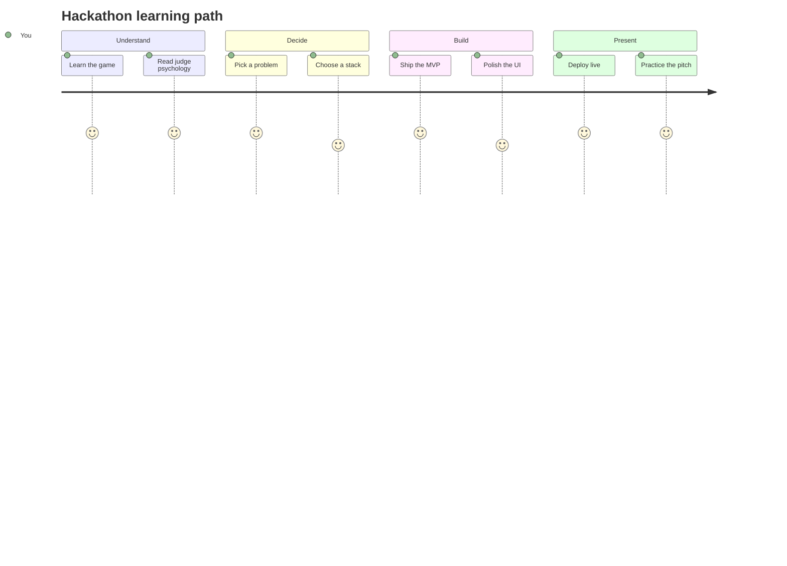

<h1 align="left">🚀 Hackathon Starter Pack</h1>

> The practical system for going from idea to demo faster, with better decisions, cleaner execution, and less hackathon chaos. Built for students, creators, and teams who want to ship something judges actually remember.


<p align="center">
  
</p>

<p align="center">
  <a href="https://github.com/udaysharmadev/Hackathon-Starter-Pack">
    
  </a>

  <a href="https://github.com/udaysharmadev/Hackathon-Starter-Pack/blob/main/LICENSE">
    
  </a>

  <a href="https://github.com/udaysharmadev/Hackathon-Starter-Pack/blob/main/CONTRIBUTING.md">
    
  </a>

  <a href="https://github.com/udaysharmadev/Hackathon-Starter-Pack/blob/main/ROADMAP.md">
    
  </a>
</p>

# Hackathon Starter Pack
> Hackathon Roadmap, Guide & Resources to Win Hackathons

Complete Hackathon Starter Pack & Roadmap for beginners. Learn how to win hackathons, build projects, find ideas, free APIs, deployment, pitching & GitHub workflow.

Learn:

✅ How to win hackathons  
✅ Complete hackathon roadmap  
✅ Best hackathon project ideas  
✅ Team building strategies  
✅ Free APIs for hackathons  
✅ UI/UX fast-track  
✅ Pitching & presentation mastery  
✅ Deployment roadmap  
✅ GitHub for hackathons  
✅ Resume & LinkedIn leverage

Whether you're preparing for SIH, Devfolio, Unstop, MLH, or college hackathons, this repository gives you a complete practical roadmap from idea → build → deploy → demo → win.

**ZERO → IDEA → BUILD → DEPLOY → DEMO → WIN**

It is built to solve the real pain points:
- “I do not know what to build”
- “I do not know what stack to choose”
- “I do not know how to deploy”
- “I do not know how to pitch”
- “I do not know how to find APIs”
- “I do not know how to turn an idea into something judges remember”

---

## Why this repo exists

Most hackathon content falls into one of three traps:

1. It is too theoretical.
2. It is too generic.
3. It is too incomplete.

This repo is built to be the opposite.

It is designed to be:
- practical enough to use during a real hackathon,
- polished enough to star,
- deep enough to teach,
- structured enough to navigate fast,
- and useful enough to bookmark permanently.

---

## Who this repo is for

| Person | What they get |
|---|---|
| First-time hackathon student | A guided path from zero to demo |
| Intermediate builder | Faster workflow, better stack decisions, cleaner shipping |
| Team lead | A structure for splitting work and managing delivery |
| Designer | UI and pitch systems that support winning demos |
| Creator | Shareable resources and content-worthy systems |
| Open-source contributor | A clean architecture for adding more value |

---

## What you will learn

- How hackathons actually work
- How judges think
- How to spot winning problems
- How to turn a boring idea into a demo people remember
- How to choose a stack that does not slow you down
- How to find APIs and tools fast
- How to ship a live product in a short time
- How to make a pitch that feels confident and sharp
- How to prepare your GitHub repo like a real product
- How to build a project that looks bigger than the time you had

---

## Navigation

| Section | Outcome |
|---|---|
| [01. Getting Started](01-getting-started/README.md) | Understand hackathons, judging, and winning patterns |
| [02. Find Hackathons](02-find-hackathons/README.md) | Discover platforms, communities, and search strategies |
| [03. Problem Selection Engine](03-problem-selection-engine/README.md) | Find real problems worth building |
| [04. Winning Project Ideas](04-winning-project-ideas/README.md) | Explore ideas by category with strong MVP scope |
| [05. Tech Stack Chooser](05-tech-stack-chooser/README.md) | Pick the fastest stack for your project |
| [06. Free APIs Mega List](06-free-apis-mega-list/README.md) | Use real APIs without wasting time |
| [07. Vibe Coding Tools](07-vibe-coding-tools/README.md) | Combine AI tools without chaos |
| [08. Build Fast Framework](08-build-fast-framework/README.md) | Ship an MVP in hours, not days |
| [09. UI UX Fast Track](09-ui-ux-fast-track/README.md) | Make your project look premium quickly |
| [10. Deployment Mastery](10-deployment-mastery/README.md) | Deploy without breaking the demo |
| [11. Presentation Winning](11-presentation-winning/README.md) | Pitch like a team that understands judges |
| [12. Team Building](12-team-building/README.md) | Recruit, split, and coordinate smartly |
| [13. GitHub for Hackathons](13-github-for-hackathons/README.md) | Turn the repo into a product page |
| [14. Resume + LinkedIn Leverage](14-resume-linkedin-leverage/README.md) | Convert the hackathon into long-term career value |
| [15. Winning Secrets](15-winning-secrets/README.md) | Learn the details that often decide results |
| [16. Boilerplates](16-boilerplates/README.md) | Start from production-minded templates |
| [17. Resources](17-resources/README.md) | Keep the best references in one place |

---

## Hackathon roadmap


### What winning usually looks like



---

## Repo architecture preview

```text
Hackathon-Starter-Pack/
├── README.md
├── CONTRIBUTING.md
├── ROADMAP.md
├── LICENSE
├── assets/
│   ├── banner/
│   ├── screenshots/
│   ├── gifs/
│   ├── diagrams/
│   └── icons/
├── templates/
├── examples/
├── tools/
├── 01-getting-started/
├── 02-find-hackathons/
├── 03-problem-selection-engine/
├── 04-winning-project-ideas/
├── 05-tech-stack-chooser/
├── 06-free-apis-mega-list/
├── 07-vibe-coding-tools/
├── 08-build-fast-framework/
├── 09-ui-ux-fast-track/
├── 10-deployment-mastery/
├── 11-presentation-winning/
├── 12-team-building/
├── 13-github-for-hackathons/
├── 14-resume-linkedin-leverage/
├── 15-winning-secrets/
├── 16-boilerplates/
└── 17-resources/
```

---

## Quick start

1. Read [01-getting-started](01-getting-started/README.md)
2. Use [03-problem-selection-engine](03-problem-selection-engine/README.md) to choose your problem
3. Pick your stack in [05-tech-stack-chooser](05-tech-stack-chooser/README.md)
4. Build with [08-build-fast-framework](08-build-fast-framework/README.md)
5. Deploy using [10-deployment-mastery](10-deployment-mastery/README.md)
6. Finish with [11-presentation-winning](11-presentation-winning/README.md)

---

## Featured sections

### Problem selection engine
A framework for finding problems people actually care about, not random ideas that only sound impressive.

### API database
A practical map of APIs and services that help you ship faster, demo better, and avoid dead-end engineering.

### Deployment mastery
A real deployment path for Vercel, Railway, Render, Firebase, Supabase, and more.

### Presentation winning
A judge-facing pitch system that helps your project feel clear, credible, and memorable.


---

## Learning path



---

## Contributors

This repository gets stronger when people add:
- better examples,
- faster templates,
- more useful API's,
- stronger pitch frameworks,
- cleaner diagrams,
- and battle-tested hacks from real hackathons.

Read [CONTRIBUTING.md](CONTRIBUTING.md) before opening a pull request.

---

## Topics

hackathon roadmap github,
hackathon starter pack github,
hackathon guide github,
how to win hackathon github,
smart india hackathon roadmap,
hackathon preparation roadmap,
hackathon guide for beginners,
best github repo for hackathon,
hackathon resources github,
hackathon winning strategy

---

## ❓ Frequently Asked Questions

<details>
<summary><strong>I'm a complete beginner. Can I still join hackathons?</strong></summary>

Yes.

Many hackathons are beginner-friendly and have tracks for students and first-time builders.

Start with:

`01-getting-started` → `02-find-hackathons` → `03-problem-selection`

Focus on learning and shipping something small.

</details>

<details>
<summary><strong>I don't know coding. Can I still participate?</strong></summary>

Absolutely.

Hackathons also need:

- Designers
- Pitchers
- Researchers
- Product thinkers
- Content creators
- Presenters

You can contribute in UI/UX, presentations, problem research, product strategy, testing, and storytelling.

</details>

<details>
<summary><strong>How do I find teammates?</strong></summary>

Try:

- Discord communities
- LinkedIn posts
- Devpost hackathon communities
- College groups
- GitHub
- Twitter/X

See:

`04-team-building`

</details>

<details>
<summary><strong>How do people actually win hackathons?</strong></summary>

Winning usually comes from:

✅ Solving a real problem  
✅ Clean UI  
✅ Fast MVP  
✅ Strong demo  
✅ Good storytelling  
✅ Proper deployment  
✅ Clear presentation

Most teams lose because they overbuild or choose bad ideas.

See:

`12-winning-strategies`

</details>

<details>
<summary><strong>Can I use AI tools like ChatGPT, Claude, Gemini, Cursor?</strong></summary>

Yes.

Most hackathon teams now use AI for:

- Coding
- UI generation
- Debugging
- Documentation
- Idea validation
- Research
- Pitch creation

See:

`09-ai-tools`

</details>

<details>
<summary><strong>How do I choose a winning project idea?</strong></summary>

Don't build random ideas.

Choose ideas that:

- Solve real pain points
- Are easy to demo
- Have visible impact
- Can be built in limited time
- Have clear storytelling

See:

`03-problem-selection`

</details>

<details>
<summary><strong>What tech stack should I use?</strong></summary>

Pick speed over complexity.

Recommended:

Frontend → Next.js / React  
Backend → Supabase / Firebase  
AI → OpenAI / Gemini  
Hosting → Vercel / Railway

See:

`05-tech-stack-selection`

</details>

<details>
<summary><strong>What if my project breaks during submission?</strong></summary>

Always have backups:

- Demo video
- Screenshots
- PPT
- Hosted backup link
- GitHub repo ready

See:

`10-deployment-mastery`

</details>

<details>
<summary><strong>Can I participate solo?</strong></summary>

Yes.

Many people win solo.

Choose smaller scope and move fast.

Focus on:

- Simple MVP
- Strong presentation
- Clear problem-solving

</details>

<details>
<summary><strong>How much time should I spend building?</strong></summary>

Rule of thumb:

60% building  
20% polishing  
20% demo + pitch

Teams often lose because they spend everything on coding and ignore presentation.

</details>

<details>
<summary><strong>Do judges check GitHub repositories?</strong></summary>

Sometimes yes.

A clean GitHub repo increases credibility.

Good README, deployment links, screenshots, and documentation can help.

See:

`13-github-for-hackathons`

</details>

<details>
<summary><strong>Should I build something unique or practical?</strong></summary>

Practical usually wins.

Judges care about:

- Real problem
- Execution
- Demo quality
- Feasibility

Not just "crazy innovation".

</details>

<details>
<summary><strong>How much should I rely on AI?</strong></summary>

Use AI to accelerate, not replace thinking.

AI helps speed.

Your understanding and execution still matter.

</details>

___


## Open source mission

This project exists to make hackathon success less random and more learnable.

The goal is simple: help more students ship useful things, present them well, and leave hackathons with real momentum.

---

## Star this repository
> ⭐ If this helps you, star the repo. It helps more students discover it.
