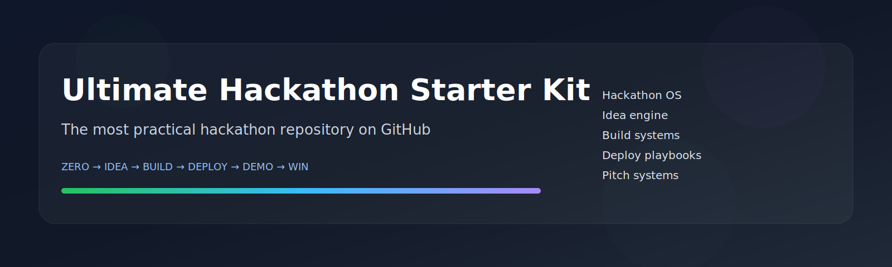
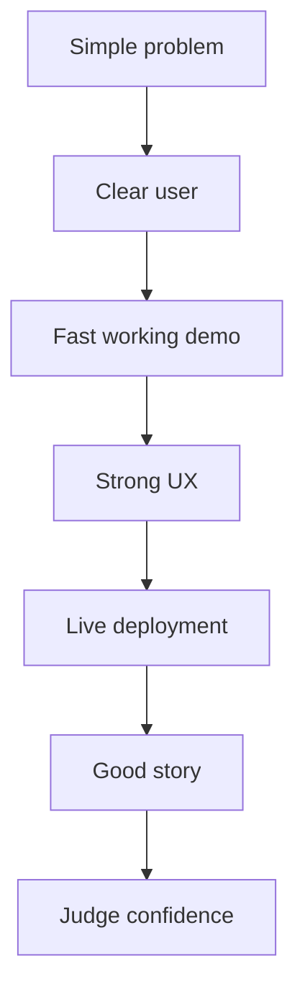
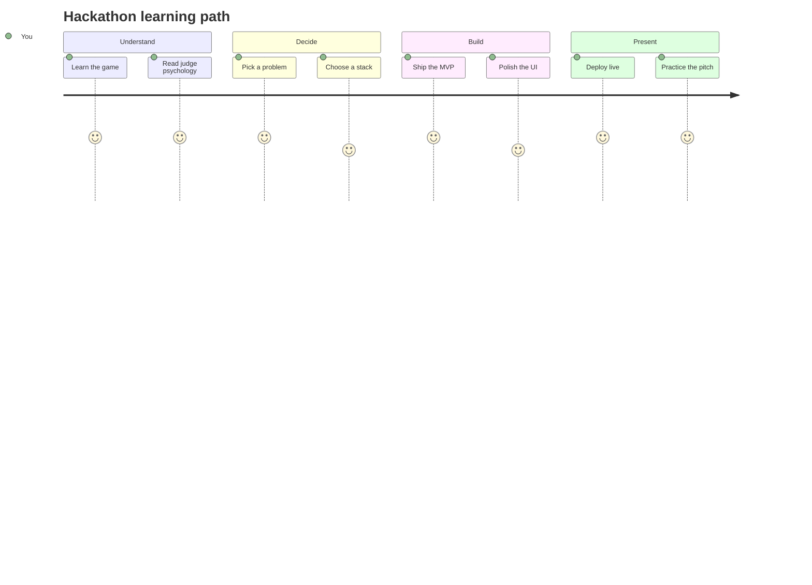

> ⭐ If this helps you, star the repo. It helps more students discover it.
---
title: Ultimate Hackathon Starter Kit
description: The internet's most practical hackathon repository for going from zero to winning demo.
---

<p align="center">
  
</p>

<p align="center">
  <a href="https://github.com/"></a>
  <a href="LICENSE"></a>
  <a href="CONTRIBUTING.md"></a>
  <a href="ROADMAP.md"></a>
</p>

# Ultimate Hackathon Starter Kit

A hackathon should not feel like panic, guesswork, and last-minute chaos.  
It should feel like a system.

This repository is a complete hackathon operating system for students and creators who want to go from:

**ZERO → IDEA → BUILD → DEPLOY → DEMO → WIN**

It is built to solve the real pain points:
- “I do not know what to build”
- “I do not know what stack to choose”
- “I do not know how to deploy”
- “I do not know how to pitch”
- “I do not know how to find APIs”
- “I do not know how to turn an idea into something judges remember”

---

## Why this repo exists

Most hackathon content falls into one of three traps:

1. It is too theoretical.
2. It is too generic.
3. It is too incomplete.

This repo is built to be the opposite.

It is designed to be:
- practical enough to use during a real hackathon,
- polished enough to star,
- deep enough to teach,
- structured enough to navigate fast,
- and useful enough to bookmark permanently.

---

## Who this repo is for

| Person | What they get |
|---|---|
| First-time hackathon student | A guided path from zero to demo |
| Intermediate builder | Faster workflow, better stack decisions, cleaner shipping |
| Team lead | A structure for splitting work and managing delivery |
| Designer | UI and pitch systems that support winning demos |
| Creator | Shareable resources and content-worthy systems |
| Open-source contributor | A clean architecture for adding more value |

---

## What you will learn

- How hackathons actually work
- How judges think
- How to spot winning problems
- How to turn a boring idea into a demo people remember
- How to choose a stack that does not slow you down
- How to find APIs and tools fast
- How to ship a live product in a short time
- How to make a pitch that feels confident and sharp
- How to prepare your GitHub repo like a real product
- How to build a project that looks bigger than the time you had

---

## Navigation

| Section | Outcome |
|---|---|
| [01. Getting Started](01-getting-started/README.md) | Understand hackathons, judging, and winning patterns |
| [02. Find Hackathons](02-find-hackathons/README.md) | Discover platforms, communities, and search strategies |
| [03. Problem Selection Engine](03-problem-selection-engine/README.md) | Find real problems worth building |
| [04. Winning Project Ideas](04-winning-project-ideas/README.md) | Explore ideas by category with strong MVP scope |
| [05. Tech Stack Chooser](05-tech-stack-chooser/README.md) | Pick the fastest stack for your project |
| [06. Free APIs Mega List](06-free-apis-mega-list/README.md) | Use real APIs without wasting time |
| [07. Vibe Coding Tools](07-vibe-coding-tools/README.md) | Combine AI tools without chaos |
| [08. Build Fast Framework](08-build-fast-framework/README.md) | Ship an MVP in hours, not days |
| [09. UI UX Fast Track](09-ui-ux-fast-track/README.md) | Make your project look premium quickly |
| [10. Deployment Mastery](10-deployment-mastery/README.md) | Deploy without breaking the demo |
| [11. Presentation Winning](11-presentation-winning/README.md) | Pitch like a team that understands judges |
| [12. Team Building](12-team-building/README.md) | Recruit, split, and coordinate smartly |
| [13. GitHub for Hackathons](13-github-for-hackathons/README.md) | Turn the repo into a product page |
| [14. Resume + LinkedIn Leverage](14-resume-linkedin-leverage/README.md) | Convert the hackathon into long-term career value |
| [15. Winning Secrets](15-winning-secrets/README.md) | Learn the details that often decide results |
| [16. Boilerplates](16-boilerplates/README.md) | Start from production-minded templates |
| [17. Resources](17-resources/README.md) | Keep the best references in one place |

---

## Hackathon roadmap


### What winning usually looks like



---

## Repo architecture preview

```text
Ultimate-Hackathon-Starter-Kit/
├── README.md
├── CONTRIBUTING.md
├── ROADMAP.md
├── LICENSE
├── assets/
│   ├── banner/
│   ├── screenshots/
│   ├── gifs/
│   ├── diagrams/
│   └── icons/
├── templates/
├── examples/
├── tools/
├── 01-getting-started/
├── 02-find-hackathons/
├── 03-problem-selection-engine/
├── 04-winning-project-ideas/
├── 05-tech-stack-chooser/
├── 06-free-apis-mega-list/
├── 07-vibe-coding-tools/
├── 08-build-fast-framework/
├── 09-ui-ux-fast-track/
├── 10-deployment-mastery/
├── 11-presentation-winning/
├── 12-team-building/
├── 13-github-for-hackathons/
├── 14-resume-linkedin-leverage/
├── 15-winning-secrets/
├── 16-boilerplates/
└── 17-resources/
```

---

## Quick start

1. Read [01-getting-started](01-getting-started/README.md)
2. Use [03-problem-selection-engine](03-problem-selection-engine/README.md) to choose your problem
3. Pick your stack in [05-tech-stack-chooser](05-tech-stack-chooser/README.md)
4. Build with [08-build-fast-framework](08-build-fast-framework/README.md)
5. Deploy using [10-deployment-mastery](10-deployment-mastery/README.md)
6. Finish with [11-presentation-winning](11-presentation-winning/README.md)

---

## Featured sections

### Problem selection engine
A framework for finding problems people actually care about, not random ideas that only sound impressive.

### API database
A practical map of APIs and services that help you ship faster, demo better, and avoid dead-end engineering.

### Deployment mastery
A real deployment path for Vercel, Railway, Render, Firebase, Supabase, and more.

### Presentation winning
A judge-facing pitch system that helps your project feel clear, credible, and memorable.

---

## Visual placeholders

### Screenshot preview


### GIF preview


### Diagram preview


---

## Learning path



---

## Contributors

This repository gets stronger when people add:
- better examples,
- faster templates,
- more useful APIs,
- stronger pitch frameworks,
- cleaner diagrams,
- and battle-tested hacks from real hackathons.

Read [CONTRIBUTING.md](CONTRIBUTING.md) before opening a pull request.

---

## FAQ

<details>
<summary>Is this beginner friendly?</summary>

Yes. The repo starts from the basics, then moves toward advanced workflows only after the foundation is clear.

</details>

<details>
<summary>Is this only for India?</summary>

No. The workflows are global. The discovery section includes Indian, international, student, startup, and university sources.

</details>

<details>
<summary>Will this help in real hackathons?</summary>

That is the point. Every section is designed around actual shipping pressure, judge behavior, and demo-day constraints.

</details>

<details>
<summary>Can this be used as a content project too?</summary>

Yes. The structure is highly shareable, visual, and creator-friendly.

</details>

---

## Open source mission

This project exists to make hackathon success less random and more learnable.

The goal is simple: help more students ship useful things, present them well, and leave hackathons with real momentum.

---

## Star this repository

If this repo helps you move faster, star it so other builders can find it too.
