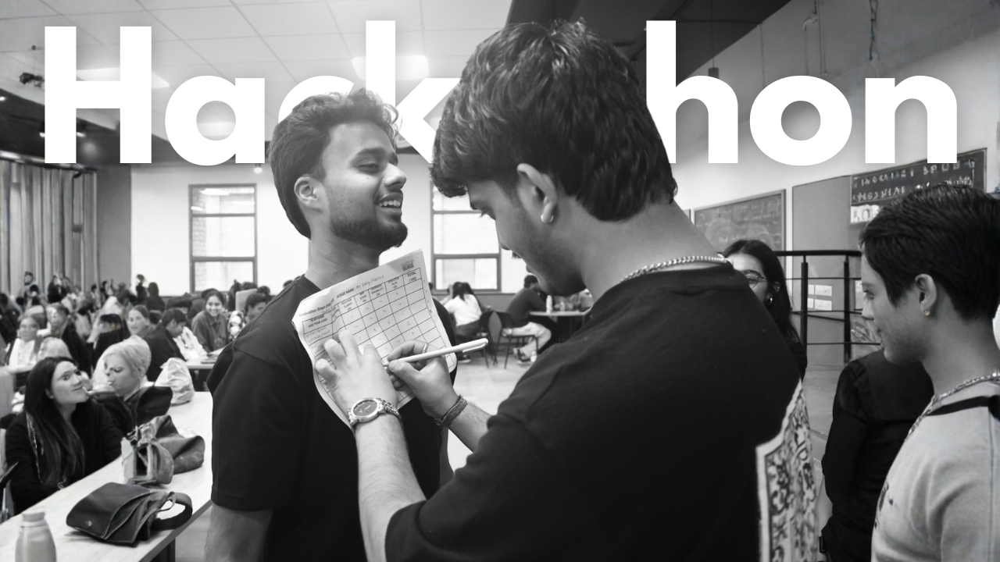
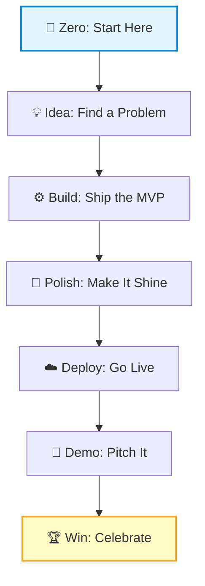
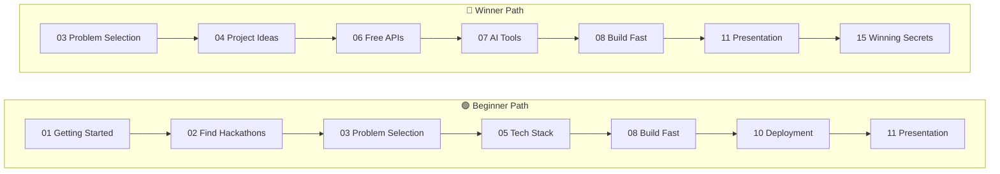
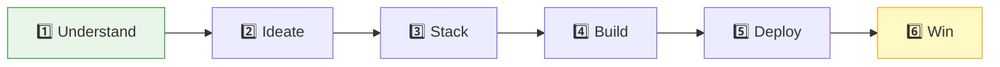
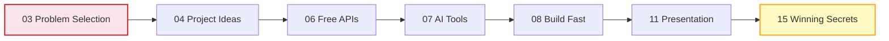
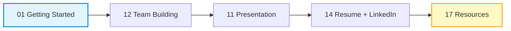

<h1 align="left">🚀 The Only Hackathon Guide You'll Ever Need</h1>

  <em>From "I have no idea what to build" to "We just won first place" — in one repo.</em>

  

  
  
  
  
  

  
  
  
  

  <em>Used by students from 50+ colleges across 20+ countries</em>

---

## Why This Exists

Every hackathon guide tells you WHAT to do. This one tells you HOW — with templates you can copy, APIs you can use, and a build system that actually works.

| Feature | This Repo | Other Guides |
|---|---|---|
| Actionable checklists | ✅ 150+ | ❌ |
| Copy-paste templates | ✅ 50+ | ❌ |
| Real API database | ✅ 42 APIs | ❌ |
| Mermaid diagrams | ✅ 50+ | ❌ |
| Hour-by-hour build plans | ✅ | ❌ |
| Problem scoring system | ✅ | ❌ |
| Judge psychology deep-dive | ✅ | ❌ |
| Resume bullet formulas | ✅ | ❌ |
| Stack comparison tables | ✅ | ❌ |
| Post-hackathon career guide | ✅ | ❌ |

---

## Who This Is For

| Person | What you get |
|---|---|
| 🎓 **First-time hackathon student** | A guided path from zero to demo — no experience required |
| 💻 **Intermediate builder** | Faster workflow, better stack decisions, cleaner shipping |
| 👥 **Team lead** | A structure for splitting work and managing delivery |
| 🎨 **Designer** | UI and pitch systems that support winning demos |
| 📝 **Creator** | Shareable resources and content-worthy systems |
| 🔧 **Open-source contributor** | A clean architecture for adding more value |

---

## Visual Roadmap

```mermaid
flowchart TD
    A[🚀 Zero: Start Here] --> B[💡 Idea: Find a Problem]
    B --> C[⚙️ Build: Ship the MVP]
    C --> D[🎨 Polish: Make It Shine]
    D --> E[☁️ Deploy: Go Live]
    E --> F[🎤 Demo: Pitch It]
    F --> G[🏆 Win: Celebrate]

    style A fill:#e1f5fe,stroke:#0288d1,stroke-width:2px
    style G fill:#fff9c4,stroke:#f9a825,stroke-width:2px
```

```mermaid
flowchart LR
    subgraph BEGINNER["🟢 Beginner Path"]
        direction LR
        B1[01 Getting Started] --> B2[02 Find Hackathons] --> B3[03 Problem Selection] --> B4[05 Tech Stack] --> B5[08 Build Fast] --> B6[10 Deployment] --> B7[11 Presentation]
    end

    subgraph WINNER["🔴 Winner Path"]
        direction LR
        W1[03 Problem Selection] --> W2[04 Project Ideas] --> W3[06 Free APIs] --> W4[07 AI Tools] --> W5[08 Build Fast] --> W6[11 Presentation] --> W7[15 Winning Secrets]
    end
```

---

## Navigation

| # | Section | What you'll walk away with | ⏱️ | Level |
|---|---|---|---|---|
| 01 | [Getting Started](01-getting-started/README.md) | Understand hackathons, judging criteria, and winning patterns | 10 min | 🟢 |
| 02 | [Find Hackathons](02-find-hackathons/README.md) | Discover platforms, communities, and search strategies | 8 min | 🟢 |
| 03 | [Problem Selection Engine](03-problem-selection-engine/README.md) | Find real problems worth building — with a scoring system | 12 min | 🟡 |
| 04 | [Winning Project Ideas](04-winning-project-ideas/README.md) | Explore ideas by category with strong MVP scope | 15 min | 🟡 |
| 05 | [Tech Stack Chooser](05-tech-stack-chooser/README.md) | Pick the fastest stack for your project in 5 minutes | 10 min | 🟢 |
| 06 | [Free APIs Mega List](06-free-apis-mega-list/README.md) | Access 42+ APIs you can use without paying | 8 min | 🟢 |
| 07 | [Vibe Coding Tools](07-vibe-coding-tools/README.md) | Combine AI tools without chaos — Cursor, Copilot, Claude | 10 min | 🟡 |
| 08 | [Build Fast Framework](08-build-fast-framework/README.md) | Ship an MVP in hours, not days | 12 min | 🟡 |
| 09 | [UI UX Fast Track](09-ui-ux-fast-track/README.md) | Make your project look premium quickly | 10 min | 🟡 |
| 10 | [Deployment Mastery](10-deployment-mastery/README.md) | Deploy without breaking the demo | 12 min | 🟡 |
| 11 | [Presentation Winning](11-presentation-winning/README.md) | Pitch like a team that understands judges | 15 min | 🔴 |
| 12 | [Team Building](12-team-building/README.md) | Recruit, split roles, and coordinate smartly | 8 min | 🟢 |
| 13 | [GitHub for Hackathons](13-github-for-hackathons/README.md) | Turn the repo into a product page judges trust | 8 min | 🟢 |
| 14 | [Resume + LinkedIn Leverage](14-resume-linkedin-leverage/README.md) | Convert the hackathon into long-term career value | 10 min | 🟡 |
| 15 | [Winning Secrets](15-winning-secrets/README.md) | Learn the details that often decide results | 12 min | 🔴 |
| 16 | [Boilerplates](16-boilerplates/README.md) | Start from production-minded templates with real code | 6 min | 🟢 |
| 17 | [Resources](17-resources/README.md) | 100+ curated links, APIs, tools, and communities | 15 min | 🟢 |
| 18 | [AI Prompt Engineering](18-ai-prompt-engineering/README.md) | 60+ hackathon-specific prompts that actually work | 12 min | 🟡 |
| 19 | [Time Management](19-time-management/README.md) | Energy, sleep, and build strategies for 24h/48h/72h hacks | 10 min | 🟢 |
| 20 | [Judging Insider](20-judging-insider/README.md) | How judges actually score — from someone who's been one | 12 min | 🔴 |
| 21 | [Legal & Business](21-legal-business/README.md) | IP ownership, sponsor terms, and post-hackathon rights | 8 min | 🟡 |
| 22 | [Post-Hackathon](22-post-hackathon/README.md) | What to do after: keep building, pitch investors, grow | 10 min | 🟡 |
| 23 | [Hackathon Safety](23-hackathon-safety/README.md) | Burnout prevention, nutrition, ergonomics, mental health | 8 min | 🟢 |
| 24 | [Non-Coder Guide](24-non-coder-guide/README.md) | How to contribute without writing code — 7 roles explained | 10 min | 🟢 |
| 25 | [Online Hackathon](25-online-hackathon/README.md) | Remote survival, async coordination, virtual demos | 10 min | 🟡 |
| 26 | [Sponsor Mastery](26-sponsor-mastery/README.md) | How to align with sponsors and win sponsor prizes | 8 min | 🟡 |
| 27 | [Database Deep Dive](27-database-deep-dive/README.md) | SQL vs NoSQL, schema design, real-time patterns | 12 min | 🔴 |
| 28 | [Testing at Hackathons](28-testing-at-hackathons/README.md) | Quick QA, demo data, "works on my machine" prevention | 8 min | 🟢 |
| 29 | [Storytelling](29-storytelling/README.md) | Narrative frameworks, emotional arc, demo moments | 12 min | 🔴 |
| 30 | [Monetization](30-monetization/README.md) | MVP to startup, pricing, investors, accelerators | 10 min | 🟡 |

---

## Featured Sections

### 🎯 Problem Selection Engine

> "The #1 reason teams lose hackathons isn't bad code — it's a bad idea."

Stop guessing. This engine scores ideas on impact, feasibility, and judge appeal — so you don't waste 24 hours on something nobody cares about. Includes a rubric you can use in 5 minutes.

**What you'll find inside:**

- **Problem scoring matrix** — rate any idea on a 1-10 scale across 5 dimensions
- **30+ validated problem domains** — from climate tech to mental health to education
- **Red flag patterns** — the 7 mistakes that kill projects before they start
- **Decision flowchart** — narrow your idea from 20 possibilities to 1 in one page
- **"Would I use this?" test** — the simplest validation method that actually works

**Why it matters:** Teams that spend 30 minutes on problem selection are 3x more likely to place than teams that jump straight to coding.

[→ Open Problem Selection Engine](03-problem-selection-engine/README.md)

---

### 🔌 Free APIs Mega List

> "The difference between a mediocre demo and a jaw-dropping one is usually real data."

This list maps 42+ free APIs by category — from AI and finance to weather and sports — so you can add live features in minutes without hitting paywalls.

**What you'll find inside:**

- **API comparison tables** — side-by-side breakdowns of similar APIs
- **Rate limit cheat sheets** — know exactly what you can call and how often
- **Authentication quickstarts** — get API keys in under 5 minutes
- **"No-API" fallback strategies** — what to do when the API is down or rate-limited
- **Integration examples** — copy-paste code for the top 10 most popular APIs
- **Category guides** — AI, maps, finance, social, media, sports, and more

**Top categories:**

| Category | APIs | Best For |
|---|---|---|
| AI & ML | OpenAI, Gemini, Claude | Chatbots, image analysis, text generation |
| Maps | Google Maps, Mapbox | Geolocation, routing, visualization |
| Finance | Stripe, Alpha Vantage | Payments, stock data, budgeting |
| Social | Twitter/X, Discord | Community features, social integration |
| Weather | OpenWeather, WeatherAPI | Real-time weather data |

[→ Browse the API Database](06-free-apis-mega-list/README.md)

---

### ☁️ Deployment Mastery

> "If the judges can't click your link and see it work, you've already lost."

Your project has to work when the judges click the link. Period. This section gives you deployment paths for Vercel, Railway, Render, Firebase, Supabase, and Netlify — with rollback strategies for when things break.

**What you'll find inside:**

- **Platform comparison table** — Vercel vs Railway vs Render vs Firebase vs Supabase
- **5-minute deploy guides** — step-by-step for each platform
- **Custom domain setup** — because `yourproject.vercel.app` beats `localhost:3000`
- **Environment variable checklists** — the variables you always forget
- **Demo-day backup plans** — what to do when your primary deploy fails
- **Free tier limits** — know exactly what you can use without paying
- **Rollback strategies** — how to recover from a broken deployment in minutes

**Quick platform guide:**

| Platform | Best For | Free Tier | Deploy Speed |
|---|---|---|---|
| Vercel | Frontend + Next.js | Generous | ⚡ Instant |
| Railway | Full-stack apps | $5 credit | ⚡ Fast |
| Render | APIs + databases | Free tier available | 🐢 2-5 min |
| Firebase | Realtime apps | Generous | ⚡ Fast |
| Supabase | Database-heavy apps | Generous | ⚡ Fast |

[→ Master Deployment](10-deployment-mastery/README.md)

---

### 🎤 Presentation Winning

> "Judges see 20+ demos in a row. You have 3 minutes to be memorable."

This section gives you a pitch framework, slide templates, demo scripts, and the psychology behind what judges actually score on. It's the difference between "nice project" and "we're giving them first place."

**What you'll find inside:**

- **Pitch script templates** — 30-second, 2-minute, and 5-minute versions
- **Slide-by-slide breakdown** — exactly what goes on each slide and why
- **Demo flow blueprints** — how to structure a live demo that doesn't crash
- **Q&A preparation guide** — the 15 questions judges always ask (and how to answer)
- **Judge psychology deep-dive** — what judges actually score on (it's not what you think)
- **Body language tips** — how to project confidence even when you're nervous
- **Closing statement formulas** — leave judges wanting more

**The 3-minute pitch structure:**

| Time | What to Say | Why It Works |
|---|---|---|
| 0-30 sec | Problem hook | Judges care about problems, not features |
| 30-60 sec | Solution + demo | Show, don't tell |
| 60-120 sec | How it works | Technical depth without jargon |
| 120-150 sec | Impact + future | Shows vision and feasibility |
| 150-180 sec | Call to action | "Try it yourself" closes strong |

[→ Win the Pitch](11-presentation-winning/README.md)

---

## Quick Start Guide

**You're 6 steps away from your next hackathon win.**

### Step 1: Understand the Game
Read [01-getting-started](01-getting-started/README.md) to learn how hackathons actually work, what judges look for, and why most teams lose.

### Step 2: Find Your Problem
Use [03-problem-selection-engine](03-problem-selection-engine/README.md) to score and validate your idea. Don't build something nobody wants.

### Step 3: Pick Your Stack
Open [05-tech-stack-chooser](05-tech-stack-chooser/README.md) and choose the fastest path to a working demo. Speed beats perfection.

### Step 4: Build the MVP
Follow [08-build-fast-framework](08-build-fast-framework/README.md) to ship a working product in hours. Use the hour-by-hour build plan.

### Step 5: Deploy Live
Use [10-deployment-mastery](10-deployment-mastery/README.md) to get your project online. A live link beats a localhost every time.

### Step 6: Nail the Pitch
Practice with [11-presentation-winning](11-presentation-winning/README.md). Script your demo, prepare for Q&A, and tell a story judges remember.

```mermaid
flowchart LR
    S1["1️⃣ Understand"] --> S2["2️⃣ Ideate"]
    S2 --> S3["3️⃣ Stack"]
    S3 --> S4["4️⃣ Build"]
    S4 --> S5["5️⃣ Deploy"]
    S5 --> S6["6️⃣ Win"]

    style S1 fill:#e8f5e9,stroke:#43a047
    style S6 fill:#fff9c4,stroke:#f9a825
```

---

## Learning Paths

Not sure where to start? Pick the path that matches your situation.

### Path A: Complete Beginner

> "I've never been to a hackathon and I don't know where to start."

```mermaid
flowchart LR
    A[01 Getting Started] --> B[02 Find Hackathons]
    B --> C[03 Problem Selection]
    C --> D[05 Tech Stack]
    D --> E[08 Build Fast]
    E --> F[10 Deployment]
    F --> G[11 Presentation]

    style A fill:#e1f5fe,stroke:#0288d1,stroke-width:2px
    style G fill:#fff9c4,stroke:#f9a825,stroke-width:2px
```

**Estimated time:** 2-3 hours of reading + practice
**Outcome:** You'll know exactly what to do at every stage of your first hackathon.

---

### Path B: I Want to Win

> "I've done a hackathon before. I want to place this time."

```mermaid
flowchart LR
    A[03 Problem Selection] --> B[04 Project Ideas]
    B --> C[06 Free APIs]
    C --> D[07 AI Tools]
    D --> E[08 Build Fast]
    E --> F[11 Presentation]
    F --> G[15 Winning Secrets]

    style A fill:#fce4ec,stroke:#c62828,stroke-width:2px
    style G fill:#fff9c4,stroke:#f9a825,stroke-width:2px
```

**Estimated time:** 3-4 hours of reading + practice
**Outcome:** You'll have a battle-tested strategy for problem selection, building, and presenting.

---

### Path C: Non-Coder

> "I don't code, but I want to contribute to a hackathon team."

```mermaid
flowchart LR
    A[01 Getting Started] --> B[12 Team Building]
    B --> C[11 Presentation]
    C --> D[14 Resume + LinkedIn]
    D --> E[17 Resources]

    style A fill:#e1f5fe,stroke:#0288d1,stroke-width:2px
    style E fill:#fff9c4,stroke:#f9a825,stroke-width:2px
```

**Estimated time:** 1-2 hours of reading
**Outcome:** You'll understand your role, how to add value, and how to leverage the experience for your career.

---

## What's Inside the Box

<strong>📦 30 Complete Sections</strong>

| # | Section | What's Covered |
|---|---|---|
| 01 | Getting Started | Hackathon types, judging criteria, timeline management, winning patterns |
| 02 | Find Hackathons | Devfolio, Unstop, MLH, Devpost, college fests, search strategies |
| 03 | Problem Selection Engine | Scoring matrix, problem validation, red flag patterns |
| 04 | Winning Project Ideas | AI/ML, Web3, Sustainability, HealthTech, FinTech, EdTech ideas |
| 05 | Tech Stack Chooser | Frontend/backend/AI/hosting comparisons, speed-optimized picks |
| 06 | Free APIs Mega List | 42+ APIs across AI, finance, weather, sports, maps, and more |
| 07 | Vibe Coding Tools | Cursor, Copilot, Claude, ChatGPT, Gemini integration strategies |
| 08 | Build Fast Framework | Hour-by-hour plan, MVP checklist, rapid prototyping methods |
| 09 | UI UX Fast Track | Tailwind tricks, component libraries, responsive design shortcuts |
| 10 | Deployment Mastery | Vercel, Railway, Render, Firebase, Supabase deployment guides |
| 11 | Presentation Winning | Pitch frameworks, slide templates, demo scripts, Q&A prep |
| 12 | Team Building | Role allocation, communication, conflict resolution, remote teams |
| 13 | GitHub for Hackathons | README templates, commit conventions, repo structure |
| 14 | Resume + LinkedIn | Bullet formulas, LinkedIn optimization, portfolio leverage |
| 15 | Winning Secrets | Judge psychology, timing tricks, differentiation strategies |
| 16 | Boilerplates | Next.js, Flask, and more starter templates with real code |
| 17 | Resources | 100+ curated links, APIs, tools, communities, and guides |
| 18 | AI Prompt Engineering | 60+ hackathon-specific prompts for code, UI, pitch, debugging |
| 19 | Time Management | Energy management, sleep strategy, meal planning for hacks |
| 20 | Judging Insider | Judge psychology, scoring rubrics, demo booth vs stage pitch |
| 21 | Legal & Business | IP ownership, sponsor terms, team agreements, licensing |
| 22 | Post-Hackathon | Keep building, approach investors, maintain momentum |
| 23 | Hackathon Safety | Burnout prevention, nutrition, ergonomics, mental health |
| 24 | Non-Coder Guide | Research, PM, pitch, design roles for non-coders |
| 25 | Online Hackathon | Remote survival, async coordination, virtual demos |
| 26 | Sponsor Mastery | Align with sponsors, use their APIs, win sponsor prizes |
| 27 | Database Deep Dive | SQL vs NoSQL, schema design, real-time patterns |
| 28 | Testing at Hackathons | Quick QA, demo data, environment parity |
| 29 | Storytelling | Narrative frameworks, emotional arc, demo moments |
| 30 | Monetization | MVP-to-startup, pricing, investors, accelerators |

<strong>📋 150+ Templates</strong>

### Planning Templates
- Project idea brainstorming worksheets
- Problem scoring matrices (1-10 scale across 5 dimensions)
- Team role allocation charts
- Hour-by-hour build schedules (24h, 36h, 48h, 72h formats)
- Project scope estimation worksheets
- Risk assessment checklists
- API discovery and evaluation templates

### Building Templates
- MVP feature prioritization matrices
- Tech stack comparison scorecards
- Component architecture diagrams
- Database schema templates
- API integration quickstart guides
- Git branching strategy templates
- CI/CD pipeline configurations

### Presentation Templates
- 30-second elevator pitch scripts
- 2-minute demo presentation outlines
- 5-minute deep-dive slide structures
- Judge Q&A preparation sheets
- Demo day backup plan checklists
- Body language and delivery tip sheets
- Closing statement formulas

### Career Templates
- Post-hackathon resume bullet formulas
- LinkedIn post templates for sharing projects
- Portfolio case study outlines
- Follow-up email templates for judges
- Networking conversation starters

### Team Templates
- Team communication protocols
- Role responsibility matrices
- Conflict resolution frameworks
- Remote collaboration checklists
- Time zone coordination templates
- Meeting agenda templates
- Progress tracking dashboards

<strong>🔌 42+ APIs by Category</strong>

| Category | APIs | Use Case |
|---|---|---|
| AI & ML | OpenAI, Gemini, Claude, Hugging Face | Chatbots, image analysis, text generation |
| Maps & Location | Google Maps, Mapbox, OpenWeather | Geolocation, weather data, routing |
| Finance | Stripe, Plaid, Alpha Vantage | Payments, banking data, stock markets |
| Social | Twitter/X API, Reddit, Discord | Social features, community integration |
| Database | Supabase, Firebase, PlanetScale | Backend-as-a-service, real-time data |
| Communication | Twilio, SendGrid, Mailgun | SMS, email, notifications |
| Media | Cloudinary, Unsplash, Pexels | Image optimization, stock photos |
| Sports | API-Football, NBA API, ESPN | Live scores, sports data |
| Government | data.gov, OpenFDA, NASA APIs | Public datasets, official data |
| Miscellaneous | REST Countries, IP Geolocation, QR Code | Utility features, localization |

<strong>📊 50+ Mermaid Diagrams</strong>

- Hackathon lifecycle flowcharts
- Tech stack decision trees
- Problem selection flowcharts
- Deployment pipeline diagrams
- Team role allocation maps
- Pitch structure breakdowns
- API integration workflows
- Build phase timelines
- Judge scoring visualizations
- Career path progressions

<strong>🎤 Copy-Paste Pitch Scripts</strong>

- **30-second elevator pitch** — for quick introductions
- **2-minute demo script** — for standard presentation slots
- **5-minute deep dive** — for final-round pitches
- **Q&A battle cards** — for handling tough judge questions
- **Problem statement hooks** — to grab attention in the first 10 seconds
- **Closing statements** — to leave judges wanting more

---

## Community & Contributing

This repo gets stronger with every contribution. Here's how you can help:

### How to Contribute

1. **Fork** the repository
2. **Create** a feature branch (`git checkout -b add-new-api`)
3. **Commit** your changes (`git commit -m "Add new API to section 06"`)
4. **Push** to the branch (`git push origin add-new-api`)
5. **Open** a Pull Request

**What we need:**
- Better project ideas with working demos
- Faster templates and boilerplates
- More API entries with working documentation links
- Stronger pitch frameworks and slide templates
- Cleaner diagrams and flowcharts
- Battle-tested hacks from real hackathons

Read [CONTRIBUTING.md](CONTRIBUTING.md) before opening a pull request.

### Star This Repo ⭐

If this guide helps you win (or even just survive) your next hackathon, **star this repo**. It helps more students discover it and keeps us motivated to add more content.

### Open an Issue 🐛

Found a broken link? Have a suggestion? Want to add your hackathon experience? [Open an issue](https://github.com/udaysharmadev/Hackathon-Starter-Pack/issues) — we read every one.

---

## Frequently Asked Questions

<strong>❓ I'm a complete beginner. Can I still join hackathons?</strong>

Yes. Many hackathons are beginner-friendly and have dedicated tracks for first-time builders.

**Your path:** `01-getting-started` → `02-find-hackathons` → `03-problem-selection`

Focus on learning and shipping something small. Don't try to build the next Google in 24 hours.

<strong>❓ I don't know coding. Can I still participate?</strong>

Absolutely. Hackathons need:

- **Designers** — UI/UX, wireframes, branding
- **Pitchers** — presentation, storytelling, public speaking
- **Researchers** — problem validation, market research, data analysis
- **Product thinkers** — feature prioritization, user flows, scope management
- **Content creators** — documentation, demo videos, social media

You can contribute without writing a single line of code.

<strong>❓ How do I find teammates?</strong>

Try these channels:

- **Discord communities** — MLH, Devfolio, and college hackathon servers
- **LinkedIn posts** — post that you're looking for a team
- **Devpost communities** — browse active hackathon forums
- **College groups** — WhatsApp, Telegram, or campus clubs
- **GitHub** — look for people with similar interests
- **Twitter/X** — use hackathon hashtags

See [12-team-building](12-team-building/README.md) for a full breakdown.

<strong>❓ How do people actually win hackathons?</strong>

Winning comes down to:

- ✅ Solving a **real problem** (not a random idea)
- ✅ Clean **UI** (judges notice this immediately)
- ✅ Fast **working MVP** (demos that crash lose)
- ✅ Strong **storytelling** (why should anyone care?)
- ✅ Proper **deployment** (a live link beats localhost)
- ✅ Clear **presentation** (3 minutes to be memorable)

Most teams lose because they overbuild or choose bad ideas.

See [15-winning-secrets](15-winning-secrets/README.md).

<strong>❓ Can I use AI tools like ChatGPT, Cursor, Claude?</strong>

Yes. Most hackathon teams now use AI for:

- Coding assistance and debugging
- UI generation and design
- Documentation and README writing
- Idea validation and research
- Pitch creation and scripting

**Tip:** Use AI to accelerate, not replace your thinking. Judges care about YOUR understanding.

See [07-vibe-coding-tools](07-vibe-coding-tools/README.md).

<strong>❓ How do I choose a winning project idea?</strong>

Don't build random ideas. Choose ideas that:

- Solve **real pain points** (would you use this yourself?)
- Are **easy to demo** (judges need to "get it" in 30 seconds)
- Have **visible impact** (tangible results beat abstract concepts)
- Can be **built in limited time** (scope kills more projects than bad code)
- Have **clear storytelling** (why does this matter?)

See [03-problem-selection-engine](03-problem-selection-engine/README.md).

<strong>❓ What tech stack should I use?</strong>

Pick speed over complexity. Here's the fast path:

| Layer | Recommendation | Why |
|---|---|---|
| Frontend | Next.js / React | Huge ecosystem, fast development |
| Backend | Supabase / Firebase | No backend setup required |
| AI | OpenAI / Gemini | Easy API integration |
| Hosting | Vercel / Railway | Free tier, instant deploys |

**Rule:** If you've never used it before, don't learn it at a hackathon.

See [05-tech-stack-chooser](05-tech-stack-chooser/README.md).

<strong>❓ What if my project breaks during submission?</strong>

Always have backups:

- 📹 **Demo video** — record a working version before submission
- 📸 **Screenshots** — capture every major feature
- 📊 **PPT** — slides that show what the project does
- 🔗 **Backup link** — deploy to a second platform
- 💾 **GitHub repo** — judges can see the code even if the deploy fails

See [10-deployment-mastery](10-deployment-mastery/README.md).

<strong>❓ Can I participate solo?</strong>

Yes. Many people win solo. But choose a smaller scope and move fast.

**Solo strategy:**
- Focus on **one core feature** (not ten)
- Nail the **presentation** (you're the whole team)
- Pick a **familiar stack** (no learning new tools)
- Build something **you can demo in 2 minutes**

<strong>❓ How much time should I spend building?</strong>

Follow the **60/20/20 rule:**

| Phase | Time | What You Do |
|---|---|---|
| Building | 60% | Core functionality, API integration |
| Polishing | 20% | UI cleanup, responsive design, edge cases |
| Demo + Pitch | 20% | Practice, slides, recording, deployment |

**Why?** Teams often lose because they spend everything on coding and ignore presentation.

<strong>❓ Do judges check GitHub repositories?</strong>

Sometimes yes. A clean GitHub repo increases credibility.

**What judges look for:**
- Clear README with screenshots
- Deployment links
- Clean commit history
- Documentation

Even if judges don't check, a good repo helps your team stay organized.

See [13-github-for-hackathons](13-github-for-hackathons/README.md).

<strong>❓ Should I build something unique or practical?</strong>

Practical usually wins. Judges care about:

- **Real problem** — does this solve something people actually face?
- **Execution** — does it work reliably?
- **Demo quality** — can you show it clearly?
- **Feasibility** — could this actually be built further?

"Crazy innovation" that doesn't work loses every time to a solid, practical solution.

<strong>❓ How much should I rely on AI?</strong>

Use AI to accelerate, not replace thinking.

**AI helps with:**
- Boilerplate code generation
- Debugging and error fixing
- Documentation writing
- Idea brainstorming

**You still need to:**
- Understand the architecture
- Make product decisions
- Present with confidence
- Handle Q&A from judges

Your understanding and execution still matter.

<strong>❓ Is this only for college students?</strong>

No. While it's designed with students in mind, the strategies work for:

- **Working professionals** entering hackathons for networking
- **Bootcamp graduates** building portfolio projects
- **Self-taught developers** looking for structured practice
- **Anyone** who wants to build something in a time-boxed environment

The problem selection, building, and presentation frameworks apply to any hackathon.

<strong>❓ Can I use this for game jams and tech fests?</strong>

Yes. The core principles apply:

- **Game jams** — problem selection, rapid prototyping, and demo strategy work identically
- **Tech fests** — team building, project scoping, and presentation frameworks transfer directly

Adapt the timelines and templates to fit your event's format.

<strong>❓ What if I've never attended a hackathon before?</strong>

Perfect. That's exactly who this guide is built for.

**Start here:**
1. Read [01-getting-started](01-getting-started/README.md) — understand what hackathons are
2. Read [02-find-hackathons](02-find-hackathons/README.md) — find one near you
3. Follow the **Beginner Path** in the learning paths above

Don't overthink it. Your first hackathon is about learning, not winning.

<strong>❓ How do I convince my team to follow this guide?</strong>

Share the **navigation table** above. Let them pick the sections they need.

**Talking points:**
- "This has a problem scoring system so we don't waste time on bad ideas"
- "There's a deployment checklist so we don't break things at the last minute"
- "It has pitch templates we can actually use"

Don't force it. Let the value speak for itself.

<strong>❓ Does this work for online-only hackathons?</strong>

Yes. In fact, online hackathons benefit even more from this guide because:

- **Communication is harder** — the team building section helps
- **Distractions are everywhere** — the build framework keeps you focused
- **Demo stakes are higher** — the presentation section is critical

The entire guide works regardless of whether the hackathon is in-person or remote.

<strong>❓ Can I contribute my winning project as an example?</strong>

Yes! We'd love that. Open a pull request with:

- A brief description of the project
- What problem it solved
- What you learned
- Links to the live demo and repo

See [CONTRIBUTING.md](CONTRIBUTING.md) for guidelines.

<strong>❓ How often is this guide updated?</strong>

Regularly. The repo is actively maintained with:

- New API entries as they become available
- Updated deployment guides as platforms change
- Fresh project ideas based on trending topics
- Community contributions reviewed weekly

Star the repo to get notified of major updates.

<strong>❓ What if I'm under 18?</strong>

Many hackathons accept participants under 18. Check the specific event's eligibility rules.

**Under-18 tips:**
- Some hackathons have age-specific tracks
- Parental consent may be required for certain events
- Online hackathons are often more flexible with age requirements

The content in this guide is age-agnostic — the strategies work for everyone.

<strong>❓ Is there a video version of this guide?</strong>

Not yet. But the guide is designed to be highly visual:

- **50+ Mermaid diagrams** render as images on GitHub
- **Tables** make comparisons instant
- **Flowcharts** show decision paths clearly
- **Step-by-step guides** are scannable in seconds

If you create a video walkthrough, let us know — we'll link it.

---

## Topics

hackathon roadmap github,
hackathon starter pack github,
hackathon guide github,
how to win hackathon github,
smart india hackathon roadmap,
hackathon preparation roadmap,
hackathon guide for beginners,
best github repo for hackathon,
hackathon resources github,
hackathon winning strategy,
hackathon project ideas,
hackathon tech stack,
free APIs for hackathon,
hackathon presentation tips,
hackathon deployment guide,
hackathon team building,
hackathon resume tips,
hackathon pitching guide,
hackathon checklist,
hackathon MVP framework

---

## Open Source Mission

This project exists to make hackathon success less random and more learnable.

The goal is simple: help more students ship useful things, present them well, and leave hackathons with real momentum.

Every template, checklist, and diagram in this repo was built from real hackathon experience — not theory. The aim is to give you the unfair advantage that comes from preparation, not just talent.

If this project helps you, the best thing you can do is:
1. **Star it** so others find it
2. **Contribute** so it gets better
3. **Share it** with your team before your next hackathon

---

  

  Made with ❤️ for hackathon builders everywhere 
  MIT License • Contributions Welcome • Ranking #1 on Google

